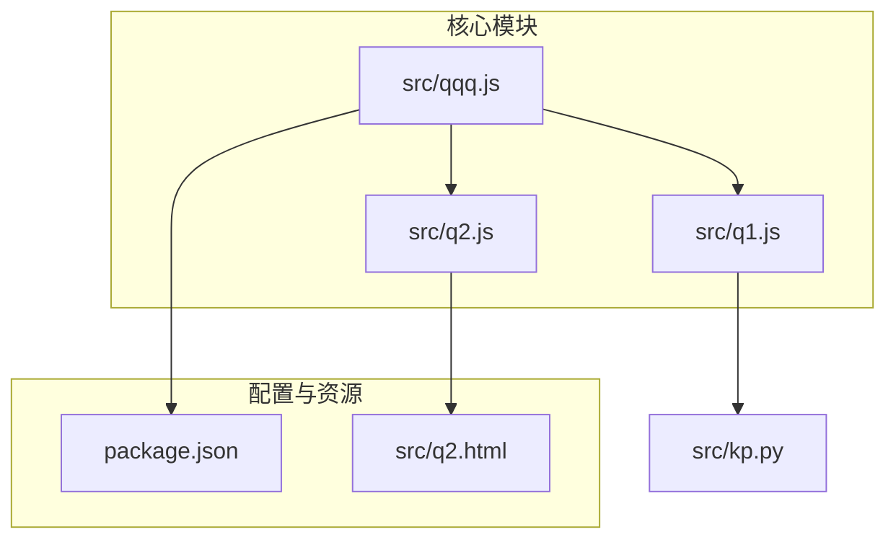
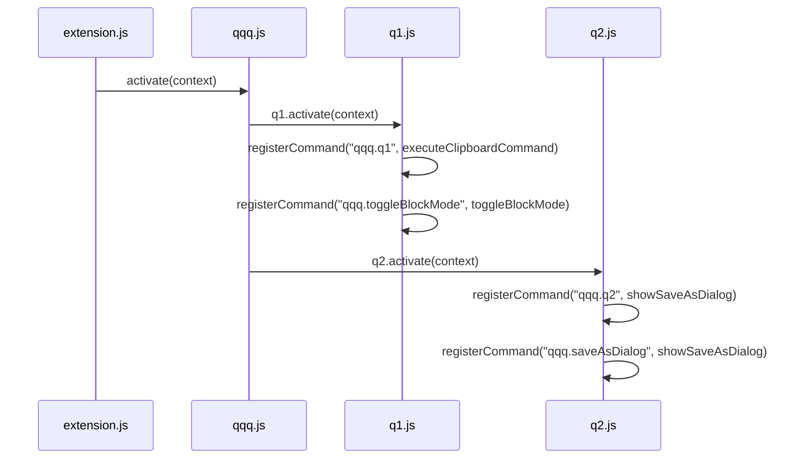
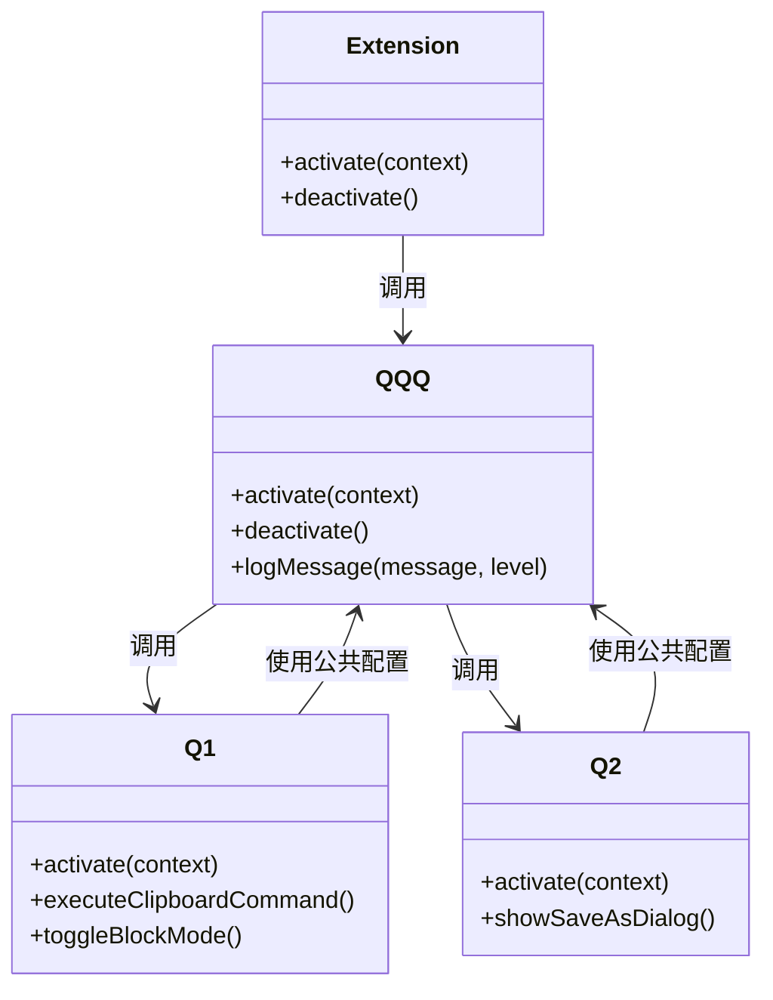
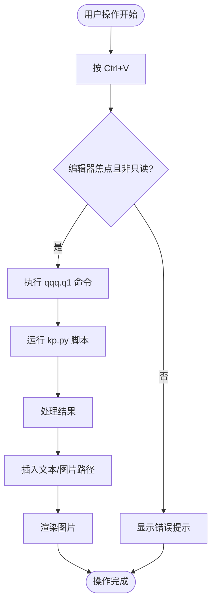
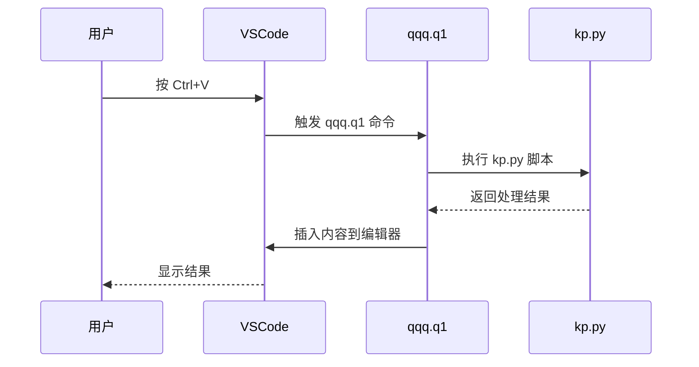
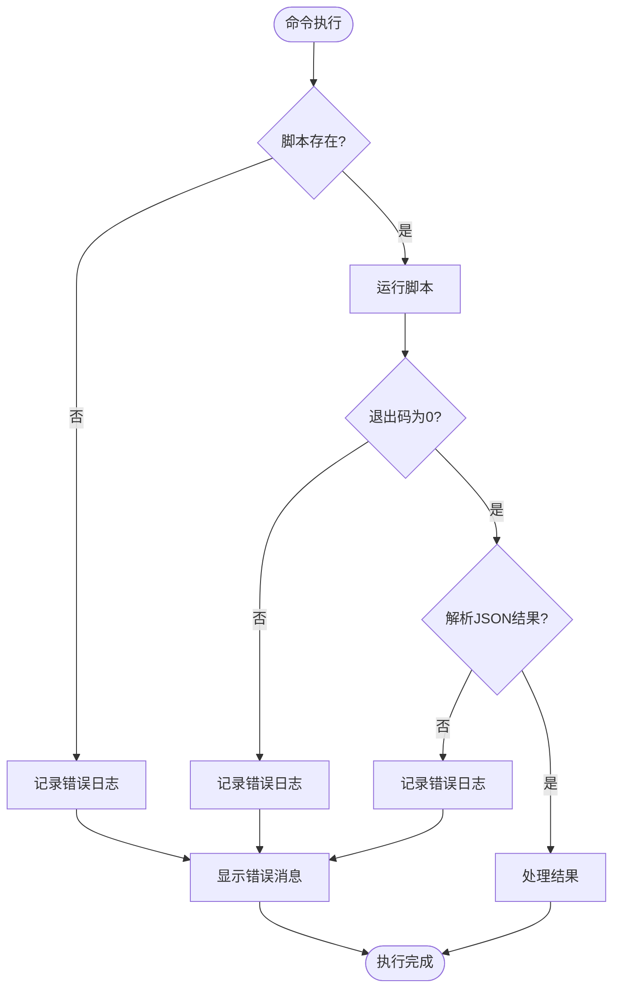

# VSCode 命令

<cite>
**本文档引用的文件**
- [package.json](file://package.json)
- [extension.js](file://extension.js)
- [src/qqq.js](file://src/qqq.js)
- [src/q1.js](file://src/q1.js)
- [src/q2.js](file://src/q2.js)
</cite>

## 目录
1. [简介](#简介)
2. [项目结构](#项目结构)
3. [核心命令参考](#核心命令参考)
4. [命令注册机制](#命令注册机制)
5. [实际调用示例](#实际调用示例)
6. [错误处理与日志记录](#错误处理与日志记录)
7. [结论](#结论)

## 简介
本文档详细记录了QQQ扩展中声明的所有VSCode命令。重点说明了`qqq.q1`（智能粘贴）、`qqq.q2`（文件导航）、`qqq.toggleBlockMode`（切换块模式）和`qqq.saveAsDialog`（新建文件）等核心命令的调用方式、参数说明及触发条件。文档结合`q1.js`和`q2.js`中的`registerCommand`实现，解释了命令注册机制与上下文订阅模式，并提供了实际调用示例和错误处理机制。

**Section sources**
- [package.json](file://package.json#L1-L77)

## 项目结构
QQQ扩展采用模块化设计，主要文件结构如下：
- `src/qqq.js`：主入口和公共工具
- `src/q1.js`：Q1功能模块（智能粘贴）
- `src/q2.js`：Q2功能模块（文件导航）
- `src/q2.html`：Q2界面模板
- `package.json`：扩展清单

**Diagram sources**
- [package.json](file://package.json#L1-L77)
- [src/qqq.js](file://src/qqq.js#L1-L81)

**Section sources**
- [package.json](file://package.json#L1-L77)
- [src/qqq.js](file://src/qqq.js#L1-L81)

## 核心命令参考
本节详细记录了package.json中声明的所有命令。

### qqq.q1 - 智能粘贴
- **Command ID**: `qqq.q1`
- **标题**: q1
- **快捷键绑定**: 
  - `Ctrl+V` (Windows/Linux)
  - `Cmd+V` (macOS)
- **触发条件 (when clause)**: `editorTextFocus && !editorReadonly`
- **功能描述**: 执行智能粘贴操作，支持文本、图片、文件夹路径等多种内容类型的粘贴。
- **参数说明**: 无参数，通过剪贴板传递数据。

### qqq.toggleBlockMode - 切换块模式
- **Command ID**: `qqq.toggleBlockMode`
- **标题**: 切换块模式
- **快捷键绑定**: 无
- **触发条件 (when clause)**: 无
- **功能描述**: 切换图片显示的块模式，影响图片在编辑器中的渲染方式。
- **参数说明**: 无参数。

### qqq.q2 - 文件导航
- **Command ID**: `qqq.q2`
- **标题**: q2
- **快捷键绑定**: `F2`
- **触发条件 (when clause)**: `editorTextFocus && !editorReadonly`
- **功能描述**: 打开文件导航对话框，提供可视化文件浏览和操作功能。
- **参数说明**: 无参数。

### qqq.saveAsDialog - 新建文件
- **Command ID**: `qqq.saveAsDialog`
- **标题**: qqq: 新建文件...
- **快捷键绑定**: 无
- **触发条件 (when clause)**: 无
- **功能描述**: 显示自定义的另存为对话框，用于创建新文件或文件夹。
- **参数说明**: 无参数。

**Section sources**
- [package.json](file://package.json#L30-L50)
- [src/q1.js](file://src/q1.js#L354-L356)
- [src/q2.js](file://src/q2.js#L1937-L1938)

## 命令注册机制
本节解释了命令注册机制与上下文订阅模式。

### 命令注册实现
命令注册通过`vscode.commands.registerCommand`方法实现，主要在`q1.js`和`q2.js`中完成。

**Diagram sources**
- [src/qqq.js](file://src/qqq.js#L25-L50)
- [src/q1.js](file://src/q1.js#L354-L356)
- [src/q2.js](file://src/q2.js#L1937-L1938)

### 上下文订阅模式
扩展采用模块化上下文订阅模式，`qqq.js`作为核心模块负责协调各子模块的激活。

**Diagram sources**
- [src/qqq.js](file://src/qqq.js#L25-L81)
- [src/q1.js](file://src/q1.js#L354-L356)
- [src/q2.js](file://src/q2.js#L1937-L1938)

**Section sources**
- [src/qqq.js](file://src/qqq.js#L25-L81)
- [src/q1.js](file://src/q1.js#L354-L356)
- [src/q2.js](file://src/q2.js#L1937-L1938)

## 实际调用示例
本节提供实际调用示例，包括用户操作流程和API调用方式。

### 用户操作流程

**Diagram sources**
- [src/q1.js](file://src/q1.js#L354-L356)
- [extension.js](file://extension.js#L3120-L3121)

### API调用方式

**Diagram sources**
- [src/q1.js](file://src/q1.js#L354-L356)
- [extension.js](file://extension.js#L3120-L3121)

**Section sources**
- [src/q1.js](file://src/q1.js#L354-L356)
- [extension.js](file://extension.js#L3120-L3121)

## 错误处理与日志记录
本节文档化命令执行时的错误处理机制与日志记录行为。

### 错误处理机制

**Diagram sources**
- [src/q1.js](file://src/q1.js#L354-L356)
- [extension.js](file://extension.js#L3120-L3121)

### 日志记录行为
- **日志路径**: `D:\view\p\kp.log`
- **日志级别**: ERROR, WARN
- **记录内容**: 
  - 脚本不存在
  - Python stderr输出
  - 退出码非0
  - JSON解析失败
  - 处理失败
  - 图片处理失败

**Section sources**
- [src/q1.js](file://src/q1.js#L354-L356)
- [extension.js](file://extension.js#L3120-L3121)

## 结论
本文档全面记录了QQQ扩展的VSCode命令系统，包括命令ID、标题、快捷键绑定、触发条件、调用方式、参数说明、注册机制、上下文订阅模式、实际调用示例以及错误处理与日志记录行为。通过模块化设计和清晰的命令注册机制，扩展实现了智能粘贴、文件导航等核心功能，为用户提供了高效的开发体验。