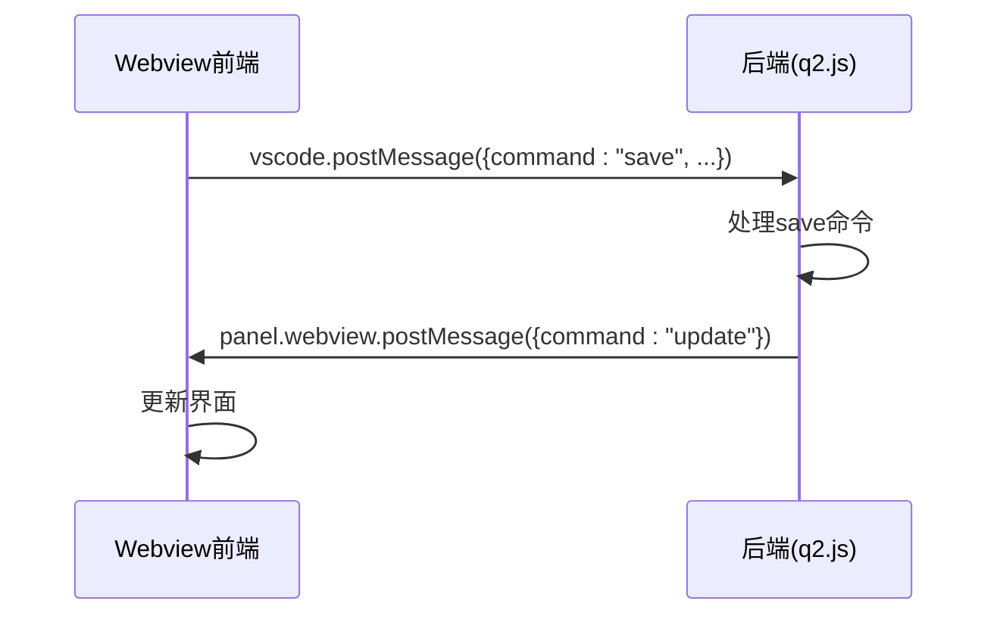
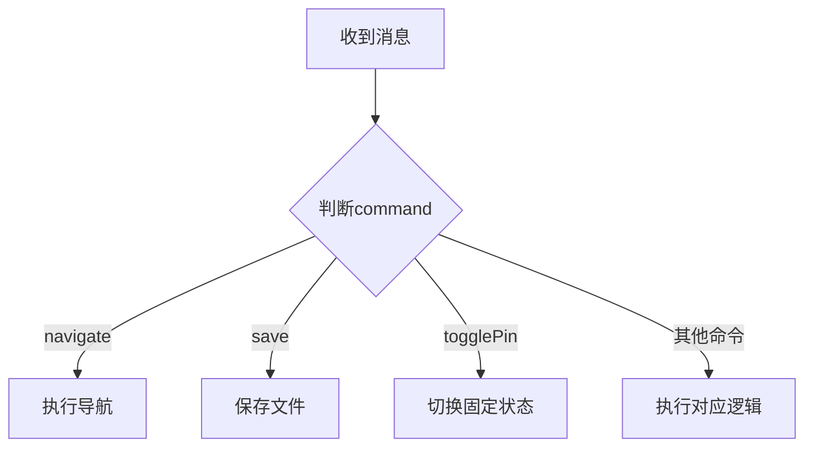
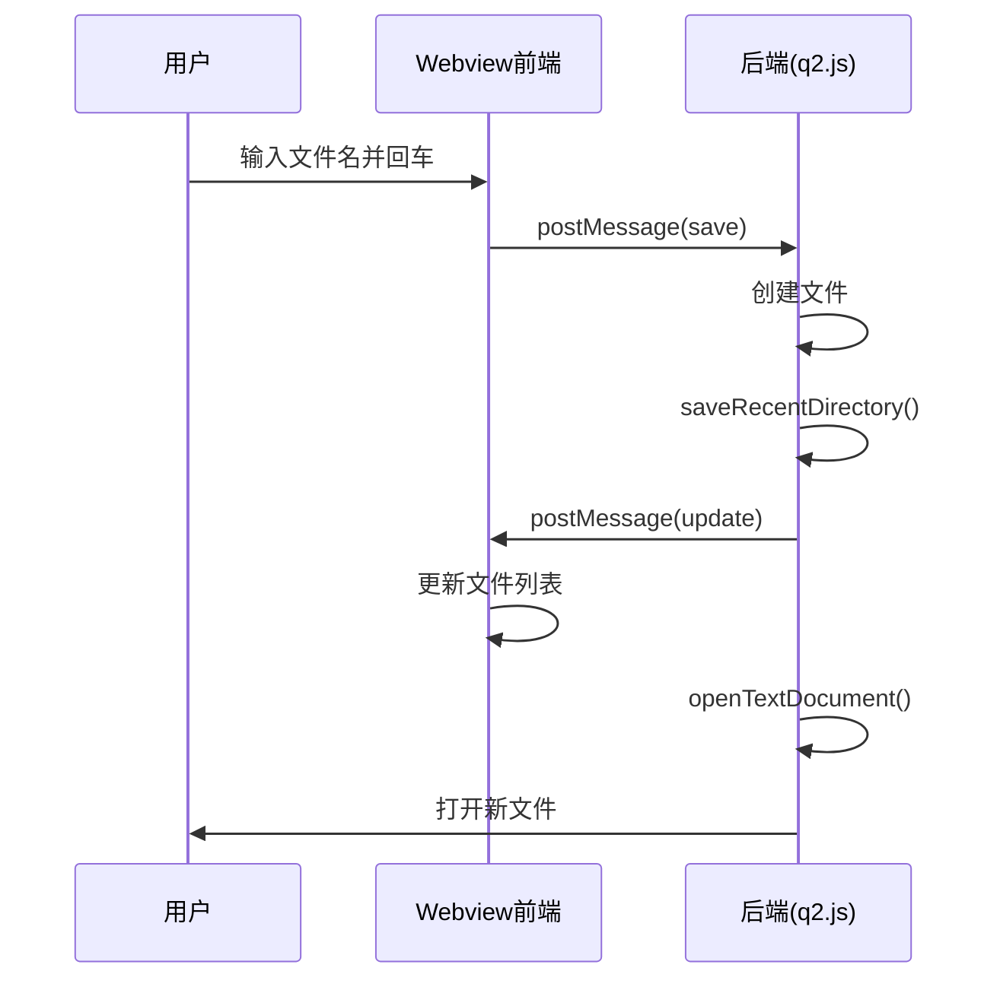

# Webview 消息通信

<cite>
**Referenced Files in This Document**  
- [q2.js](file://src/q2.js)
- [q2.html](file://src/q2.html)
</cite>

## 目录
1. [消息通信机制概述](#消息通信机制概述)
2. [支持的消息类型与数据格式](#支持的消息类型与数据格式)
3. [postMessage 与 message 事件监听实现模式](#postmessage-与-message-事件监听实现模式)
4. [消息数据结构字段说明](#消息数据结构字段说明)
5. [消息时序示例](#消息时序示例)
6. [错误处理与边界情况](#错误处理与边界情况)

## 消息通信机制概述

该系统通过 VS Code 的 Webview API 实现前端（q2.html）与后端（q2.js）之间的双向通信。前端使用 `vscode.postMessage()` 发送消息，后端通过 `panel.webview.onDidReceiveMessage()` 监听消息并作出响应。后端也可主动向 Webview 发送更新消息以刷新界面状态。

**Section sources**  
- [q2.js](file://src/q2.js#L1626-L1947)

## 支持的消息类型与数据格式

以下是系统支持的所有消息类型及其数据格式：

| 消息类型 | 触发场景 | 数据结构 |
|---------|--------|--------|
| navigate | 用户点击驱动器、最近目录或在地址栏回车 | `{ command: "navigate", path: string }` |
| save | 用户在输入框输入文件名并按回车 | `{ command: "save", filename: string, isPinned: boolean, openInCurrentGroup: boolean }` |
| togglePin | 用户点击“长驻”按钮 | `{ command: "togglePin", isPinned: boolean }` |
| cancel | 用户点击取消按钮 | `{ command: "cancel" }` |
| removeFromRecent | 用户点击最近目录项的删除按钮 | `{ command: "removeFromRecent", path: string }` |
| requestSize | 用户请求获取文件/文件夹大小 | `{ command: "requestSize", path: string, type: "file"\|"folder", name: string }` |
| update | 后端通知前端更新文件列表 | `{ command: "update", currentPath: string, fileListHtml: string, items: Array }` |
| updateSize | 后端返回文件/文件夹大小信息 | `{ command: "updateSize", path: string, type: "file"\|"folder", sizeDisplay: string }` |
| clearFilenameInput | 后端通知前端清空输入框 | `{ command: "clearFilenameInput" }` |
| startRename | 后端通知前端开始重命名 | `{ command: "startRename", path: string, name: string, type: "file"\|"folder" }` |
| refreshSizes | 用户请求刷新所有大小显示 | `{ command: "refreshSizes" }` |

**Section sources**  
- [q2.js](file://src/q2.js#L535-L879)
- [q2.js](file://src/q2.js#L1626-L1947)

## postMessage 与 message 事件监听实现模式

### 前端发送消息（postMessage）
前端通过 `vscode.postMessage()` 向后端发送消息。此方法定义于 `generateWebviewScript` 函数中，用于封装各种用户操作。

**Diagram sources**  
- [q2.js](file://src/q2.js#L535-L879)

### 后端接收消息（onDidReceiveMessage）
后端通过 `panel.webview.onDidReceiveMessage()` 注册消息监听器，根据 `message.command` 字段进行分发处理。

**Diagram sources**  
- [q2.js](file://src/q2.js#L1626-L1947)

## 消息数据结构字段说明

| 字段 | 类型 | 含义 |
|------|------|------|
| command | string | 消息命令类型，决定处理逻辑 |
| path | string | 文件或目录的完整路径 |
| type | string | 类型标识："file" 或 "folder" |
| sizeDisplay | string | 格式化后的大小显示字符串（如 " 123 k"） |
| filename | string | 用户输入的文件名 |
| isPinned | boolean | 是否为“长驻”模式 |
| openInCurrentGroup | boolean | 是否在当前组打开文件 |
| currentPath | string | 当前所在目录路径 |
| fileListHtml | string | 生成的文件列表HTML片段 |
| items | array | 文件项元数据数组 |

**Section sources**  
- [q2.js](file://src/q2.js#L535-L879)
- [q2.js](file://src/q2.js#L1626-L1947)

## 消息时序示例

以下是一个典型用户操作流程的消息流：

**Diagram sources**  
- [q2.js](file://src/q2.js#L1756-L1793)

## 错误处理与边界情况

系统对多种异常情况进行了处理：

- **路径不存在**：导航时检查路径有效性，提示“无效的目录路径”
- **文件已存在**：创建文件时弹出覆盖确认对话框
- **同名冲突**：检测文件与文件夹命名冲突并提示
- **权限问题**：操作失败时记录日志并显示错误信息
- **缓存机制**：使用 `fileSizeCache` 和 `sizeCalculationPromises` 避免重复计算
- **焦点管理**：精确控制输入框与文件列表的焦点切换逻辑

**Section sources**  
- [q2.js](file://src/q2.js#L1626-L1947)
- [q2.js](file://src/q2.js#L535-L879)