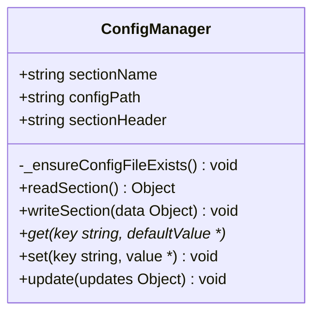
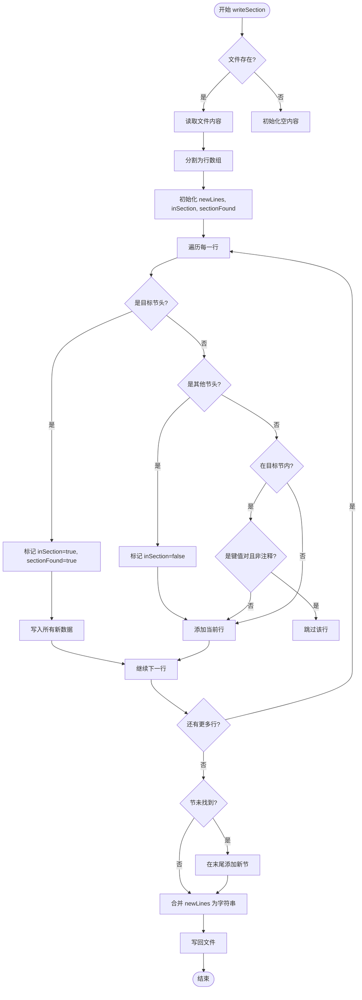
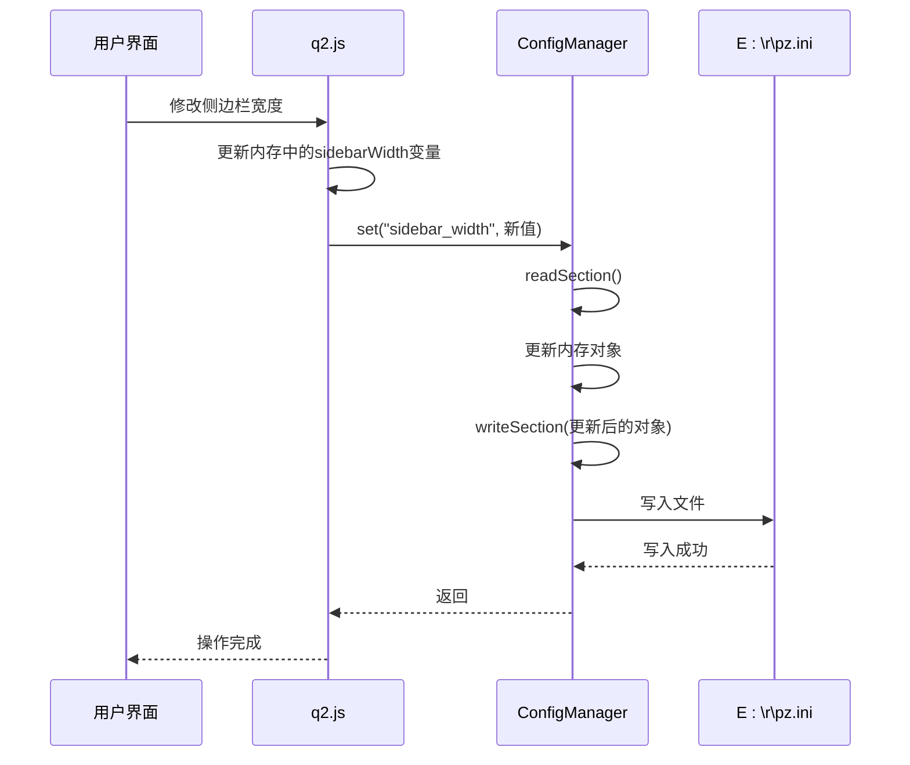
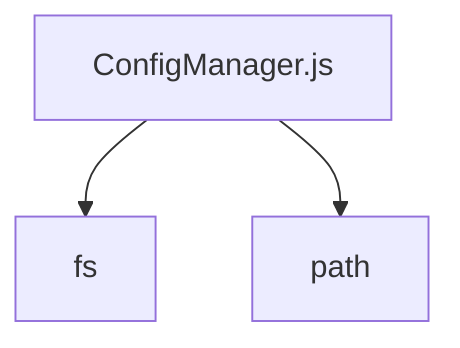

# 配置管理接口

<cite>
**Referenced Files in This Document**   
- [ConfigManager.js](file://src/ConfigManager.js)
- [q2.js](file://src/q2.js)
</cite>

## 目录
1. [简介](#简介)
2. [核心组件](#核心组件)
3. [架构概述](#架构概述)
4. [详细组件分析](#详细组件分析)
5. [依赖分析](#依赖分析)
6. [性能考虑](#性能考虑)
7. [故障排除指南](#故障排除指南)
8. [结论](#结论)

## 简介
`ConfigManager` 是一个通用的配置管理器，专为多进程安全地读写 INI 格式配置文件而设计。该模块支持多个程序共享同一配置文件（`E:\r\pz.ini`），每个程序或模块可独立管理自己的配置节（section）。其核心特性包括保留文件原有格式和注释、确保线程安全的文件锁机制，以及提供简洁的 `get`/`set`/`update` 便捷接口。本文档将详细阐述其公共接口、设计原理、实现机制，并结合 `q2.js` 模块中的实际应用，说明其在管理 `recent_dirs`、`line_spacing` 等配置项时的行为规范与最佳实践。

## 核心组件
`ConfigManager` 的核心功能由 `ConfigManager.js` 文件实现，其主要提供以下公共接口：
- **构造函数**: 接收 `sectionName` 和 `configPath` 参数，初始化一个针对特定配置节的管理器实例。
- **核心读写方法**: `readSection()` 和 `writeSection(data)`，用于原子性地读取和写入整个配置节。
- **便捷操作接口**: `get(key, defaultValue)`、`set(key, value)` 和 `update(updates)`，提供更高级别的键值对操作。
这些接口共同构成了一个安全、易用的配置管理解决方案，确保了在多进程环境下配置数据的一致性和完整性。

**Section sources**
- [ConfigManager.js](file://src/ConfigManager.js#L1-L201)

## 架构概述
`ConfigManager` 采用了一种基于文件读写和内存操作的架构模式。其工作流程如下：当需要读取配置时，它会将整个配置文件加载到内存中，通过逐行解析来定位目标节并提取键值对；当需要写入配置时，它会读取现有文件内容，根据目标节是否存在来决定是更新现有节还是创建新节，然后将修改后的完整内容写回文件。这种设计确保了对单个配置节的读写操作是原子的，从而避免了并发写入导致的文件损坏。同时，通过保留非目标节的内容和注释，实现了对文件格式的完美保留。

```mermaid
graph TB
subgraph "ConfigManager.js"
A[构造函数] --> B[readSection]
A --> C[writeSection]
B --> D[get]
C --> E[set]
C --> F[update]
end
subgraph "外部使用"
G[q2.js] --> D
G --> E
G --> F
end
H[(E:\r\pz.ini)] < --> B
H < --> C
```

**Diagram sources**
- [ConfigManager.js](file://src/ConfigManager.js#L1-L201)

## 详细组件分析
### ConfigManager 类分析
`ConfigManager` 类是整个配置管理功能的核心，它封装了对 INI 文件的复杂操作，为上层应用提供了简洁的接口。

#### 类图


**Diagram sources**
- [ConfigManager.js](file://src/ConfigManager.js#L1-L201)

#### 构造函数与初始化
`ConfigManager` 的构造函数接收两个参数：`sectionName` 用于标识配置节，`configPath` 指定配置文件的路径（默认为 `E:\r\pz.ini`）。在实例化时，它会调用私有方法 `_ensureConfigFileExists()` 来确保配置文件及其所在目录存在。该方法会自动创建缺失的目录和空的配置文件，为后续的读写操作做好准备。

**Section sources**
- [ConfigManager.js](file://src/ConfigManager.js#L25-L44)

#### 核心读写方法
`readSection()` 和 `writeSection(data)` 是 `ConfigManager` 的底层核心方法，负责与文件系统进行直接交互。

`readSection()` 方法通过 `fs.readFileSync` 读取整个文件内容，然后逐行扫描。它使用一个布尔标志 `inSection` 来跟踪当前是否处于目标配置节内。当遇到 `[sectionName]` 时，标志被置为 `true`；当遇到其他节或文件结束时，标志被置为 `false`。在目标节内，它会解析以 `=` 分隔的键值对，并跳过以 `#` 或 `;` 开头的注释行，从而将配置数据构建成一个 JavaScript 对象返回。

`writeSection(data)` 方法则更为复杂。它首先读取现有文件的所有行，然后遍历这些行。当找到目标节时，它会将新的配置数据（按键排序）一次性写入，同时跳过原有的键值对以避免重复，但会保留原有的注释和空行。如果目标节不存在，它会将新节追加到文件末尾。最后，将处理后的所有行重新组合并写回文件。这种方法确保了写入操作的原子性，并最大限度地保留了文件的原始格式。



**Diagram sources**
- [ConfigManager.js](file://src/ConfigManager.js#L96-L164)

#### 便捷操作接口
`get`、`set` 和 `update` 方法是构建在 `readSection` 和 `writeSection` 之上的高级接口，极大地简化了日常的配置操作。

`get(key, defaultValue)` 方法首先调用 `readSection()` 获取整个节的配置对象，然后检查指定的 `key` 是否存在，若存在则返回其值，否则返回提供的 `defaultValue`。

`set(key, value)` 方法同样先读取整个节的配置，然后在内存对象中更新指定的键值对（并强制将值转换为字符串），最后调用 `writeSection()` 将整个更新后的对象写回文件。

`update(updates)` 方法用于批量更新多个配置项。它接收一个包含多个键值对的对象 `updates`，通过 `Object.assign()` 将这些更新合并到当前的配置对象中，然后同样通过 `writeSection()` 将结果持久化。

**Section sources**
- [ConfigManager.js](file://src/ConfigManager.js#L172-L196)

### q2.js 中的配置使用分析
`q2.js` 模块是 `ConfigManager` 的一个典型应用案例，它展示了如何利用该管理器来持久化用户界面的状态。

#### 配置项存取模式
`q2.js` 中定义了多个具体的配置项，如 `recent_dirs`（最近目录）、`line_spacing`（行间距）、`sidebar_width`（侧边栏宽度）、`recycle_bin`（回收站）和 `is_pinned`（是否固定）。这些配置项的存取模式清晰地体现了 `ConfigManager` 的使用方式。例如，在 `saveConfig` 函数中，它会将这些状态变量打包成一个对象，然后通过 `ConfigManager` 的 `writeSection` 方法（或其封装）一次性写入 `qqq` 节。而在 `getConfig` 函数中，则通过 `readSection` 方法读取整个节的内容，并解析出各个配置项的值。

#### 应用流程序列图


**Diagram sources**
- [q2.js](file://src/q2.js#L200-L350)

## 依赖分析
`ConfigManager` 模块主要依赖于 Node.js 的内置模块 `fs` 和 `path`。`fs` 模块用于执行文件的读写、检查和创建等操作，是实现配置持久化的基础。`path` 模块则用于处理文件路径，确保在不同操作系统下路径操作的正确性，特别是在创建配置文件目录时。



**Diagram sources**
- [ConfigManager.js](file://src/ConfigManager.js#L3-L4)

## 性能考虑
`ConfigManager` 的性能主要受文件 I/O 操作的影响。由于每次 `set` 或 `update` 操作都会触发一次完整的文件读取和写入，因此在频繁修改配置的场景下可能会成为性能瓶颈。然而，这种设计保证了操作的原子性和数据的一致性。对于大多数配置管理场景，配置的读写频率较低，因此这种性能开销是可以接受的。为了优化性能，建议将相关的配置项进行批量更新（使用 `update` 方法），而不是进行多次单独的 `set` 操作，以减少文件 I/O 的次数。

## 故障排除指南
在使用 `ConfigManager` 时，可能会遇到一些常见问题。首先，如果配置文件路径（`E:\r\pz.ini`）所在的磁盘或目录没有写入权限，`writeSection` 方法将失败，并在控制台输出 "写入配置失败" 的错误信息。其次，如果配置文件被其他进程以独占方式锁定，`fs.writeFileSync` 调用可能会抛出异常。此外，如果配置文件的格式严重损坏（例如，缺少节头或包含非法字符），`readSection` 方法可能无法正确解析，导致返回空对象或部分数据。在这些情况下，应检查文件权限、确认没有其他程序占用文件，并在必要时手动修复或重置配置文件。

**Section sources**
- [ConfigManager.js](file://src/ConfigManager.js#L10-L15)
- [ConfigManager.js](file://src/ConfigManager.js#L70-L75)
- [ConfigManager.js](file://src/ConfigManager.js#L150-L155)

## 结论
`ConfigManager` 是一个设计精良、功能完备的 INI 配置管理器。它通过封装复杂的文件操作，提供了一个简单、安全的 API，有效解决了多进程环境下配置共享的问题。其保留文件格式和注释的特性，使得配置文件对用户友好且易于维护。结合 `q2.js` 中的实际应用可以看出，该模块能够很好地满足持久化用户界面状态的需求。遵循其提供的 `get`/`set`/`update` 接口进行开发，可以确保配置操作的正确性和一致性。在未来的使用中，应遵循批量更新的原则以优化性能，并注意处理可能的文件 I/O 异常。