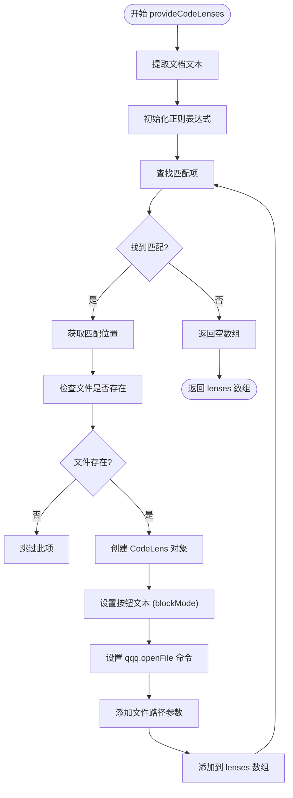
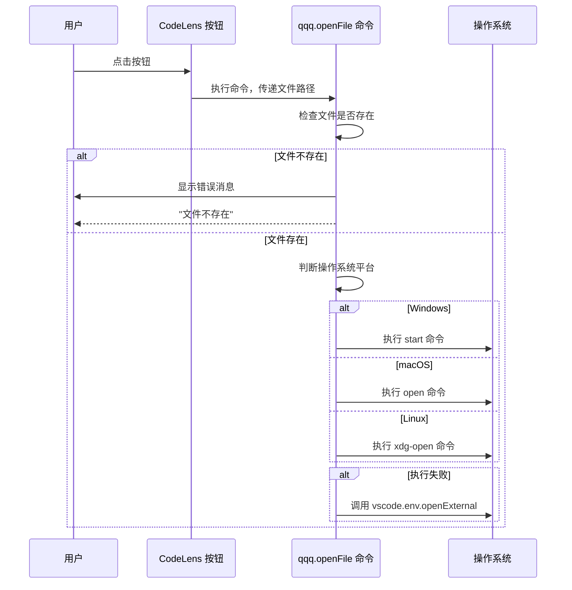
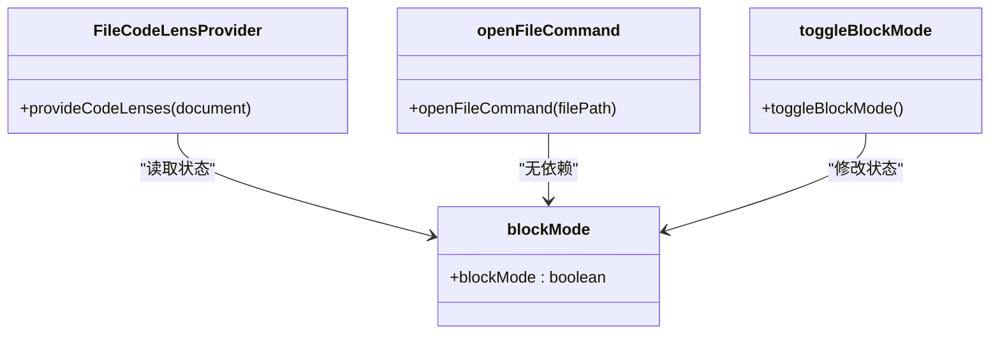

# CodeLens 集成与文件打开

<cite>
**Referenced Files in This Document**   
- [extension.js](file://extension.js)
- [src/q1.js](file://src/q1.js)
- [src/qqq.js](file://src/qqq.js)
</cite>

## Table of Contents
1. [简介](#简介)
2. [核心组件](#核心组件)
3. [FileCodeLensProvider 实现](#filecodelensprovider-实现)
4. [文件打开命令实现](#文件打开命令实现)
5. [状态管理与交互](#状态管理与交互)
6. [异常处理与健壮性](#异常处理与健壮性)
7. [使用示例](#使用示例)
8. [常见问题排查](#常见问题排查)

## 简介
本文档详细说明了CodeLens功能的技术实现，重点介绍`FileCodeLensProvider`类如何识别文件路径标记并创建交互式按钮。文档涵盖了从路径解析、按钮生成到文件打开的完整流程，以及相关的状态管理和异常处理机制。

## 核心组件

本功能涉及多个核心组件的协同工作，包括CodeLens提供者、文件打开命令处理器和全局状态管理器。

**Section sources**
- [extension.js](file://extension.js#L316-L358)
- [src/q1.js](file://src/q1.js#L266-L308)

## FileCodeLensProvider 实现

`FileCodeLensProvider`类负责在编辑器中识别特定格式的文件路径标记，并为每个有效路径创建CodeLens按钮。



**Diagram sources**
- [src/q1.js](file://src/q1.js#L266-L289)
- [extension.js](file://extension.js#L324-L349)

**Section sources**
- [src/q1.js](file://src/q1.js#L266-L289)
- [extension.js](file://extension.js#L324-L349)

### 路径识别机制
`FileCodeLensProvider`使用正则表达式`/\[([A-Za-z]:[\\\/]view[\\\/]p[\\\/][^\[\]]+)\]/gi`来识别文档中的文件路径标记。该正则表达式专门匹配形如`[D:\view\p\...]`的字符串，确保只处理特定目录下的文件路径。

### 按钮创建流程
对于每个匹配的路径，系统执行以下步骤：
1. 将相对路径转换为绝对路径
2. 使用`fs.existsSync`检查文件是否存在
3. 仅当文件存在时才创建CodeLens按钮
4. 根据`blockMode`状态设置按钮文本为"qqq"或"aaa"

## 文件打开命令实现

`openFileCommand`函数负责处理用户点击CodeLens按钮后的文件打开操作。



**Diagram sources**
- [src/q1.js](file://src/q1.js#L292-L308)
- [src/qqq.js](file://src/qqq.js#L60-L70)

**Section sources**
- [src/q1.js](file://src/q1.js#L292-L308)

### 跨平台命令调用
系统根据不同的操作系统平台选择相应的命令：
- **Windows**: 使用`start "" "文件路径"`命令
- **macOS**: 使用`open "文件路径"`命令
- **Linux**: 使用`xdg-open "文件路径"`命令

### 异常回退机制
如果通过`child_process.exec`执行系统命令失败，系统会回退到使用VS Code内置的`vscode.env.openExternal`方法打开文件，确保操作的可靠性。

## 状态管理与交互

`blockMode`是一个全局状态变量，用于控制CodeLens按钮的显示文本。



**Diagram sources**
- [src/q1.js](file://src/q1.js#L17-L17)
- [extension.js](file://extension.js#L157-L157)

**Section sources**
- [src/q1.js](file://src/q1.js#L17-L17)
- [extension.js](file://extension.js#L157-L157)

### 状态切换
通过`toggleBlockMode`函数可以切换`blockMode`的状态，从而改变所有CodeLens按钮的显示文本。状态变化后会触发重新渲染，确保界面及时更新。

## 异常处理与健壮性

系统实现了多层次的异常处理机制，确保在各种异常情况下都能稳定运行。

### 文件存在性检查
在创建CodeLens按钮之前，系统会使用`fs.existsSync`检查目标文件是否存在。这避免了为不存在的文件创建无效按钮，提升了用户体验。

### 错误消息提示
当用户尝试打开一个不存在的文件时，系统会显示明确的错误消息："文件不存在: [文件路径]"，帮助用户快速定位问题。

### 命令执行保护
文件打开命令的执行被包裹在try-catch块中，捕获任何可能的异常。即使系统命令执行失败，也能通过回退机制确保文件能够被打开。

**Section sources**
- [src/q1.js](file://src/q1.js#L292-L308)
- [src/q1.js](file://src/q1.js#L266-L289)

## 使用示例

### 基本用法
在文档中插入以下标记：
```
[D:\view\p\example.jpg]
```
如果该文件存在，系统会自动在该行上方显示一个CodeLens按钮，文本为"aaa"（当`blockMode`为false时）。

### 状态切换效果
执行`qqq.toggleBlockMode`命令后，所有CodeLens按钮的文本会从"aaa"变为"qqq"，反之亦然。

**Section sources**
- [src/q1.js](file://src/q1.js#L310-L314)

## 常见问题排查

### 问题1：CodeLens按钮未显示
**可能原因**：
- 目标文件不存在
- 文件路径格式不符合要求
- `blockMode`状态影响

**解决方案**：
1. 确认文件路径正确且文件存在
2. 检查路径是否以`D:\view\p\`开头
3. 验证文件路径中不包含方括号

### 问题2：点击按钮无反应
**可能原因**：
- 系统命令执行失败
- 文件关联程序缺失

**解决方案**：
1. 检查系统终端是否能正常执行`start`/`open`/`xdg-open`命令
2. 确认文件类型有默认打开程序
3. 查看VS Code开发者工具中的错误日志

### 问题3：按钮文本显示异常
**可能原因**：
- `blockMode`状态与预期不符

**解决方案**：
执行`qqq.toggleBlockMode`命令切换状态，观察按钮文本变化。

**Section sources**
- [src/q1.js](file://src/q1.js#L292-L308)
- [src/q1.js](file://src/q1.js#L266-L289)
- [src/q1.js](file://src/q1.js#L310-L314)