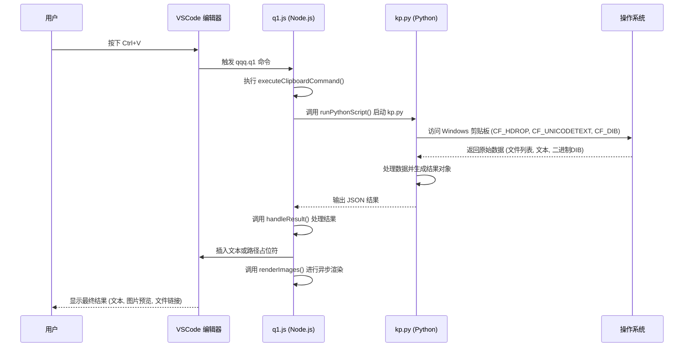
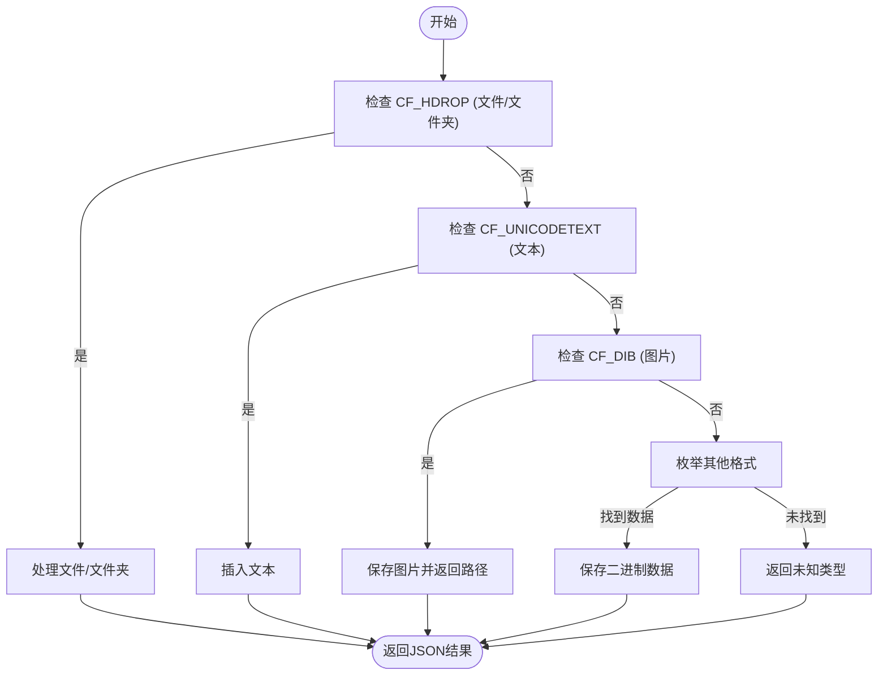
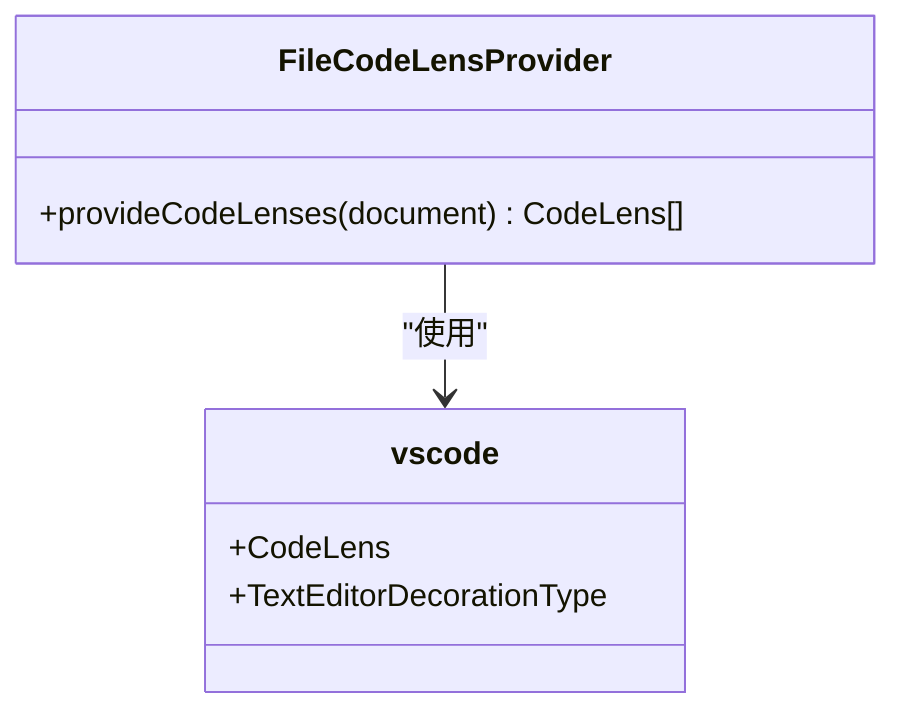

# Q1 智能粘贴功能

<cite>
**Referenced Files in This Document**   
- [src/q1.js](file://src\q1.js)
- [src/kp.py](file://src\kp.py)
- [Q1功能恢复报告.md](file://Q1功能恢复报告.md)
- [extension.js](file://extension.js)
- [src/qqq.js](file://src\qqq.js)
- [package.json](file://package.json)
</cite>

## 目录
1. [简介](#简介)
2. [核心架构与事件流](#核心架构与事件流)
3. [数据类型识别与处理逻辑](#数据类型识别与处理逻辑)
4. [图片预览与缩略图生成](#图片预览与缩略图生成)
5. [CodeLens 与块模式](#codelens-与块模式)
6. [关键实现与配置](#关键实现与配置)
7. [错误处理与性能优化](#错误处理与性能优化)

## 简介
Q1 智能粘贴功能是 VSCode 扩展中的核心模块，旨在提供一种智能、高效的粘贴体验。当用户在编辑器中按下 `Ctrl+V` 或 `Cmd+V` 时，该功能能够捕获剪贴板内容，根据内容类型（文本、图片、文件路径等）进行智能处理，并将结果以最直观的方式呈现给用户。本技术文档深入剖析了 `src/q1.js` 与 `kp.py` 之间的交互机制，详细解释了从事件捕获到最终渲染的完整流程。

## 核心架构与事件流
Q1 功能的实现依赖于一个清晰的前后端分离架构。前端（JavaScript）负责与 VSCode 编辑器交互，捕获用户命令并渲染结果；后端（Python）则负责与操作系统剪贴板直接通信，处理原始数据。

**Diagram sources**
- [src/q1.js](file://src\q1.js#L71-L73)
- [src/q1.js](file://src\q1.js#L35-L68)
- [src/q1.js](file://src\q1.js#L74-L136)
- [src/kp.py](file://src\kp.py#L418-L531)

**Section sources**
- [src/q1.js](file://src\q1.js#L1-L386)
- [src/kp.py](file://src\kp.py#L1-L532)
- [package.json](file://package.json#L1-L78)

## 数据类型识别与处理逻辑
`kp.py` 脚本是数据识别的核心。它通过 `handle_windows()` 函数，按优先级顺序检查剪贴板的多种格式，以确定内容类型。

### 识别流程
1.  **文件路径 (CF_HDROP)**: 首先检查剪贴板是否包含文件或文件夹路径。如果存在文件夹，直接返回路径文本。对于文件，会检查目标目录中是否存在同名文件。
2.  **Unicode 文本 (CF_UNICODETEXT)**: 如果没有文件，检查是否为纯文本。
3.  **图片截图 (CF_DIB)**: 如果没有文本，检查是否为位图图像（如截图）。
4.  **其他格式**: 作为兜底方案，枚举所有可用的剪贴板格式并尝试读取其二进制数据。

### 处理逻辑
根据识别出的类型，`kp.py` 会生成一个包含 `type` 字段的 JSON 对象，该对象被 `q1.js` 的 `handleResult()` 函数接收并处理：
- **`text`**: 直接将文本插入编辑器光标位置。
- **`image`**: 将图片路径（如 `[D:\view\p\2025.10.15五123Ab 14.22.30.png]`）作为占位符插入。
- **`file`**: 将多个文件的路径占位符以换行符连接后插入。
- **`folder_text`**: 直接插入文件夹路径文本。
- **`binary`**: 保存二进制数据并提示用户。

**Diagram sources**
- [src/kp.py](file://src\kp.py#L118-L400)
- [src/q1.js](file://src\q1.js#L74-L136)

**Section sources**
- [src/kp.py](file://src\kp.py#L118-L400)
- [src/q1.js](file://src\q1.js#L74-L136)

## 图片预览与缩略图生成
图片预览功能是 Q1 的亮点，它利用 `sharp` 库在前端生成缩略图，避免了直接加载大图导致的性能问题。

### 缩略图生成过程
1.  `q1.js` 的 `renderImages()` 函数扫描编辑器中的所有 `[路径]` 占位符。
2.  对于图片文件，它调用 `sharp` 库的 `resize()` 方法，将图片等比缩放至 **512x288** 像素。
3.  使用 `fit: "contain"` 和透明背景填充，确保图片完整显示且无变形。
4.  将处理后的图片转换为 Base64 编码的数据 URI。
5.  通过 `TextEditorDecorationType` 将图片作为装饰（decoration）显示在占位符下方。

### 显示样式
- **尺寸**: 518x294px (包含2px内边距和1px边框)。
- **背景**: 橙黄色 (`#fff3cd`)。
- **边框**: 1px 虚线 (`#888`)。
- **位置**: 通过负边距 (`-227px`) 实现靠左对齐。

**Section sources**
- [src/q1.js](file://src\q1.js#L135-L264)
- [Q1功能恢复报告.md](file://Q1功能恢复报告.md#L1-L82)

## CodeLens 与块模式
为了增强交互性，Q1 功能为每个 `[路径]` 占位符添加了可点击的 CodeLens。

### CodeLens 实现
- **提供者**: `FileCodeLensProvider` 类实现了 `provideCodeLenses` 方法。
- **触发条件**: 当光标悬停在 `[路径]` 上方时，会显示一个按钮。
- **按钮文本**: 文本内容由 `blockMode` 变量控制，正常模式为 "aaa"，块模式为 "qqq"。
- **点击行为**: 点击按钮会触发 `qqq.openFile` 命令，调用系统默认程序打开该文件。

### 切换块模式
`toggleBlockMode` 命令会切换 `blockMode` 的布尔值，并立即重新渲染所有编辑器。这会改变 CodeLens 的显示文本和图片预览的显示样式（如高度），为用户提供不同的视觉体验。

**Diagram sources**
- [src/q1.js](file://src\q1.js#L266-L290)
- [src/q1.js](file://src\q1.js#L310-L314)

**Section sources**
- [src/q1.js](file://src\q1.js#L266-L314)

## 关键实现与配置
### 占位符替换与二进制流处理
- **占位符替换**: `kp.py` 在处理文件时，会将原始文件路径替换为以时间戳命名的新路径（如 `2025.10.15五123Ab 14.22.30.png`），并返回 `[新路径]` 作为占位符。这确保了文件名的唯一性。
- **二进制流处理**: 对于无法识别的剪贴板格式，`kp.py` 会通过 `enum_and_try_read_hglobal()` 函数尝试读取其二进制流，并使用 `save_bytes()` 函数将其保存为 `.bin` 文件。

### 配置项
- **图片存储路径**: 所有粘贴的图片和文件均被保存到固定的 `D:\view\p\` 目录下。
- **依赖库**: `package.json` 中声明了对 `sharp` 库的依赖，用于图片处理。

**Section sources**
- [src/kp.py](file://src\kp.py#L12-L50)
- [src/kp.py](file://src\kp.py#L104-L116)
- [src/kp.py](file://src\kp.py#L4-L6)
- [package.json](file://package.json#L1-L78)

## 错误处理与性能优化
### 错误处理
- **Python 脚本失败**: 如果 `kp.py` 执行失败或返回错误，`q1.js` 会通过 `vscode.window.showErrorMessage()` 显示错误信息。
- **JSON 解析失败**: 若 `kp.py` 的输出无法解析为 JSON，会记录日志并提示用户。
- **文件不存在**: `renderImages()` 在渲染前会检查文件是否存在，避免因文件被删除而导致的错误。
- **Sharp 库缺失**: 如果 `sharp` 库未安装，会降级为直接显示原始图片，确保功能可用。

### 性能优化
- **防抖渲染 (Debounce)**: `debounceRender()` 函数确保在用户快速输入时，`renderImages()` 不会被频繁调用，从而避免性能卡顿。
- **可见区域渲染**: `renderImages()` 仅处理编辑器当前可视范围内的文本，减少了不必要的计算。
- **异步处理**: 图片的缩放和渲染是异步进行的，不会阻塞主线程。

**Section sources**
- [src/q1.js](file://src\q1.js#L345-L376)
- [src/q1.js](file://src\q1.js#L135-L264)
- [src/q1.js](file://src\q1.js#L35-L68)
- [src/q1.js](file://src\q1.js#L135-L264)