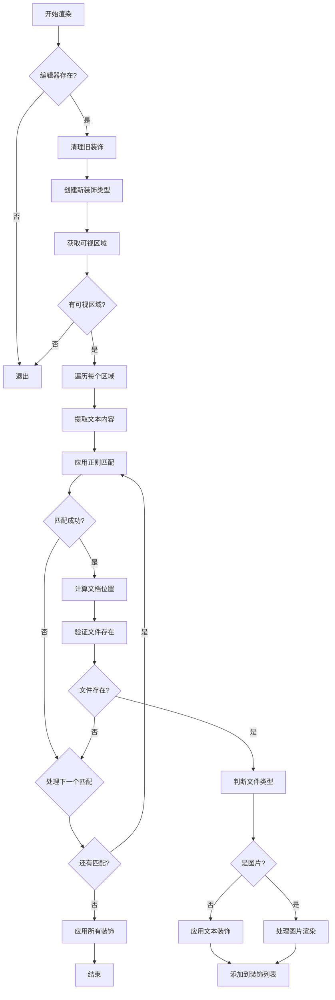
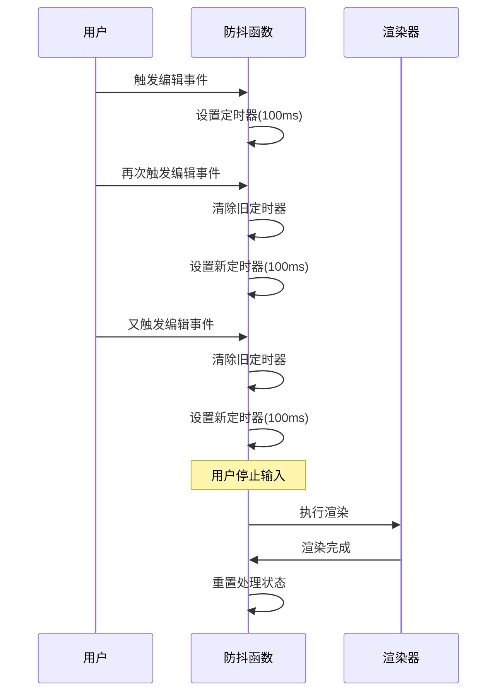

<!-- File: .qoder/repowiki/zh/content/Q1 智能粘贴功能/图片预览与渲染.md -->
# 图片预览与渲染

<cite>
**Referenced Files in This Document**
- [q1.js](file://src/q1.js)
- [extension.js](file://extension.js)
- [Q1功能恢复报告.md](file://Q1功能恢复报告.md)
</cite>

## 目录
1. [图片预览机制概述](#图片预览机制概述)
2. [路径匹配与正则表达式](#路径匹配与正则表达式)
3. [图像渲染流程](#图像渲染流程)
4. [Sharp库图像处理](#sharp库图像处理)
5. [降级处理方案](#降级处理方案)
6. [BlockMode对样式的影响](#blockmode对样式的影响)
7. [错误处理机制](#错误处理机制)
8. [防抖性能优化](#防抖性能优化)
9. [Async/Await修复重要性](#asyncawait修复重要性)

## 图片预览机制概述

q1模块实现了在VSCode编辑器中预览本地图片的功能。当用户粘贴包含特定格式路径的文本时，系统会自动识别并渲染图片缩略图。该功能通过`renderImages`函数实现，利用VSCode的`TextEditorDecorationType` API在文本下方嵌入图像预览，为用户提供直观的视觉反馈。

**Section sources**
- [q1.js](file://src/q1.js#L139-L303)

## 路径匹配与正则表达式

系统通过正则表达式识别符合`[D:\view\p\...]`格式的路径。正则模式`/\[([A-Za-z]:[\\\/]view[\\\/]p[\\\/][^\[\]]+)\]/gi`专门匹配以盘符开头、位于`view/p`目录下的文件路径。该模式确保只处理目标目录的资源，避免误匹配其他文本内容。匹配成功后，系统提取绝对路径并验证文件是否存在，只有存在的文件才会进行后续渲染处理。

**Section sources**
- [q1.js](file://src/q1.js#L155-L156)

## 图像渲染流程

`renderImages`函数负责整个渲染流程。首先清理旧的装饰，然后创建新的`TextEditorDecorationType`实例。函数遍历编辑器的可视区域，提取文本内容并应用正则匹配。对于每个匹配项，计算其在文档中的精确位置，创建装饰范围，并根据文件类型决定渲染方式。最终通过`editor.setDecorations`方法批量应用所有装饰，实现高效渲染。

**Diagram sources**
- [q1.js](file://src/q1.js#L139-L303)

## Sharp库图像处理

当`sharp`库可用时，系统会对原始图片进行专业处理。图片被调整为统一的512x288尺寸，采用`contain`模式保持宽高比，并在四周填充透明背景。处理后的图像转换为Data URI格式嵌入显示，确保跨环境一致性。Data URI通过`vscode.Uri.parse`创建，直接作为`contentIconPath`使用，避免了外部文件引用的潜在问题。

**Section sources**
- [q1.js](file://src/q1.js#L189-L215)

## 降级处理方案

在`sharp`库不可用或处理失败时，系统提供优雅的降级方案。直接使用`vscode.Uri.file(absPath)`指向原始文件路径，VSCode会尝试直接显示原图。此方案虽然无法统一尺寸，但保证了基本功能可用性。降级处理同时应用于`sharp`未安装和图片解码失败两种场景，确保用户体验的连续性。

**Section sources**
- [q1.js](file://src/q1.js#L216-L233)
- [q1.js](file://src/q1.js#L234-L251)

## BlockMode对样式的影响

`blockMode`是一个全局状态变量，影响图片预览的显示样式。在`blockMode`启用时，图片高度设置为自适应(`auto`)，允许完整显示大图；禁用时固定为148px，提供紧凑预览。边距方面，两种模式均使用`-227px`的负左边距实现靠左对齐，但`blockMode`的边距设置会动态响应状态变化，确保样式一致性。

**Section sources**
- [q1.js](file://src/q1.js#L17)
- [q1.js](file://src/q1.js#L220-L221)
- [q1.js](file://src/q1.js#L226-L227)

## 错误处理机制

系统实现了完善的错误处理机制。通过`try-catch`捕获`sharp`处理过程中的异常，如图片解码失败或格式不支持。错误发生时，记录警告日志但不中断整体渲染流程，转而使用降级方案显示原图。同时，文件不存在的情况在早期验证阶段就被过滤，避免不必要的处理开销，确保系统稳定运行。

**Section sources**
- [q1.js](file://src/q1.js#L234-L251)
- [q1.js](file://src/q1.js#L175-L177)

## 防抖性能优化

`debounceRender`函数实现了关键的防抖机制，防止频繁触发渲染导致性能问题。该函数通过`setTimeout`延迟执行，并利用`isProcessing`标志位阻止并发执行。当用户快速输入或编辑时，只会执行最后一次延迟的渲染，大幅减少CPU占用。此优化对于大文件或复杂文档的实时预览至关重要，确保编辑器响应流畅。

**Diagram sources**
- [q1.js](file://src/q1.js#L345-L366)

## Async/Await修复重要性

根据《Q1功能恢复报告》，`renderImages`函数曾因异步逻辑错误导致功能完全失效。关键修复是正确使用`async/await`处理`sharp`的异步操作。若缺少`await`，`toBuffer()`调用将返回Promise而非实际数据，导致后续处理失败。此修复证明了在异步编程中正确处理Promise链的重要性，确保图像处理完成后再进行Data URI转换和渲染。

**Section sources**
- [Q1功能恢复报告.md](file://Q1功能恢复报告.md#L1-L82)
- [q1.js](file://src/q1.js#L205-L206)