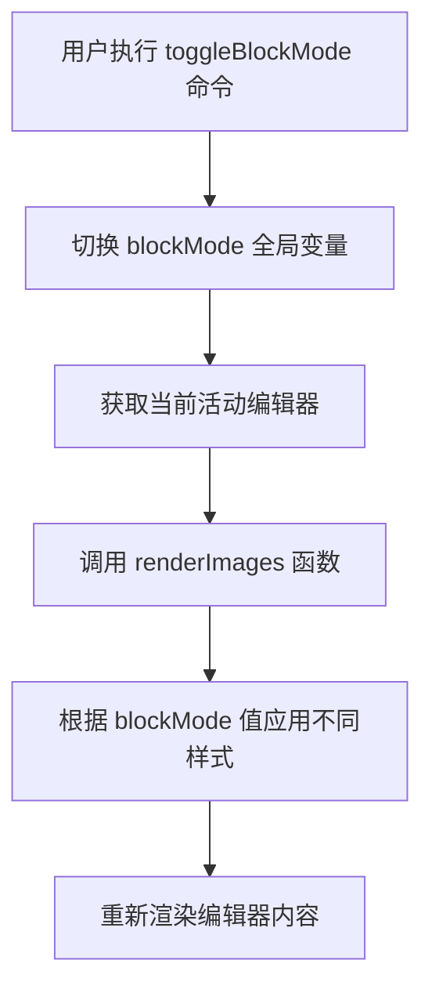

<!-- File: .qoder/repowiki/zh/content/Q1 智能粘贴功能/块模式切换功能.md -->
# 块模式切换功能

<cite>
**Referenced Files in This Document**
- [q1.js](file://src/q1.js)
- [extension.js](file://extension.js)
</cite>

## Table of Contents
1. [功能概述](#功能概述)
2. [实现原理](#实现原理)
3. [装饰器样式差异](#装饰器样式差异)
4. [状态持久性说明](#状态持久性说明)
5. [用户使用场景](#用户使用场景)
6. [功能联动说明](#功能联动说明)

## 功能概述
`toggleBlockMode` 命令是编辑器的一项核心功能，用于在会话期间动态切换两种不同的内容显示模式。该功能通过一个全局状态变量控制，能够即时改变图片和文件路径的视觉呈现方式，为用户提供灵活的查看体验。

**Section sources**
- [q1.js](file://src/q1.js#L310-L314)

## 实现原理
该功能的核心实现依赖于一个名为 `blockMode` 的全局布尔变量。当用户执行 `toggleBlockMode` 命令时，该变量的值会被取反（`blockMode = !blockMode`），从而实现状态的切换。

状态变更后，系统会立即获取当前活动的文本编辑器实例，并调用 `renderImages` 函数。`renderImages` 函数负责重新扫描编辑器中的所有内容，识别出图片和文件路径的标记，并根据当前 `blockMode` 的值应用不同的渲染样式。这种设计确保了状态变化能够实时、准确地反映在用户界面上。

**Diagram sources**
- [q1.js](file://src/q1.js#L310-L314)
- [q1.js](file://src/q1.js#L135-L264)

**Section sources**
- [q1.js](file://src/q1.js#L17-L17)
- [q1.js](file://src/q1.js#L310-L314)

## 装饰器样式差异
`blockMode` 的两种状态对图片和文件路径的显示布局产生了显著影响，主要体现在CSS属性的差异上。

在 `blockMode` 为 `true` 和 `false` 时，最核心的差异在于图片的高度（`height`）属性：
- **当 `blockMode` 为 `true` 时**：图片的 `height` 属性被设置为 `"auto"`，这意味着图片将按照其原始尺寸或内容自然高度进行显示，不受固定高度的限制。
- **当 `blockMode` 为 `false` 时**：图片的 `height` 属性被固定为 `"148px"`，这会强制图片显示在一个预设的高度内。

此外，`margin` 属性在两种模式下保持一致，均设置为 `"4px 0 4px -227px"`，通过负的左边距（`-227px`）使图片向左偏移，实现更靠左的布局效果。`width` 属性在 `blockMode` 为 `true` 时也为 `"auto"`，而在 `false` 时为 `"auto"` 或由其他逻辑决定。这些CSS属性的组合使用，使得用户可以在紧凑布局和原始尺寸布局之间自由切换。

**Section sources**
- [q1.js](file://src/q1.js#L135-L264)

## 状态持久性说明
`blockMode` 状态被设计为一个会话级的临时状态。这意味着该状态仅在当前VS Code会话期间有效。当用户关闭并重新打开编辑器时，`blockMode` 变量会被重新初始化为 `false`（在代码中定义为 `let blockMode = false;`）。该状态不会被写入任何配置文件或存储在本地持久化数据库中，因此不具备跨会话的持久性。这种设计简化了状态管理，避免了不必要的配置文件读写操作，符合其作为临时视图切换功能的定位。

**Section sources**
- [q1.js](file://src/q1.js#L17-L17)

## 用户使用场景
用户可以在多种场景下使用此功能：
1.  **快速预览**：当需要快速浏览文档中所有图片的缩略图时，可以保持 `blockMode` 为 `false`，以148px的固定高度紧凑显示，便于在有限空间内查看大量图片。
2.  **细节审查**：当需要仔细检查某张图片的原始细节时，可以切换 `blockMode` 为 `true`，让图片以自然高度（`auto`）显示，避免因压缩而丢失细节。
3.  **排版调整**：在编辑包含大量图片的文档时，用户可以随时切换模式，以评估不同显示模式对整体文档排版和阅读流畅性的影响。

## 功能联动说明
`blockMode` 状态不仅影响图片的显示，还与CodeLens功能产生联动。在 `FileCodeLensProvider` 类中，CodeLens按钮上显示的文本会根据 `blockMode` 的值动态变化：
- 当 `blockMode` 为 `true` 时，CodeLens 显示的文本为 "qqq"。
- 当 `blockMode` 为 `false` 时，CodeLens 显示的文本为 "aaa"。

这种联动设计为用户提供了额外的视觉反馈，使用户能够通过CodeLens上的文本变化，直观地感知当前所处的显示模式，增强了功能的可发现性和用户体验的一致性。

**Section sources**
- [q1.js](file://src/q1.js#L220-L230)