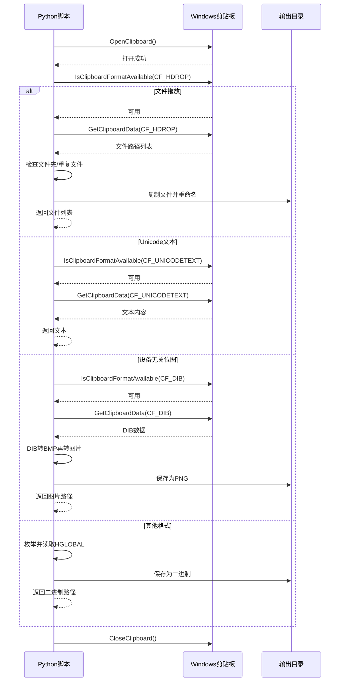
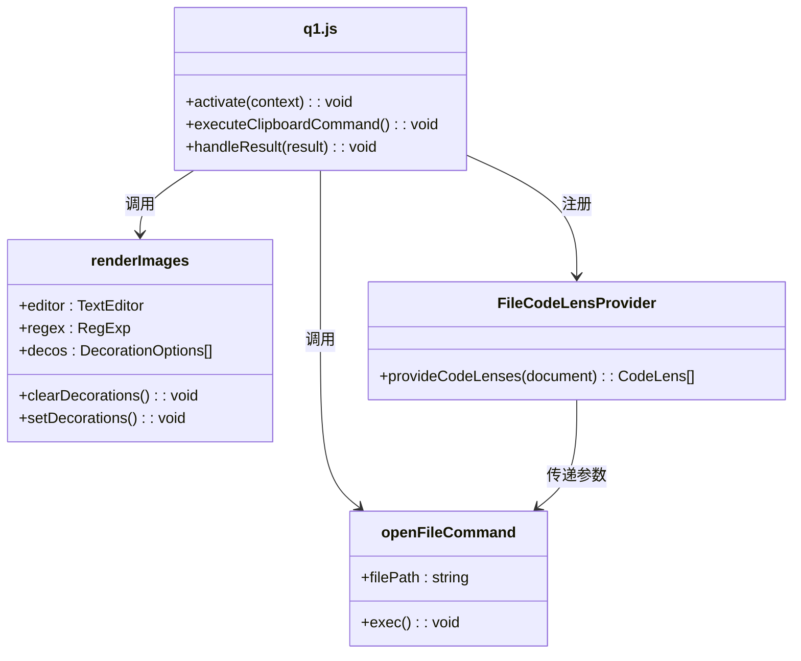

<!-- File: .qoder/repowiki/zh/content/Q1 智能粘贴功能/智能粘贴功能/数据类型处理机制.md -->
# 数据类型处理机制

<cite>
**Referenced Files in This Document**
- [kp.py](file://src/kp.py)
- [q1.js](file://src/q1.js)
- [命令统一验证报告.md](file://命令统一验证报告.md)
- [extension.js](file://extension.js)
</cite>

## 目录
1. [简介](#简介)
2. [Python端剪贴板数据识别](#python端剪贴板数据识别)
3. [MIME类型推断与安全存储](#mime类型推断与安全存储)
4. [JavaScript端渲染与交互](#javascript端渲染与交互)
5. [跨平台文件打开机制](#跨平台文件打开机制)

## 简介
本文档详细阐述了Q1模块对不同剪贴板数据类型的识别与处理机制。系统通过Python后端与JavaScript前端的协同工作，实现了对文件拖放、文本、图片等多种数据类型的智能识别、安全存储与可视化展示。核心流程包括：使用`win32clipboard`检测剪贴板格式，通过`guess_ext_by_magic`进行MIME类型推断，利用`get_timestamp_filename`策略安全存储，并在前端通过`renderImages`函数实现图片缩放与装饰层嵌入。

## Python端剪贴板数据识别

Q1模块的核心数据识别逻辑位于`kp.py`文件的`handle_windows`函数中。该函数通过`win32clipboard`库检测多种剪贴板格式，实现对不同数据类型的精准识别与解析。



**Diagram sources**
- [kp.py](file://src/kp.py#L118-L400)

**Section sources**
- [kp.py](file://src/kp.py#L118-L400)

### 文件拖放 (CF_HDROP)
当剪贴板包含`CF_HDROP`格式时，系统识别为文件拖放操作。函数首先获取文件路径列表，并检查是否存在文件夹。若存在，直接返回文件夹路径文本。对于文件，系统会检查目标目录中是否存在同名文件，若存在则通过`tkinter`弹出跨平台确认对话框，提供“打开文件夹”、“谨慎 !盖之”和“取消”选项，确保用户操作的明确性。

### Unicode文本 (CF_UNICODETEXT)
对于`CF_UNICODETEXT`格式，系统直接获取Unicode文本内容，并将其作为纯文本返回。这是处理复制粘贴文本内容的主要方式。

### 设备无关位图 (CF_DIB)
当剪贴板包含`CF_DIB`格式时，系统识别为图片截图。函数获取DIB（Device-Independent Bitmap）数据后，通过构造BMP文件头将其转换为标准BMP格式，再使用PIL库将其打开并保存为PNG格式的图片文件。图片文件使用`get_timestamp_filename`生成的唯一文件名保存至指定目录。

## MIME类型推断与安全存储

为了确保文件的安全存储与正确处理，系统实现了两层MIME类型推断机制，并采用时间戳重命名策略防止文件名冲突。


**Diagram sources**
- [kp.py](file://src/kp.py#L52-L116)

**Section sources**
- [kp.py](file://src/kp.py#L52-L116)

### MIME类型推断
系统通过`guess_ext_by_magic`函数进行MIME类型推断。该函数首先尝试使用`python-magic`库分析数据的魔数（magic number），根据返回的描述字符串判断文件类型。为确保兼容性，当`python-magic`不可用或无法识别时，会调用`guess_ext_by_magic_fallback`函数，通过预定义的字节签名列表进行匹配，如PNG的`\x89PNG`、JPEG的`\xff\xd8\xff`等。

### 安全存储策略
`save_bytes`函数负责将字节数据安全地保存到文件系统。对于图片文件，无论原始文件名如何，均使用`get_timestamp_filename`函数生成的唯一文件名进行保存，彻底避免了文件名冲突。非图片文件在无冲突时保留原始文件名，有冲突时同样采用时间戳命名。`get_timestamp_filename`生成的文件名包含年月日、星期几、毫秒、两个随机字母和时分秒，确保了极高的唯一性。

## JavaScript端渲染与交互

JavaScript端负责将Python端处理的结果可视化地展示在编辑器中，主要通过`renderImages`函数和`FileCodeLensProvider`实现。



**Diagram sources**
- [q1.js](file://src/q1.js#L135-L264)
- [q1.js](file://src/q1.js#L278-L290)
- [q1.js](file://src/q1.js#L292-L308)

**Section sources**
- [q1.js](file://src/q1.js#L135-L385)

### 图片渲染 (renderImages)
`renderImages`函数通过正则表达式`/\[([A-Za-z]:[\\\/]view[\\\/]p[\\\/][^\[\]]+)\]/gi`匹配文档中由方括号包围的路径标记。对于匹配到的图片路径，函数利用`sharp`库将图片缩放为512x288像素，并以内联Data URI的形式嵌入到编辑器的装饰层（decoration layer）中。装饰层使用虚线边框和橙黄色背景，使图片在编辑器中清晰可见。若`sharp`库未安装，则直接显示原始图片。

### 非图片文件交互
对于非图片文件，系统采用下划线样式进行标记。`renderImages`函数为非图片路径应用`textDecoration: "underline wavy #888"`的样式，使其在视觉上与普通文本区分开来。同时，`FileCodeLensProvider`为这些路径提供CodeLens功能，用户点击后可触发`qqq.openFile`命令。

## 跨平台文件打开机制

系统通过`openFileCommand`函数实现了跨平台的文件打开功能，该功能在`命令统一验证报告.md`中有明确的注册信息。

```mermaid
flowchart LR
A[openFileCommand] --> B{process.platform}
B --> |win32| C[cp.exec(`start "" "filePath"`)]
B --> |darwin| D[cp.exec(`open "filePath"`)]
B --> |其他| E[cp.exec(`xdg-open "filePath"`)]
C --> F[成功]
D --> F
E --> F
F --> G[文件打开]
C --> H[失败]
D --> H
E --> H
H --> I[vscode.env.openExternal(Uri)]
```

**Diagram sources**
- [q1.js](file://src/q1.js#L292-L308)
- [命令统一验证报告.md](file://命令统一验证报告.md#L1-L160)

**Section sources**
- [q1.js](file://src/q1.js#L292-L308)
- [命令统一验证报告.md](file://命令统一验证报告.md#L1-L160)

### 命令注册与实现
根据`命令统一验证报告.md`，`qqq.openFile`命令已在`package.json`和`src/q1.js`中正确注册。其实现逻辑根据运行平台选择不同的命令：
- **Windows**: 使用`start "" "filePath"`命令。
- **macOS**: 使用`open "filePath"`命令。
- **Linux**: 使用`xdg-open "filePath"`命令。
若命令执行失败，则回退到VS Code的`vscode.env.openExternal`API，确保文件能够被打开。