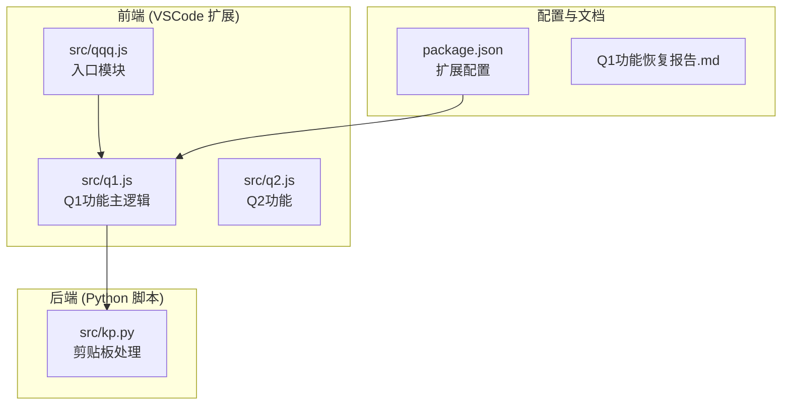
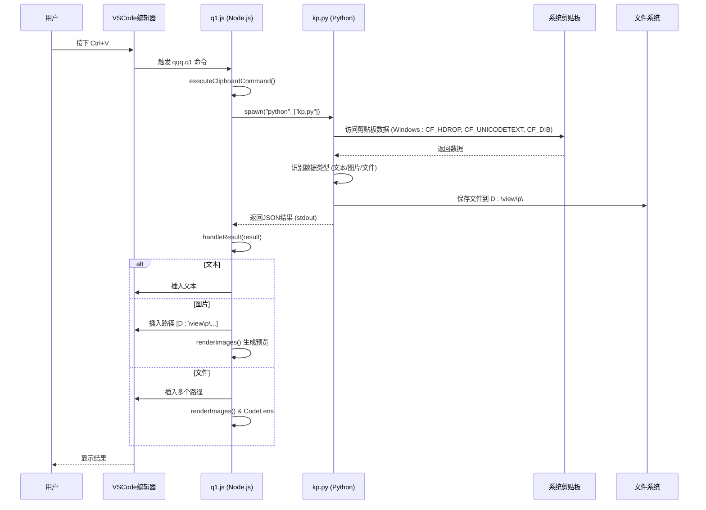
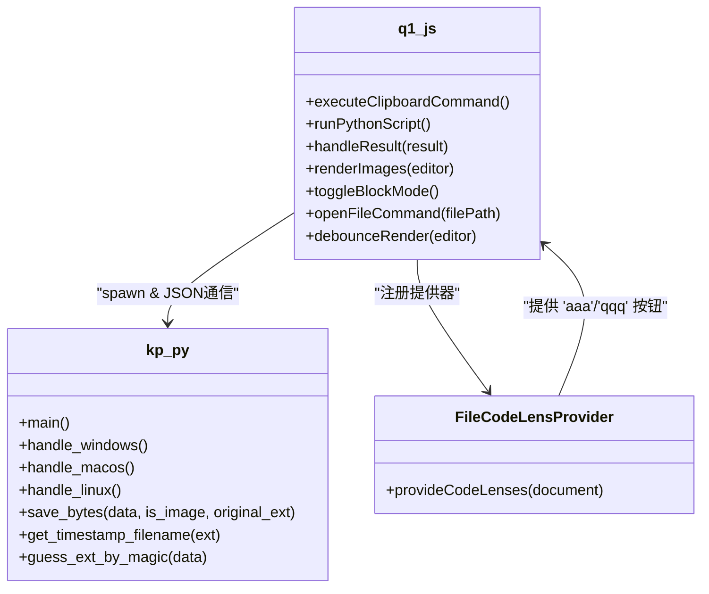
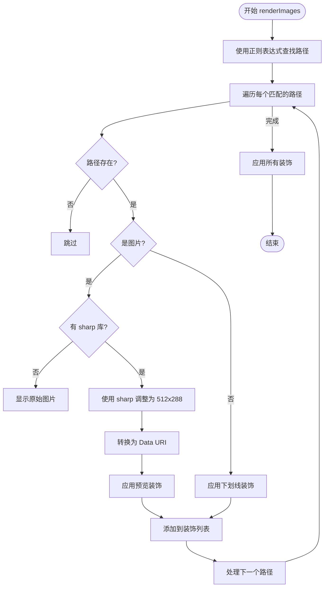
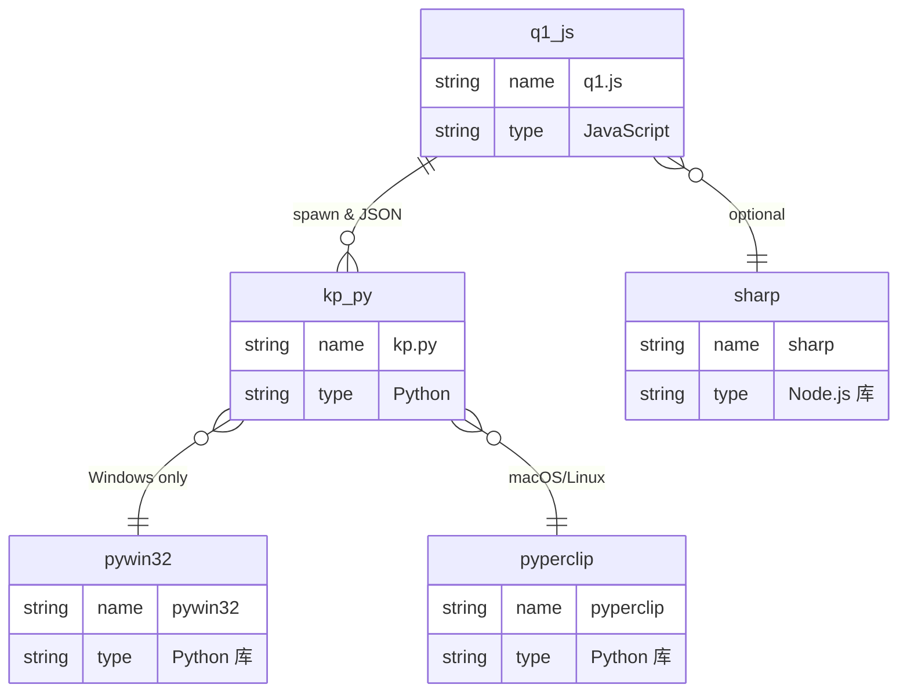

# 智能粘贴功能

<cite>
**Referenced Files in This Document**   
- [q1.js](file://src/q1.js)
- [kp.py](file://src/kp.py)
- [Q1功能恢复报告.md](file://Q1功能恢复报告.md)
- [qqq.js](file://src/qqq.js)
- [package.json](file://package.json)
</cite>

## 目录
1. [简介](#简介)
2. [项目结构](#项目结构)
3. [核心组件](#核心组件)
4. [架构概览](#架构概览)
5. [详细组件分析](#详细组件分析)
6. [依赖分析](#依赖分析)
7. [性能考量](#性能考量)
8. [故障排除指南](#故障排除指南)
9. [结论](#结论)

## 简介
本文档深入探讨了Q1智能粘贴功能的技术实现，重点分析了`src/q1.js`与`kp.py`之间的交互机制。该功能允许用户通过VSCode命令系统（Ctrl+V）触发粘贴操作，捕获剪贴板内容，并根据内容类型（文本、图片、文件路径）进行智能处理。文档详细阐述了事件处理流程、数据类型识别逻辑、图片预览生成、CodeLens功能以及配置项，并结合修复报告说明了关键实现细节。

## 项目结构
项目采用模块化设计，核心功能由`src`目录下的JavaScript和Python文件实现。`q1.js`作为VSCode扩展的主逻辑，负责与编辑器交互和UI渲染；`kp.py`作为后端脚本，负责访问系统剪贴板和文件操作。`qqq.js`是扩展的入口点，用于激活所有子模块。

**Diagram sources**
- [q1.js](file://src/q1.js)
- [kp.py](file://src/kp.py)
- [package.json](file://package.json)

**Section sources**
- [q1.js](file://src/q1.js)
- [kp.py](file://src/kp.py)
- [package.json](file://package.json)

## 核心组件
核心组件包括`q1.js`中的事件处理器、装饰器和命令，以及`kp.py`中的剪贴板数据处理逻辑。`q1.js`通过`vscode.commands`注册`qqq.q1`命令，该命令在用户按下Ctrl+V时被触发，进而调用`kp.py`脚本。`kp.py`脚本负责识别剪贴板内容类型，并将结果以JSON格式返回给`q1.js`进行后续处理。

**Section sources**
- [q1.js](file://src/q1.js#L71-L73)
- [kp.py](file://src/kp.py#L1-L532)

## 架构概览
系统架构为典型的前后端分离模式。VSCode扩展（前端）负责用户交互和UI展示，Python脚本（后端）负责系统级操作。两者通过标准输入/输出（stdin/stdout）进行通信。`q1.js`通过`child_process.spawn`启动`kp.py`，并将结果解析为JSON对象，根据对象的`type`字段执行不同的处理逻辑。

**Diagram sources**
- [q1.js](file://src/q1.js#L35-L68)
- [kp.py](file://src/kp.py#L1-L532)

## 详细组件分析
### Q1功能主逻辑分析
`q1.js`是Q1功能的核心，它实现了从命令注册到UI渲染的完整流程。

#### 事件处理与命令注册
`q1.js`通过`activate`函数注册了三个核心命令：`qqq.q1`（主粘贴命令）、`qqq.toggleBlockMode`（切换显示模式）和`qqq.openFile`（打开文件）。`qqq.q1`命令被绑定到`Ctrl+V`快捷键，其执行流程由`executeClipboardCommand`函数定义，该函数调用`runPythonScript`来启动`kp.py`。

**Diagram sources**
- [q1.js](file://src/q1.js#L1-L386)
- [kp.py](file://src/kp.py#L1-L532)

**Section sources**
- [q1.js](file://src/q1.js#L1-L386)
- [kp.py](file://src/kp.py#L1-L532)

#### 数据处理与结果分发
`handleResult`函数是处理`kp.py`返回结果的中枢。它根据`result.type`字段的值，执行不同的分支逻辑：
- **文本 (text)**: 直接插入到编辑器光标位置。
- **文件夹路径 (folder_text)**: 直接插入路径文本，不进行任何修饰。
- **图片 (image)**: 在光标处插入形如`[D:\view\p\...]`的路径标记。
- **文件 (file)**: 插入所有复制文件的路径标记，每个文件一行。
- **二进制 (binary)**: 通知用户二进制数据已保存。

在插入路径标记后，`handleResult`会调用`renderImages`函数，触发图片预览的渲染。

#### 图片预览与CodeLens功能
`renderImages`函数负责在编辑器中为图片路径生成预览。它使用正则表达式`/\[([A-Za-z]:[\\\/]view[\\\/]p[\\\/][^\[\]]+)\]/gi`匹配所有位于`D:\view\p\`目录下的路径。对于匹配到的图片路径，它会利用`sharp`库将图片调整为512x288的尺寸，并将其转换为Data URI嵌入到装饰器中，从而在编辑器内显示缩略图。如果`sharp`库未安装，则直接显示原始图片。

同时，`FileCodeLensProvider`类为所有有效的路径标记（无论是图片还是其他文件）提供了CodeLens功能。在路径上方会显示一个“aaa”或“qqq”的按钮，点击该按钮会触发`qqq.openFile`命令，调用系统默认程序打开该文件。

**Diagram sources**
- [q1.js](file://src/q1.js#L135-L303)
- [q1.js](file://src/q1.js#L266-L290)

**Section sources**
- [q1.js](file://src/q1.js#L135-L303)
- [q1.js](file://src/q1.js#L266-L290)

## 依赖分析
`q1.js`模块依赖于Node.js的核心模块（`vscode`, `child_process`, `path`, `fs`）以及第三方库`sharp`。`sharp`库是可选依赖，用于生成高质量的图片预览。`kp.py`脚本在Windows上依赖`pywin32`库来访问剪贴板，在macOS和Linux上则依赖`pyperclip`和系统命令（`pbpaste`, `xclip`）。

**Diagram sources**
- [q1.js](file://src/q1.js#L1-L10)
- [kp.py](file://src/kp.py#L1-L20)
- [package.json](file://package.json#L70-L72)

**Section sources**
- [q1.js](file://src/q1.js#L1-L10)
- [kp.py](file://src/kp.py#L1-L20)
- [package.json](file://package.json#L70-L72)

## 性能考量
系统通过多种机制优化性能：
1.  **防抖渲染 (Debounce Rendering)**: `debounceRender`函数确保`renderImages`不会在短时间内被频繁调用，避免了因用户快速输入而导致的性能瓶颈。
2.  **可见区域渲染**: `renderImages`函数只处理编辑器当前可视范围内的文本，大大减少了需要处理的路径数量。
3.  **异步处理**: 图片的缩放和转换操作是异步的，不会阻塞主线程，保证了编辑器的响应性。

## 故障排除指南
- **问题**: 图片预览不显示或显示为原始尺寸。
  - **原因**: `sharp`库未正确安装。
  - **解决方案**: 确保`node_modules`目录下存在`sharp`库，并且其平台特定的二进制文件已正确编译。

- **问题**: 粘贴操作无响应。
  - **原因**: `kp.py`脚本不存在或Python环境未配置。
  - **解决方案**: 检查`src/kp.py`文件是否存在，并确认系统中已安装Python且`python`命令可在命令行中执行。

- **问题**: 复制的文件未被正确处理。
  - **原因**: `pywin32`库未安装（Windows）。
  - **解决方案**: 运行`pip install pywin32`进行安装。

**Section sources**
- [q1.js](file://src/q1.js#L35-L68)
- [kp.py](file://src/kp.py#L1-L532)
- [Q1功能恢复报告.md](file://Q1功能恢复报告.md)

## 结论
Q1智能粘贴功能通过`q1.js`和`kp.py`的紧密协作，实现了高效、智能的剪贴板内容处理。其架构清晰，职责分离明确。通过利用VSCode的装饰器和CodeLens API，为用户提供了直观的图片预览和便捷的文件操作功能。结合`Q1功能恢复报告.md`中的修复细节，该功能已完全恢复并稳定运行。未来可考虑增加更多配置选项，如自定义图片尺寸、存储路径等，以提升用户体验。