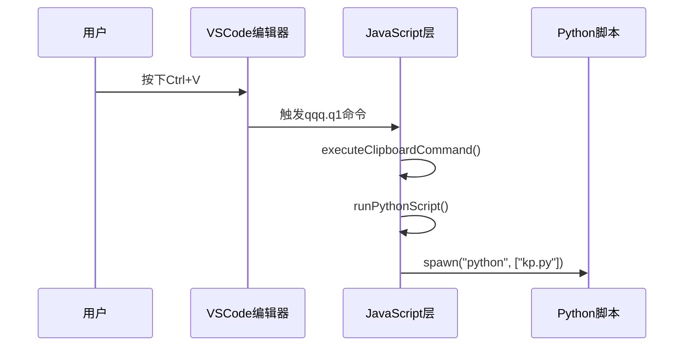
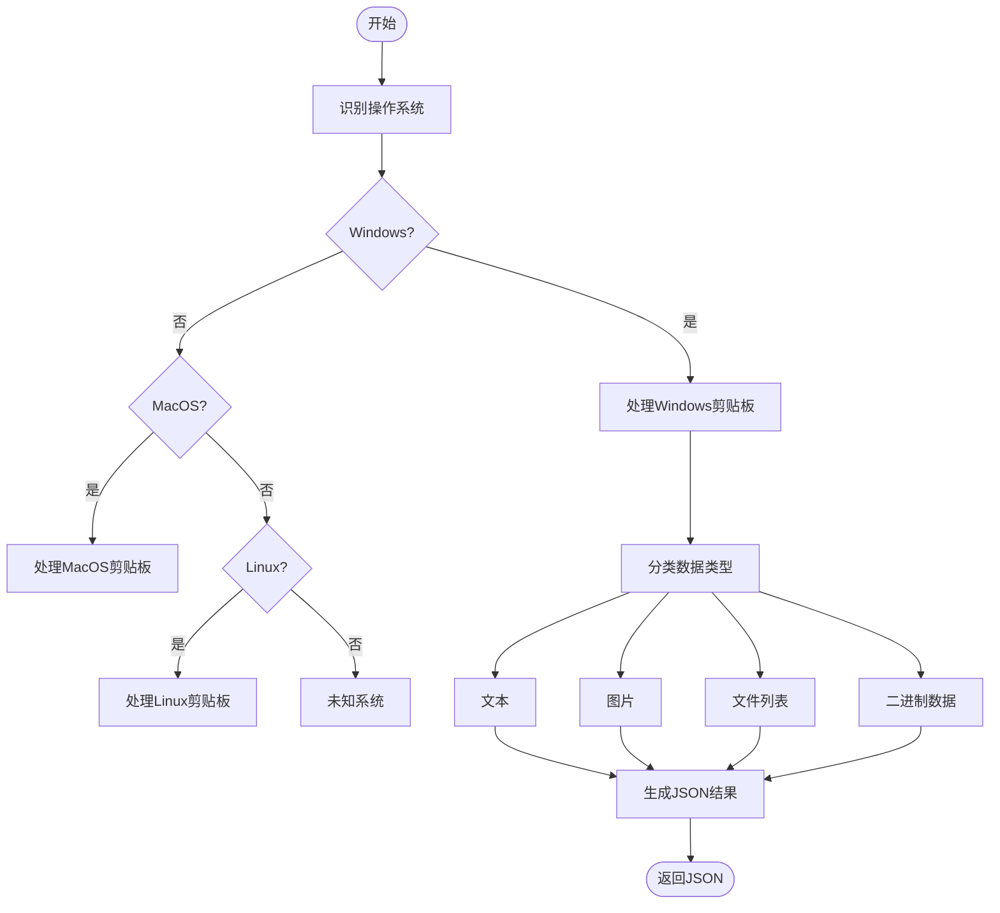
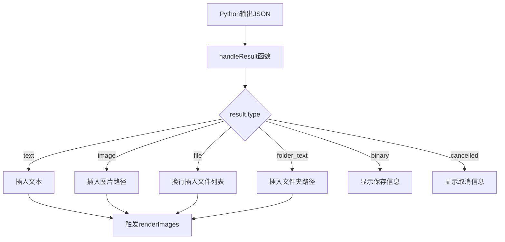
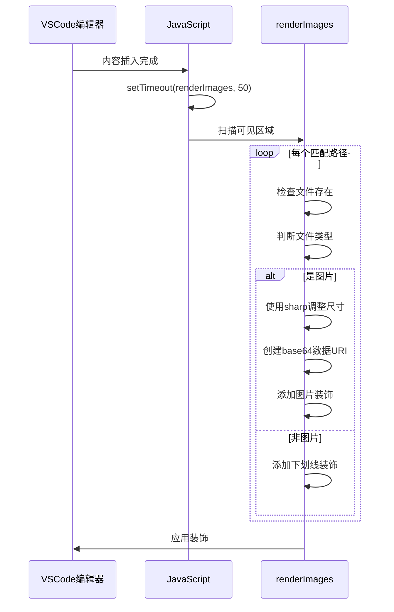

# 粘贴工作流程

<cite>
**Referenced Files in This Document**  
- [src/qqq.js](file://src/qqq.js)
- [src/q1.js](file://src/q1.js)
- [src/kp.py](file://src/kp.py)
- [Q1功能恢复报告.md](file://Q1功能恢复报告.md)
</cite>

## 目录
1. [触发与命令激活](#触发与命令激活)
2. [JavaScript层执行流程](#javascript层执行流程)
3. [Python脚本跨平台处理](#python脚本跨平台处理)
4. [结果分发与内容插入](#结果分发与内容插入)
5. [异步渲染与装饰机制](#异步渲染与装饰机制)
6. [错误处理与用户交互](#错误处理与用户交互)

## 触发与命令激活

当用户在VSCode编辑器中按下Ctrl+V时，`qqq.q1`命令被触发。该命令通过`extension.js`中的模块激活机制注册，最终调用`src/q1.js`中的`executeClipboardCommand`函数。

**Section sources**
- [src/qqq.js](file://src/qqq.js#L71-L73)
- [src/q1.js](file://src/q1.js#L71-L73)

## JavaScript层执行流程

`executeClipboardCommand`函数调用`runPythonScript`函数启动Python脚本`kp.py`。该过程通过Node.js的`child_process.spawn`方法异步执行，并设置UTF-8编码环境变量以确保中文字符正确处理。

**Diagram sources**
- [src/q1.js](file://src/q1.js#L31-L69)

**Section sources**
- [src/q1.js](file://src/q1.js#L31-L87)

## Python脚本跨平台处理

`kp.py`脚本根据操作系统类型分别处理剪贴板内容：

- **Windows**: 使用`win32clipboard`读取CF_HDROP（文件列表）、CF_UNICODETEXT（文本）、CF_DIB（图片）
- **MacOS**: 使用`pbpaste -Prefer png`获取图片，`pyperclip`获取文本
- **Linux**: 使用`xclip`获取图片，`pyperclip`获取文本

脚本将不同类型的剪贴板数据保存到`D:/view/p`目录，并生成包含`type`字段的JSON结果。

**Diagram sources**
- [src/kp.py](file://src/kp.py#L200-L250)

**Section sources**
- [src/kp.py](file://src/kp.py#L1-L531)

## 结果分发与内容插入

Python脚本执行完成后，其标准输出通过`child.stdout.on("data")`事件收集，并在进程结束时由`handleResult`函数解析JSON结果，根据`result.type`字段分发处理：

- `text`: 直接插入文本内容
- `image`: 插入图片路径标记`[D:\view\p\...]`
- `file`: 将文件路径列表换行插入
- `folder_text`: 插入文件夹路径文本
- `binary`: 显示二进制文件保存信息

**Diagram sources**
- [src/q1.js](file://src/q1.js#L75-L132)

**Section sources**
- [src/q1.js](file://src/q1.js#L75-L132)

## 异步渲染与装饰机制

内容插入后，通过`setTimeout`延迟50毫秒调用`renderImages`函数，实现异步渲染。该函数扫描编辑器中所有`[D:\view\p\...]`格式的路径，为图片文件创建内联预览装饰，为其他文件添加下划线装饰。

**Diagram sources**
- [src/q1.js](file://src/q1.js#L135-L264)

**Section sources**
- [src/q1.js](file://src/q1.js#L135-L385)
- [Q1功能恢复报告.md](file://Q1功能恢复报告.md#L1-L81)

## 错误处理与用户交互

整个工作流程包含多层错误处理机制：
- Python脚本异常捕获并返回错误JSON
- JSON解析失败时记录日志
- 子进程非零退出码显示错误消息
- 图片处理异常降级为原始显示

当复制的文件已存在时，脚本会弹出确认对话框，提供"打开文件夹"、"谨慎!盖之"和"取消"选项，确保用户对文件覆盖有完全控制权。

**Section sources**
- [src/q1.js](file://src/q1.js#L45-L69)
- [src/kp.py](file://src/kp.py#L100-L150)
- [Q1功能恢复报告.md](file://Q1功能恢复报告.md#L1-L81)