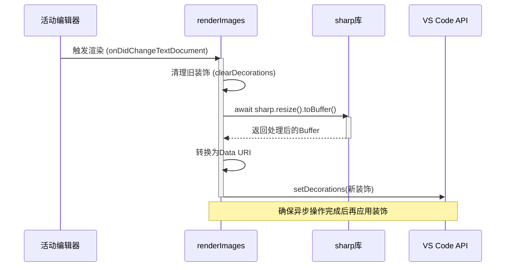
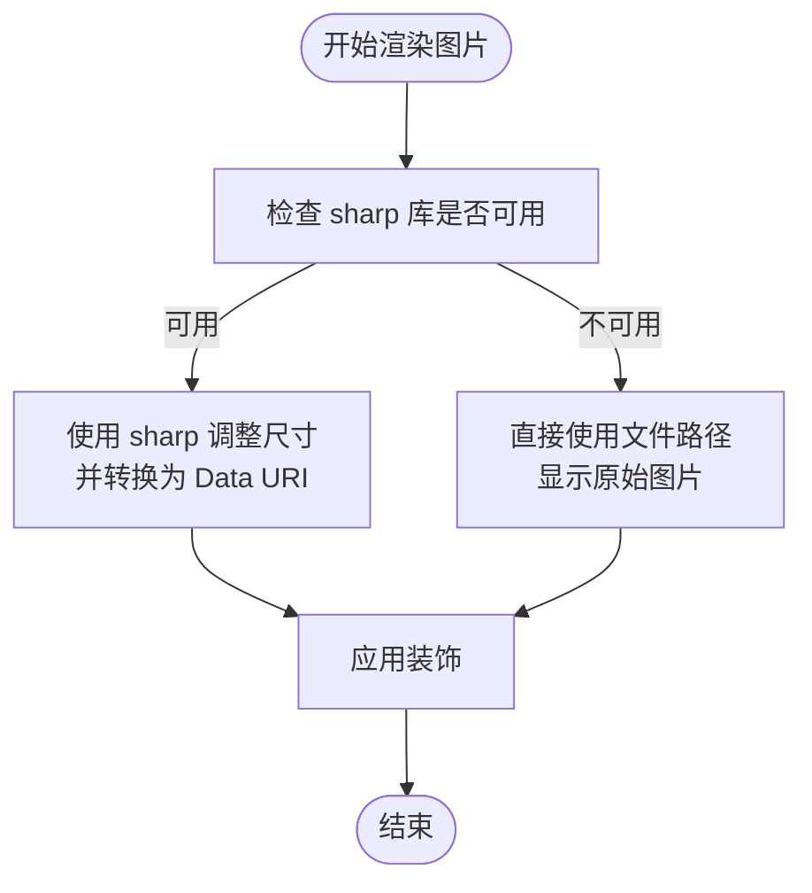
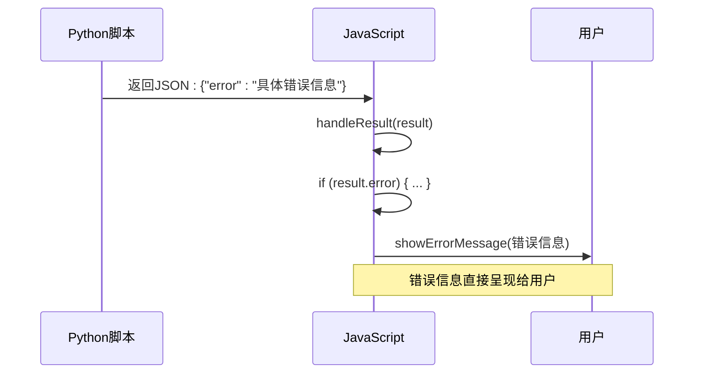
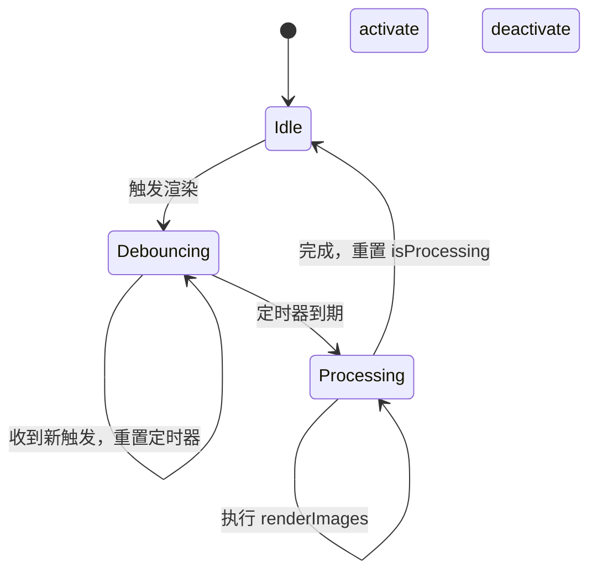

# 错误处理与恢复机制

<cite>
**Referenced Files in This Document**   
- [Q1功能恢复报告.md](file://Q1功能恢复报告.md)
- [src/q1.js](file://src/q1.js)
- [src/kp.py](file://src/kp.py)
- [extension.js](file://extension.js)
</cite>

## 目录
1. [引言](#引言)
2. [JavaScript层错误处理](#javascript层错误处理)
3. [Python层异常捕获](#python层异常捕获)
4. [系统恢复机制](#系统恢复机制)
5. [常见故障场景与修复](#常见故障场景与修复)

## 引言

本文档系统性地阐述了Q1智能粘贴功能的错误处理与系统恢复机制。基于《Q1功能恢复报告.md》中提到的历史问题，深入分析了异步渲染导致装饰器失效的根本原因，并详细说明了通过引入`async/await`和防抖机制（`debounceRender`）解决竞态条件的方案。文档还描述了在关键依赖缺失（如sharp库、pywin32）时的降级处理策略，以及从Python脚本到JavaScript前端的完整错误传递与用户提示流程。特别说明了文件覆盖确认对话框的实现原理及其对主流程的中断与恢复逻辑。

**Section sources**
- [Q1功能恢复报告.md](file://Q1功能恢复报告.md)

## JavaScript层错误处理

### 异步渲染与竞态条件修复

在`renderImages`函数中，异步渲染导致装饰器（decorations）失效的根本原因是未正确处理`sharp`库的异步调用。原始代码中，`sharp`的`resize`和`toBuffer`操作是异步的，但未使用`await`关键字，导致函数在图片处理完成前就执行了`setDecorations`，从而应用了不完整或错误的装饰。

通过引入`async/await`语法，确保了异步操作的顺序执行。`renderImages`函数被声明为`async`，并在调用`sharp`方法时使用`await`，使JavaScript运行时暂停执行，直到图片处理完成并返回`buffer`。这从根本上解决了因异步操作未完成而导致的竞态条件问题。

**Diagram sources**
- [src/q1.js](file://src/q1.js#L139-L303)

**Section sources**
- [src/q1.js](file://src/q1.js#L139-L303)
- [Q1功能恢复报告.md](file://Q1功能恢复报告.md)

### 依赖缺失的降级处理

当`sharp`库未安装时，系统不会崩溃，而是优雅地降级为直接显示原始图片。这一机制通过`try-catch`块和条件判断实现。

在`src/q1.js`文件的开头，代码尝试导入`sharp`库。如果导入失败（例如，库未通过`npm install`安装），`sharp`变量将被设置为`null`，同时在控制台输出一条日志信息。

在`renderImages`函数中，当处理图片时，会检查`sharp`变量是否为`null`。如果为`null`，则跳过使用`sharp`进行图片尺寸调整的逻辑，直接使用`vscode.Uri.file(absPath)`将文件路径作为`contentIconPath`，从而在编辑器中显示原始图片。这种方式确保了核心功能（显示图片）在缺少优化库的情况下依然可用。

**Diagram sources**
- [src/q1.js](file://src/q1.js#L152-L303)

**Section sources**
- [src/q1.js](file://src/q1.js#L152-L303)

### 用户错误提示

JavaScript层通过`handleResult`函数处理来自Python脚本的错误。当Python脚本执行失败或返回错误信息时，其输出的JSON中会包含一个`error`字段。

`handleResult`函数首先检查`result`对象中是否存在`error`字段。如果存在，函数会调用`vscode.window.showErrorMessage(result.error)`，将错误信息以弹窗的形式展示给用户。同时，该错误信息也会被记录到日志文件中。

这种设计确保了用户能够及时获知操作失败的原因，例如“pywin32 not installed”或“脚本不存在”，而无需查看控制台日志。

**Diagram sources**
- [src/q1.js](file://src/q1.js#L74-L136)

**Section sources**
- [src/q1.js](file://src/q1.js#L74-L136)

## Python层异常捕获

### 外部依赖异常处理

Python脚本`kp.py`在处理Windows剪贴板时，依赖于`pywin32`库。如果该库未安装，脚本会捕获`ImportError`异常，并返回一个包含错误信息的JSON对象：`{"error": "pywin32 not installed. pip install pywin32"}`。

此错误信息会沿着调用链传递到JavaScript层，最终通过`vscode.window.showErrorMessage`展示给用户，指导用户如何解决问题。

### 剪贴板与文件系统异常

脚本在操作剪贴板和文件系统时，使用了细粒度的`try-except`块来捕获特定异常。

- **剪贴板锁定**：在调用`wcb.OpenClipboard()`后，脚本会将其包裹在`try-finally`块中。即使在处理过程中发生任何异常，`finally`块中的`wcb.CloseClipboard()`都会被调用，确保剪贴板句柄被正确释放，防止资源泄漏和后续操作被锁定。
- **文件冲突**：当复制文件到目标目录时，脚本会预先检查目标文件是否已存在。如果存在，脚本会中断当前的复制流程，并通过`tkinter`创建一个图形化对话框，将控制权交给用户进行决策。

### JSON错误返回模式

Python脚本的错误处理遵循统一的模式：在`main()`函数的顶层`try-except`块中捕获所有未处理的异常，并将其转换为一个标准的JSON响应。

无论异常发生在哪个环节（如导入库、读取剪贴板、文件操作），最终都会执行`print(json.dumps({"error": str(e)}, ensure_ascii=False))`。这保证了JavaScript层接收到的输出始终是有效的JSON格式，且错误信息以`error`字段的形式存在，便于`handleResult`函数进行统一处理。

**Section sources**
- [src/kp.py](file://src/kp.py#L1-L532)

## 系统恢复机制

### 防抖机制（debounceRender）

`debounceRender`函数是防止系统过载的关键恢复机制。它通过限制`renderImages`函数的执行频率来解决因频繁触发导致的性能问题和潜在的竞态条件。

该机制的核心是使用`setTimeout`和一个状态标志`debounceRender.isProcessing`。当编辑器内容发生变化时，`debounceRender`被调用。它首先检查`isProcessing`标志，如果为`true`，则立即返回，忽略新的触发。否则，它会设置一个定时器，在`delay`毫秒后执行渲染。如果在定时器触发前再次调用`debounceRender`，则会清除旧的定时器并创建一个新的，从而将执行推迟。

在渲染开始时，`isProcessing`被设置为`true`，防止在此期间新的触发。渲染完成后，通过`Promise.resolve().then()`和`finally`块，确保无论成功与否，都会在50毫秒后将`isProcessing`重置为`false`，恢复系统对新触发的响应能力。

**Diagram sources**
- [src/q1.js](file://src/q1.js#L345-L366)

**Section sources**
- [src/q1.js](file://src/q1.js#L345-L366)
- [Q1功能恢复报告.md](file://Q1功能恢复报告.md)

### 文件覆盖确认与流程中断

当检测到目标目录中存在同名文件时，Python脚本会使用`tkinter`库创建一个模态对话框。这个对话框实现了主流程的中断。

- **中断逻辑**：脚本在复制文件前进行检查，一旦发现冲突，立即停止后续的复制操作，并启动`tkinter`事件循环。此时，Python脚本的执行被阻塞，等待用户在对话框上做出选择。
- **恢复逻辑**：用户的选择（覆盖、取消、打开文件夹）通过一个`result_var`变量传递。当用户点击按钮后，对话框被销毁，`result_var`被赋值，`tkinter`事件循环结束，Python脚本从阻塞点恢复执行。脚本根据`result_var`的值决定是继续覆盖操作、取消整个粘贴流程，还是打开文件夹并取消操作。

这种设计将决策权交给了用户，避免了文件被意外覆盖，同时通过模态对话框确保了流程的清晰和可控。

**Section sources**
- [src/kp.py](file://src/kp.py#L1-L532)

## 常见故障场景与修复

以下表格总结了常见故障场景的复现步骤与修复建议。

| 故障场景 | 复现步骤 | 修复建议 |
| :--- | :--- | :--- |
| **`sharp`库缺失导致图片不显示** | 1. 卸载`sharp`库 (`npm uninstall sharp`) 2. 尝试粘贴图片 | 重新安装`sharp`库：`npm install sharp`。若因环境问题无法安装，系统将自动降级为显示原始图片。 |
| **`pywin32`库缺失导致粘贴失败** | 1. 在Windows系统上卸载`pywin32`库 (`pip uninstall pywin32`) 2. 尝试粘贴文本或图片 | 安装`pywin32`库：`pip install pywin32`。安装后重启VS Code。 |
| **剪贴板被锁定** | 1. 在另一个程序（如资源管理器）中复制大量文件，保持剪贴板打开状态 2. 尝试使用Q1功能粘贴 | 关闭占用剪贴板的程序，释放资源。脚本的`finally`块会确保异常时释放句柄。 |
| **文件覆盖冲突** | 1. 复制一个名为`test.png`的图片 2. 在目标目录`D:\view\p\`中手动创建一个同名文件 3. 再次粘贴该图片 | 在弹出的“文件覆盖确认”对话框中，选择“谨慎 !盖之”以覆盖，或选择“打开文件夹”进行手动管理。 |
| **Python脚本路径错误** | 1. 将`kp.py`文件移动或重命名 2. 尝试使用Q1功能 | 检查`src/q1.js`中的`scriptPath`，确保`kp.py`位于正确路径。参考`Q1功能恢复报告.md`进行修复。 |

**Section sources**
- [src/q1.js](file://src/q1.js)
- [src/kp.py](file://src/kp.py)
- [Q1功能恢复报告.md](file://Q1功能恢复报告.md)