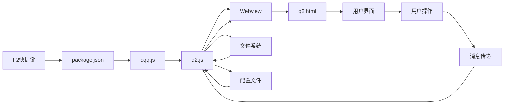
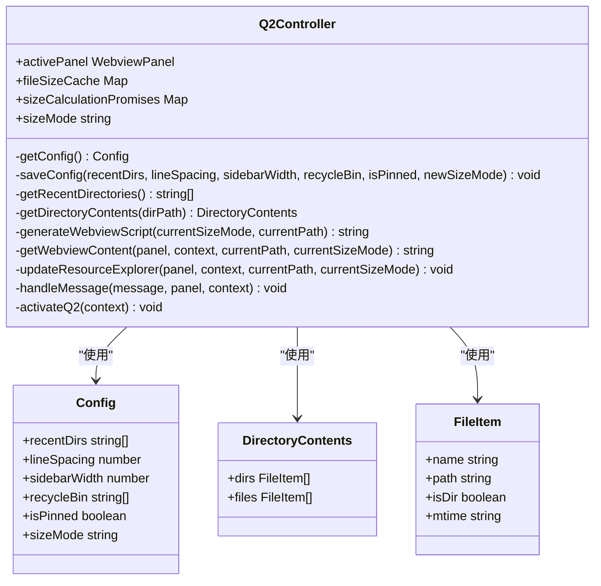
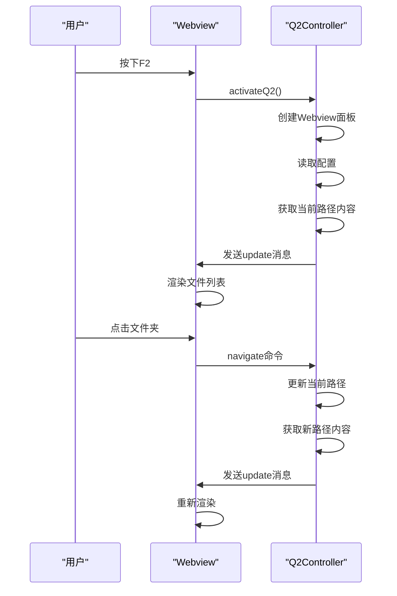
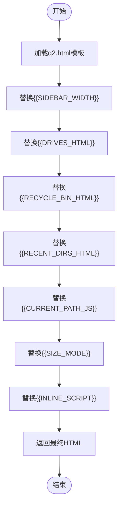
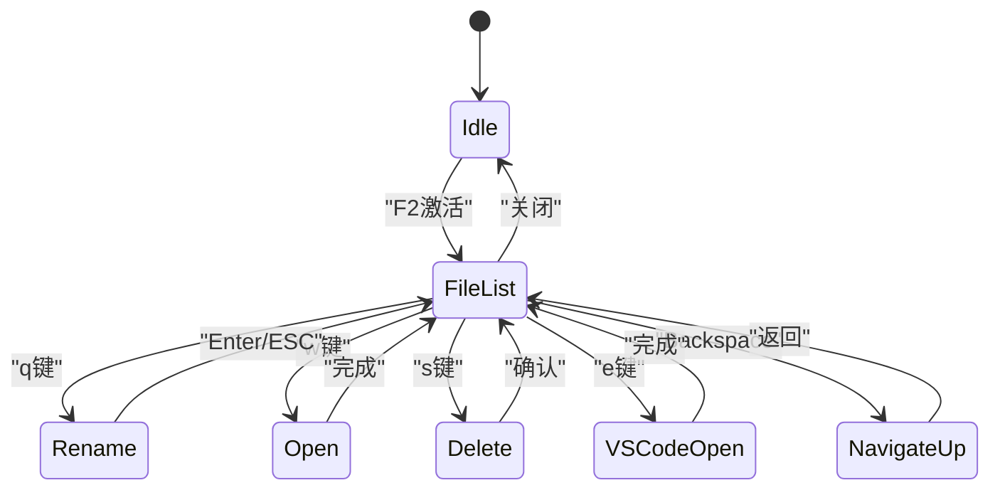
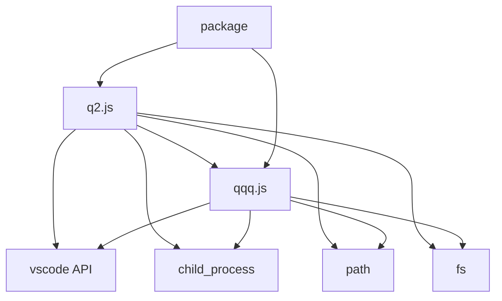

# Q2 文件导航功能

<cite>
**Referenced Files in This Document**  
- [q2.js](file://src/q2.js)
- [q2.html](file://src/q2.html)
- [qqq.js](file://src/qqq.js)
- [package.json](file://package.json)
- [q2界面完全修复报告.md](file://q2界面完全修复报告.md)
</cite>

## 目录
1. [简介](#简介)
2. [项目结构](#项目结构)
3. [核心组件](#核心组件)
4. [架构概述](#架构概述)
5. [详细组件分析](#详细组件分析)
6. [依赖分析](#依赖分析)
7. [性能考虑](#性能考虑)
8. [故障排除指南](#故障排除指南)
9. [结论](#结论)

## 简介
Q2 文件导航功能是VSCode扩展中的核心模块，提供了一个独立的Webview对话框，用于文件浏览、目录切换和文件操作。该功能通过F2快捷键激活，实现了与VSCode编辑器的无缝集成。系统采用MVC架构，其中q2.js作为控制器处理业务逻辑，q2.html作为视图模板负责UI渲染。功能包括可拖动侧边栏、文件大小显示、历史记录管理和多种文件操作，为用户提供了一个高效、直观的文件导航体验。

## 项目结构
Q2功能的项目结构清晰，遵循模块化设计原则。核心文件位于src目录下，包括q2.js控制器、q2.html视图模板和qqq.js主入口文件。配置文件位于E:\r\pz.ini，日志文件位于D:\view\p\kp.log。package.json定义了扩展的元数据和命令绑定。

```mermaid
graph TB
subgraph "源代码"
q2js[q2.js]
q2html[q2.html]
qqqjs[qqq.js]
end
subgraph "配置与资源"
config[pz.ini]
log[kp.log]
end
subgraph "扩展清单"
package[package.json]
end
q2js --> qqqjs : "被导入"
q2html --> q2js : "被加载"
package --> q2js : "命令绑定"
q2js --> config : "读写配置"
q2js --> log : "日志记录"
```

**Diagram sources**
- [q2.js](file://src/q2.js)
- [q2.html](file://src/q2.html)
- [qqq.js](file://src/qqq.js)
- [package.json](file://package.json)

**Section sources**
- [q2.js](file://src/q2.js)
- [q2.html](file://src/q2.html)
- [package.json](file://package.json)

## 核心组件
Q2文件导航功能的核心组件包括q2.js控制器和q2.html视图模板。q2.js负责处理所有业务逻辑，包括文件系统操作、配置管理、消息传递和Webview生命周期管理。q2.html是一个纯HTML/CSS模板，使用占位符系统实现动态内容注入。两个组件通过VSCode的Webview API进行通信，实现了关注点分离的设计原则。

**Section sources**
- [q2.js](file://src/q2.js)
- [q2.html](file://src/q2.html)

## 架构概述
Q2功能采用典型的MVC（Model-View-Controller）架构模式。q2.js作为控制器，协调模型（文件系统和配置）与视图（q2.html）之间的交互。系统通过消息传递机制实现双向通信：控制器向视图发送更新消息，视图向控制器发送用户操作命令。



**Diagram sources**
- [q2.js](file://src/q2.js)
- [q2.html](file://src/q2.html)
- [package.json](file://package.json)

## 详细组件分析

### Q2控制器分析
Q2控制器（q2.js）是整个功能的核心，负责管理Webview对话框的生命周期、处理用户命令和与文件系统交互。

#### 类图


**Diagram sources**
- [q2.js](file://src/q2.js)

#### 消息处理流程


**Diagram sources**
- [q2.js](file://src/q2.js)

**Section sources**
- [q2.js](file://src/q2.js)

### Q2视图模板分析
Q2视图模板（q2.html）是一个独立的HTML/CSS文件，使用占位符系统实现动态内容注入。模板通过内联JavaScript与控制器进行交互。

#### 占位符替换机制


**Diagram sources**
- [q2.js](file://src/q2.js)
- [q2.html](file://src/q2.html)

#### 键盘导航流程


**Diagram sources**
- [q2.js](file://src/q2.js)
- [q2.html](file://src/q2.html)

**Section sources**
- [q2.js](file://src/q2.js)
- [q2.html](file://src/q2.html)

## 依赖分析
Q2功能依赖于VSCode平台提供的API和Node.js内置模块。主要依赖关系如下：



**Diagram sources**
- [q2.js](file://src/q2.js)
- [qqq.js](file://src/qqq.js)
- [package.json](file://package.json)

## 性能考虑
Q2功能在性能方面进行了多项优化：
1. **文件大小缓存**：使用fileSizeCache对象缓存文件大小计算结果，避免重复计算。
2. **异步计算**：文件夹大小计算采用异步递归方式，防止阻塞主线程。
3. **配置缓存**：读取配置文件后缓存在内存中，减少磁盘I/O操作。
4. **批量更新**：文件列表更新采用批量发送消息的方式，减少通信开销。

## 故障排除指南
根据q2界面完全修复报告.md中的调试过程，以下是常见问题的解决方案：

### 界面显示问题
- **症状**：界面空白或样式错乱
- **原因**：HTML占位符格式错误（如{ { SIDEBAR_WIDTH } }）
- **解决方案**：确保占位符格式为{{SIDEBAR_WIDTH}}，无多余空格

### 功能缺失问题
- **症状**：文件列表不显示，功能无法使用
- **原因**：{{INLINE_SCRIPT}}占位符未正确替换
- **解决方案**：检查generateWebviewScript函数是否正确生成JavaScript代码

### 消息传递问题
- **症状**：控制器与视图无法通信
- **原因**：vscode模块未正确导入
- **解决方案**：在q2.js中添加const vscode = require("vscode");

**Section sources**
- [q2界面完全修复报告.md](file://q2界面完全修复报告.md)

## 结论
Q2文件导航功能通过清晰的MVC架构和模块化设计，实现了高效、稳定的文件浏览体验。系统通过占位符机制实现了HTML模板与JavaScript逻辑的完全分离，提高了代码的可维护性。F2快捷键的激活机制、动态占位符替换、丰富的文件操作功能和历史记录管理共同构成了一个完整的文件导航解决方案。经过多次修复和优化，系统已达到稳定可用的状态，为用户提供了直观、高效的文件管理体验。