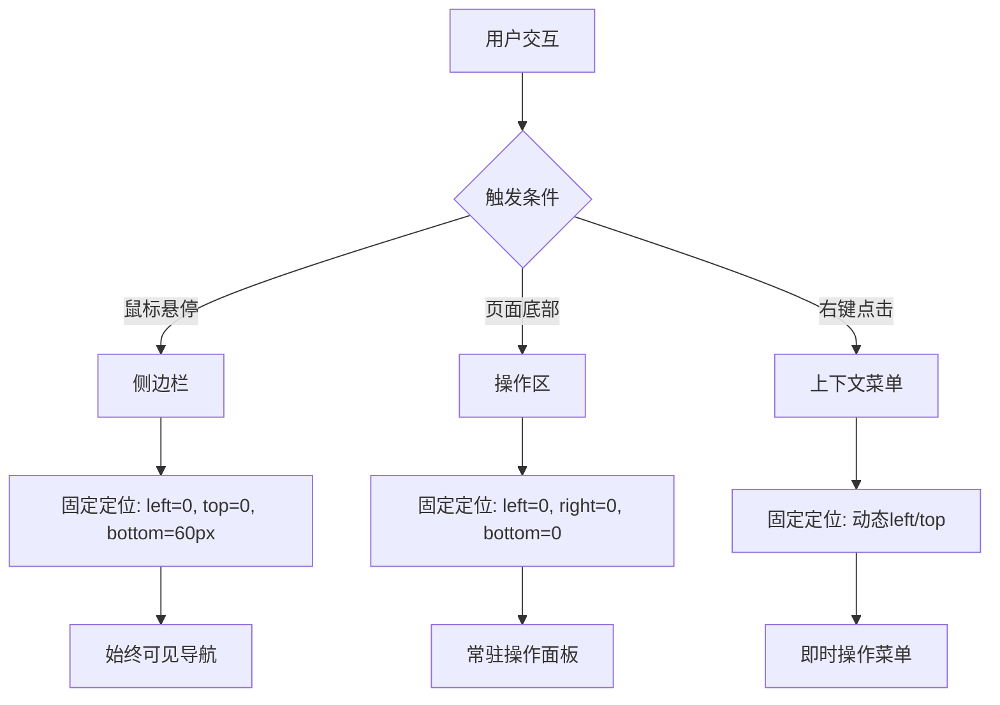
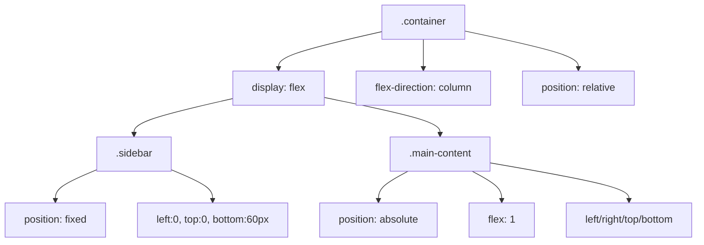
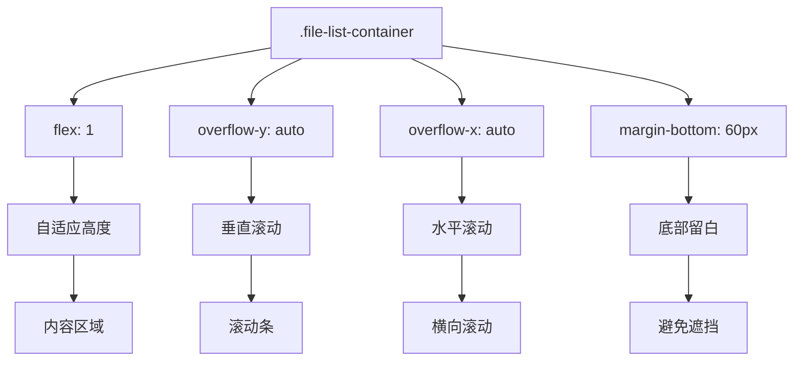
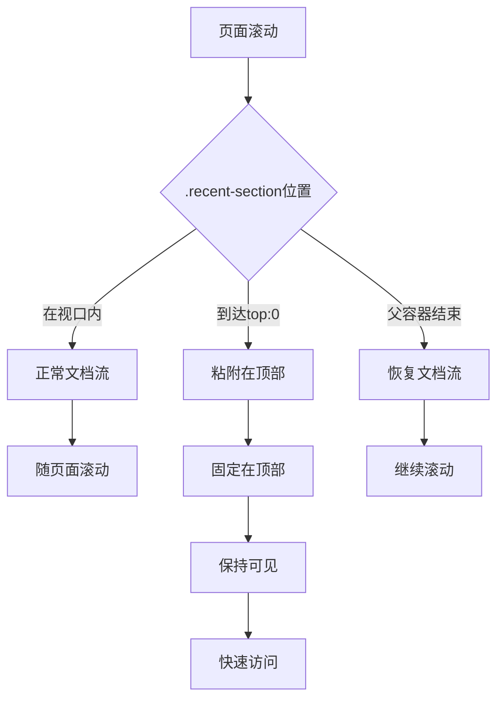

<!-- File: .qoder/repowiki/zh/content/Q2 文件导航功能/UI渲染与模板系统/CSS样式与响应式布局/响应式定位与弹性布局.md -->
# 响应式定位与弹性布局

<cite>
**Referenced Files in This Document**
- [q2.html](file://src/q2.html)
</cite>

## 目录
1. [引言](#引言)
2. [固定定位实现](#固定定位实现)
3. [弹性布局结构](#弹性布局结构)
4. [滚动区域管理](#滚动区域管理)
5. [粘性定位应用](#粘性定位应用)

## 引言
本文档深入解析`q2.html`中响应式布局的核心实现机制，重点分析CSS定位与弹性布局在界面构建中的协同作用。文档系统阐述了`position:fixed`在侧边栏、底部操作区和上下文菜单中的应用逻辑，详细说明`left/right/top/bottom`四值控制如何实现固定定位与动态占位。同时，文档全面解析了容器的flex布局层级结构，阐明主内容区如何通过`flex:1`实现自适应伸缩，以及文件列表容器如何创建独立滚动区域而不影响整体页面流。

**Section sources**
- [q2.html](file://src/q2.html#L1-L50)

## 固定定位实现

### 侧边栏固定定位
`.sidebar`元素采用`position:fixed`实现固定定位，通过`left:0`和`top:0`将其锚定在视口左上角。`bottom:60px`的设置确保其底部与固定在底部的`.footer`元素保持60px间距，避免视觉重叠。这种四值控制方式创建了一个高度自适应的固定侧边栏，其宽度由`SIDEBAR_WIDTH`变量动态决定，实现了在页面滚动时始终保持可见的导航功能。

### 底部操作区固定
`.footer`元素同样使用`position:fixed`，通过`bottom:0`、`left:0`和`right:0`将其固定在视口底部，并横向铺满整个页面宽度。`z-index:10`确保其在层级上高于其他内容，但低于侧边栏（`z-index:20`），形成清晰的视觉层次。这种定位方式创建了一个始终可见的操作面板，用户无需滚动即可访问保存和新建等核心功能。

### 上下文菜单定位
`.context-menu`和`.context-menu-empty`元素均采用`position:fixed`，初始状态`display:none`隐藏。当触发右键事件时，通过JavaScript动态设置`left`和`top`属性，将其定位在鼠标点击位置。`z-index:9999`确保菜单始终显示在最顶层，`min-width`和`padding`属性保证了良好的可点击区域和视觉呈现。

**Diagram sources**
- [q2.html](file://src/q2.html#L52-L104)
- [q2.html](file://src/q2.html#L415-L415)
- [q2.html](file://src/q2.html#L519-L519)

**Section sources**
- [q2.html](file://src/q2.html#L52-L104)
- [q2.html](file://src/q2.html#L415-L415)
- [q2.html](file://src/q2.html#L519-L519)

## 弹性布局结构

### 容器层级结构
`.container`作为根级弹性容器，采用`display:flex`和`flex-direction:column`构建垂直布局。其内部包含`.sidebar`和`.main-content`两个主要子元素。`.container`本身通过`position:relative`为内部绝对定位元素提供参考系，同时`width:100%`和`max-width:100%`确保其响应式宽度。

### 主内容区自适应
`.main-content`作为主工作区，采用`position:absolute`脱离文档流，其位置通过`left`、`right`、`top`和`bottom`四值精确控制。关键的`flex:1`属性使其在弹性布局中占据剩余可用空间，实现自适应伸缩。`overflow-y:hidden`和`overflow-x:hidden`确保主内容区自身不产生滚动条，滚动行为由内部子容器管理。

**Diagram sources**
- [q2.html](file://src/q2.html#L42-L42)
- [q2.html](file://src/q2.html#L140-L140)

**Section sources**
- [q2.html](file://src/q2.html#L42-L42)
- [q2.html](file://src/q2.html#L140-L140)

## 滚动区域管理

### 独立滚动容器
`.file-list-container`是实现独立滚动的核心组件。其`flex:1`属性使其在父容器中占据剩余空间，`overflow-y:auto`启用垂直滚动条，`overflow-x:auto`确保水平滚动条始终可见。`margin-bottom:60px`的设置为其底部留出空间，避免被固定定位的`.footer`遮挡。

### 滚动条样式定制
通过`::-webkit-scrollbar`伪元素，对滚动条的宽度、轨道背景色和滑块样式进行定制。`scrollbar-width:thin`和`scrollbar-color:#888 #f1f1f1`为Firefox等非WebKit浏览器提供兼容性支持。`padding:10px`和`padding-top:10px`确保内容与滚动条之间有足够的视觉间距。

**Diagram sources**
- [q2.html](file://src/q2.html#L275-L275)

**Section sources**
- [q2.html](file://src/q2.html#L275-L275)

## 粘性定位应用

### 最近访问区域
`.recent-section`元素采用`position:sticky`实现粘性定位，`top:0`将其粘附在视口顶部。当用户向下滚动文件列表时，该区域会像固定定位一样停留在顶部，直到其父容器的边界被完全滚动过。`z-index:5`确保其在层级上低于`.sidebar-resizer`（`z-index:30`）和`.sidebar`（`z-index:20`），但高于其他内容。

### 使用场景分析
粘性定位在此处的应用场景是保持最近访问目录的可见性。用户在浏览长文件列表时，可以随时点击最近访问的目录进行快速跳转，无需返回页面顶部。这种设计平衡了空间利用和功能可达性，既避免了固定定位对屏幕空间的永久占用，又提供了类似固定定位的便捷访问体验。

**Diagram sources**
- [q2.html](file://src/q2.html#L164-L164)

**Section sources**
- [q2.html](file://src/q2.html#L164-L164)