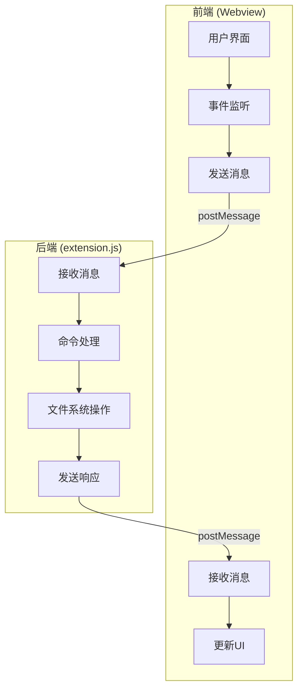
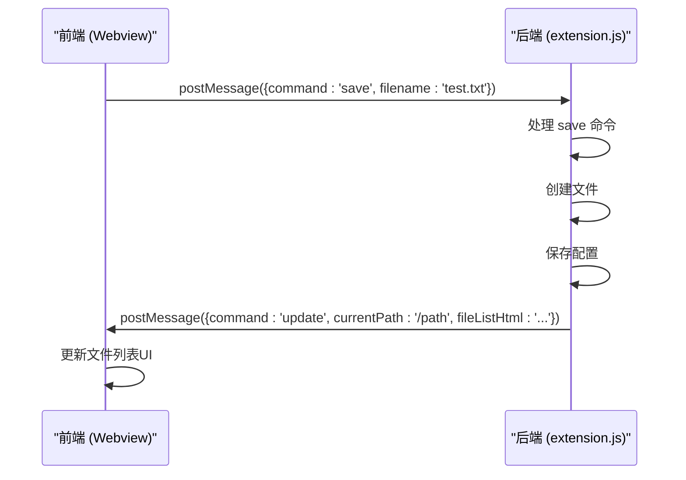
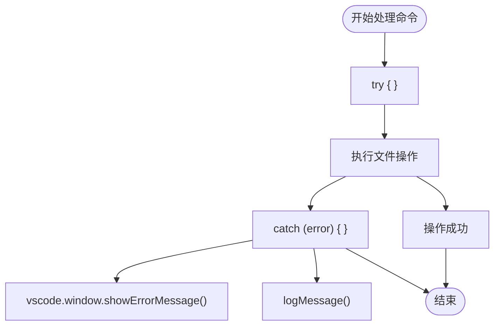
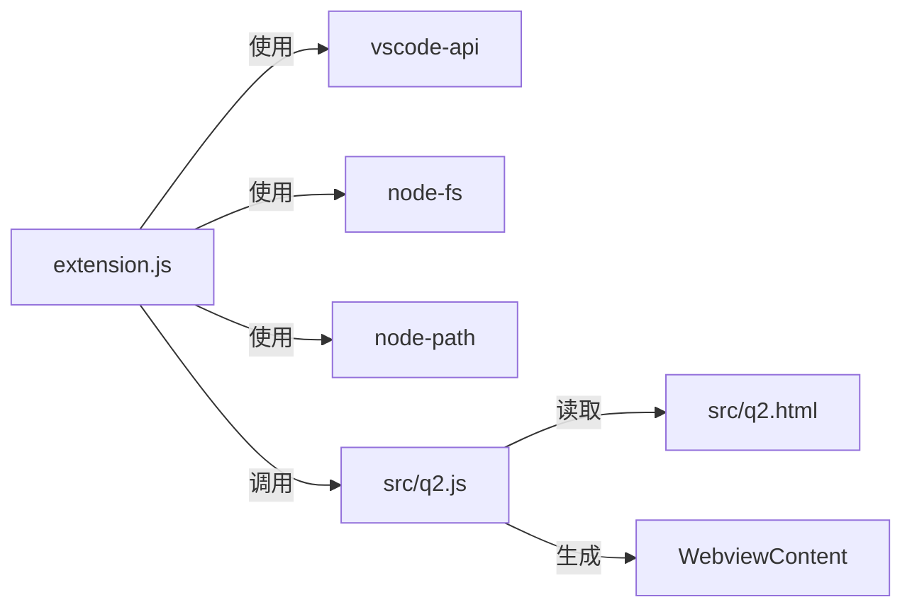

# 双向通信协议实现

<cite>
**Referenced Files in This Document**   
- [src/q2.js](file://src/q2.js)
- [extension.js](file://extension.js)
- [src/q2.html](file://src/q2.html)
</cite>

## 目录
1. [简介](#简介)
2. [项目结构](#项目结构)
3. [核心组件](#核心组件)
4. [架构概述](#架构概述)
5. [详细组件分析](#详细组件分析)
6. [依赖分析](#依赖分析)
7. [性能考虑](#性能考虑)
8. [故障排除指南](#故障排除指南)
9. [结论](#结论)

## 简介
本文档深入讲解了VSCode扩展中Webview与后端之间的双向通信协议实现。该系统基于`window.addEventListener('message')`和`vscode.postMessage()`构建，实现了前端界面与后端逻辑的高效、可靠交互。文档详细阐述了消息处理流程、通信协议设计、错误处理机制以及状态同步策略，旨在为开发者提供一个清晰、完整的通信架构视图。

## 项目结构
项目采用模块化设计，主要分为前端Webview界面和后端VSCode扩展逻辑两大部分。前端代码位于`src/`目录下，包含JavaScript和HTML文件，负责用户界面展示和交互。后端主逻辑位于根目录的`extension.js`文件中，负责处理命令、文件系统操作和与VSCode API的交互。配置文件和工具脚本也位于根目录，共同构成一个功能完整的VSCode扩展。

**Section sources**
- [src/q2.js](file://src/q2.js#L0-L1953)
- [extension.js](file://extension.js#L0-L3186)
- [src/q2.html](file://src/q2.html#L0-L675)

## 核心组件
系统的核心是Webview与VSCode后端之间的消息通信机制。前端通过`vscode.postMessage()`发送命令（如`save`, `navigate`, `togglePin`），后端通过`panel.webview.onDidReceiveMessage()`接收并处理这些命令。后端处理完成后，通过`panel.webview.postMessage()`向Webview发送更新消息（如`update`, `updateSize`, `startRename`），前端通过`window.addEventListener('message')`监听并响应这些消息，实现UI的动态更新。这种请求-响应模式构成了整个应用的控制流。

**Section sources**
- [src/q2.js](file://src/q2.js#L535-L727)
- [extension.js](file://extension.js#L2786-L3013)

## 架构概述
系统采用典型的前后端分离架构。前端Webview负责渲染用户界面，包括文件列表、导航栏和操作按钮。后端`extension.js`作为控制中心，接收来自Webview的命令，执行文件系统操作，并将结果反馈给前端。`src/q2.js`作为前端逻辑的封装，生成Webview的HTML和JavaScript内容。这种架构实现了关注点分离，使得界面展示与业务逻辑解耦，提高了代码的可维护性和可扩展性。

**Diagram sources**
- [src/q2.js](file://src/q2.js#L535-L727)
- [extension.js](file://extension.js#L2786-L3013)

## 详细组件分析

### 消息处理流程分析
该系统的核心是基于消息的异步通信。前端和后端通过定义良好的消息命令进行交互，确保了系统的松耦合和高内聚。

#### 消息发送与接收
前端通过`vscode.postMessage()`向后端发送命令，后端通过`panel.webview.onDidReceiveMessage()`接收。后端处理完成后，再通过`panel.webview.postMessage()`向前端发送更新指令，前端通过`window.addEventListener('message')`接收并更新UI。

**Diagram sources**
- [src/q2.js](file://src/q2.js#L535-L727)
- [extension.js](file://extension.js#L2949-L2983)

#### 消息数据结构设计
消息数据结构设计简洁明了，以`command`字段为核心，辅以必要的参数。例如，`save`命令包含`filename`和`isPinned`，`update`命令包含`currentPath`和`fileListHtml`。这种设计易于序列化和反序列化，保证了通信的高效性。

**Section sources**
- [src/q2.js](file://src/q2.js#L535-L727)
- [extension.js](file://extension.js#L2949-L2983)

### 错误处理与状态同步
系统具备完善的错误处理机制和状态同步策略，确保了通信的可靠性和用户体验的流畅性。

#### 错误处理机制
后端在处理命令时，使用`try-catch`块捕获异常，并通过VSCode的`showErrorMessage`向用户展示错误信息，同时将错误日志记录到文件中。这保证了即使发生错误，系统也不会崩溃，并为问题排查提供了依据。

**Diagram sources**
- [extension.js](file://extension.js#L2949-L2983)
- [extension.js](file://extension.js#L2786-L2811)

#### 状态同步策略
系统通过`refreshWebview()`函数实现状态同步。每当文件系统发生变更（如新建、重命名、删除文件），后端都会调用此函数，重新生成Webview内容并更新文件列表。这确保了前端UI始终与后端状态保持一致。

**Section sources**
- [src/q2.js](file://src/q2.js#L1618-L1674)
- [extension.js](file://extension.js#L2981-L3013)

## 依赖分析
系统依赖关系清晰。`extension.js`是核心，直接依赖VSCode API、Node.js的`fs`和`path`模块进行文件操作。`src/q2.js`被`extension.js`动态加载，用于生成Webview内容，两者通过消息通信进行交互。`src/q2.html`作为Webview的模板，被`src/q2.js`读取和填充。这种依赖关系简单直接，降低了维护复杂度。

**Diagram sources**
- [extension.js](file://extension.js#L0-L3186)
- [src/q2.js](file://src/q2.js#L0-L1953)
- [src/q2.html](file://src/q2.html#L0-L675)

## 性能考虑
系统在性能方面进行了优化。文件大小的获取是异步进行的，避免了同步操作阻塞UI。通过`fileSizeCache`缓存已计算的文件大小，避免了重复计算。`debounceRender`函数用于防抖，防止短时间内频繁触发图像渲染，提升了编辑器的响应速度。

**Section sources**
- [src/q2.js](file://src/q2.js#L1618-L1674)
- [extension.js](file://extension.js#L2981-L3013)

## 故障排除指南
当通信出现问题时，首先检查`LOG_PATH`指定的日志文件，查看是否有错误记录。其次，确认`postMessage`发送的消息格式是否正确，`command`字段是否拼写无误。最后，检查`window.addEventListener('message')`是否正确绑定，确保前端能够接收到后端的消息。

**Section sources**
- [extension.js](file://extension.js#L2949-L2983)
- [src/q2.js](file://src/q2.js#L535-L727)

## 结论
本文档详细解析了VSCode扩展中Webview与后端的双向通信协议。该系统通过`postMessage`和`addEventListener`构建了一个高效、可靠的消息传递机制，结合清晰的命令设计、完善的错误处理和状态同步策略，实现了前后端的无缝协作。其模块化的设计和对性能的考量，为构建复杂、健壮的VSCode扩展提供了一个优秀的实践范例。