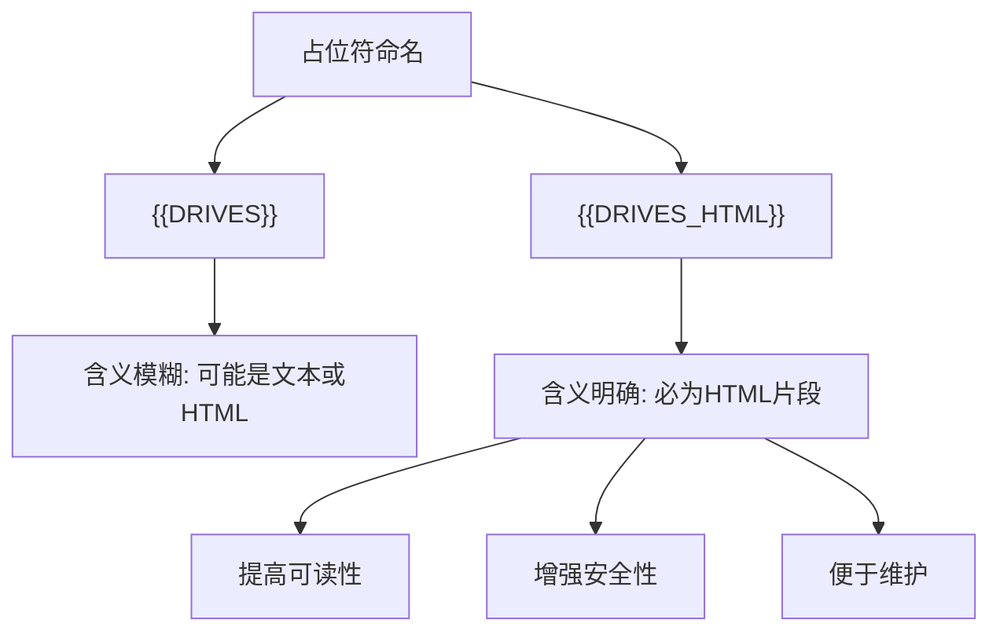

# 命名规范与重构

<cite>
**Referenced Files in This Document**   
- [重构完成报告.md](file://重构完成报告.md)
- [src/q2.js](file://src/q2.js)
- [src/q2.html](file://src/q2.html)
- [verify-placeholders.js](file://verify-placeholders.js)
</cite>

## Table of Contents
1. [占位符命名重构概述](#占位符命名重构概述)
2. [后缀_HTML的设计意图](#后缀_html的设计意图)
3. [命名规范对代码质量的影响](#命名规范对代码质量的影响)
4. [团队协作与维护效率](#团队协作与维护效率)
5. [未来扩展性](#未来扩展性)

## 占位符命名重构概述

在本次VSCode扩展的模块化重构中，一个关键的代码质量提升是占位符命名规范的建立。原始的单体文件 `extension.js` 被成功拆分为模块化结构，实现了HTML与JavaScript的完全分离。这一重构的核心是将原本内联在JavaScript中的HTML模板移至独立的 `q2.html` 文件中，并通过占位符系统进行动态内容注入。

重构过程中，占位符命名从 `{{DRIVES}}`、`{{RECENT_DIRS}}` 等基础命名，演进为 `{{DRIVES_HTML}}`、`{{RECENT_DIRS_HTML}}` 等明确标识注入内容类型的命名方式。这种命名演进并非简单的字符追加，而是设计意图的显式表达，旨在提高代码的可读性、可维护性和安全性。

**Section sources**
- [重构完成报告.md](file://重构完成报告.md#L1-L263)
- [src/q2.js](file://src/q2.js#L1-L1954)
- [src/q2.html](file://src/q2.html#L1-L676)

## 后缀_HTML的设计意图

通过在占位符名称后添加 `_HTML` 后缀，重构明确标识了注入内容的性质为HTML片段。这一设计意图体现在多个层面：

首先，`_HTML` 后缀清晰地表明了该占位符所注入的内容是结构化的HTML标记，而非纯文本。例如，`{{DRIVES_HTML}}` 表示注入的是由多个 `<button>` 元素组成的驱动器列表HTML片段，而 `{{RECENT_DIRS_HTML}}` 表示注入的是由 `<div>` 和 `<span>` 组成的最近目录列表。这种命名方式使开发者在阅读代码时能立即理解数据的结构和用途。

其次，这种命名规范强化了安全意识。当看到 `_HTML` 后缀时，开发者会自然地意识到该内容可能包含HTML标签，从而在生成内容时更加谨慎，避免将未经处理的用户输入直接插入，有效降低了跨站脚本（XSS）攻击的风险。

最后，该命名规范与 `{{INLINE_SCRIPT}}` 等其他占位符形成了清晰的分类。`_HTML` 后缀专门用于HTML结构注入，而 `INLINE_SCRIPT` 用于JavaScript代码注入，两者职责分明，避免了混淆。



**Diagram sources**
- [src/q2.html](file://src/q2.html#L80-L100)
- [src/q2.js](file://src/q2.js#L1146-L1246)

**Section sources**
- [src/q2.html](file://src/q2.html#L80-L100)
- [src/q2.js](file://src/q2.js#L1146-L1246)

## 命名规范对代码质量的影响

统一的命名规范对代码质量产生了显著的积极影响，主要体现在可读性、安全性和可维护性三个方面。

在可读性方面，`_HTML` 后缀使得代码意图一目了然。无论是 `{{SIDEBAR_WIDTH}}` 还是 `{{LINE_SPACING}}`，开发者都能立即判断出该占位符的用途和数据类型。这种自解释性减少了代码注释的需求，使代码本身成为最好的文档。

在安全性方面，明确的命名有助于防范XSS风险。当开发者看到 `{{RECENT_DIRS_HTML}}` 时，会意识到需要对目录路径进行HTML实体编码，防止恶意脚本注入。虽然本项目因使用 `unsafe-inline` CSP策略而未实施严格的转义，但良好的命名习惯为未来实施更严格的安全策略奠定了基础。

在可维护性方面，统一的命名规范使得占位符的查找和验证变得简单。项目中的 `verify-placeholders.js` 脚本正是基于此规范，通过检查 `{{VARIABLE}}` 格式的占位符来验证模板的完整性，确保了重构的正确性。

```mermaid
classDiagram
class PlaceholderValidator {
+placeholders string[]
+validate() boolean
-checkCorrectFormat() boolean
-checkBadFormat() boolean
}
class TemplateProcessor {
+getWebviewContent() string
+replacePlaceholder() string
}
PlaceholderValidator --> TemplateProcessor : "validates"
TemplateProcessor --> "q2.html" : "reads"
TemplateProcessor --> "q2.js" : "writes"
```

**Diagram sources**
- [verify-placeholders.js](file://verify-placeholders.js#L1-L60)
- [src/q2.js](file://src/q2.js#L1146-L1246)

**Section sources**
- [verify-placeholders.js](file://verify-placeholders.js#L1-L60)
- [src/q2.js](file://src/q2.js#L1146-L1246)

## 团队协作与维护效率

统一的命名规范极大地提升了团队协作和维护效率。在 `重构完成报告.md` 中明确指出，本次重构实现了HTML与JavaScript的完全分离，杜绝了内联HTML模板的使用。这一成就的达成，离不开清晰的命名约定。

当团队成员共同遵循 `{{VARIABLE_HTML}}` 的命名模式时，沟通成本显著降低。新成员可以快速理解代码结构，无需反复询问占位符的用途。同时，维护工作变得更加高效，因为开发者可以准确预测修改一个占位符可能影响的范围。

此外，命名规范的建立为自动化工具的开发提供了便利。`verify-placeholders.js` 脚本的成功应用证明了，基于统一命名的验证工具可以有效防止因占位符格式错误（如空格问题）导致的运行时错误，从而提高了开发流程的可靠性。

**Section sources**
- [重构完成报告.md](file://重构完成报告.md#L1-L263)
- [verify-placeholders.js](file://verify-placeholders.js#L1-L60)

## 未来扩展性

当前的命名规范不仅解决了当前问题，还为未来的功能扩展提供了清晰的命名空间。`_HTML` 后缀的使用暗示了其他可能的后缀，如 `_JSON`、`_TEXT` 或 `_URL`，为不同数据类型的注入提供了可扩展的模式。

例如，未来若需向Webview注入结构化数据，可以定义 `{{CONFIG_JSON}}` 或 `{{DATA_JSON}}` 等占位符，明确表示注入的是JSON字符串。这种模式化的命名方式使得代码库能够以一致的方式演进，避免了命名混乱。

同时，该规范也为国际化（i18n）等高级功能预留了空间。可以设想 `{{LABEL_EN}}`、`{{LABEL_ZH}}` 等命名，用于注入不同语言的文本，而 `{{CONTENT_HTML}}` 则用于注入富文本内容，形成一个层次分明的命名体系。

**Section sources**
- [src/q2.js](file://src/q2.js#L1146-L1246)
- [src/q2.html](file://src/q2.html#L1-L676)