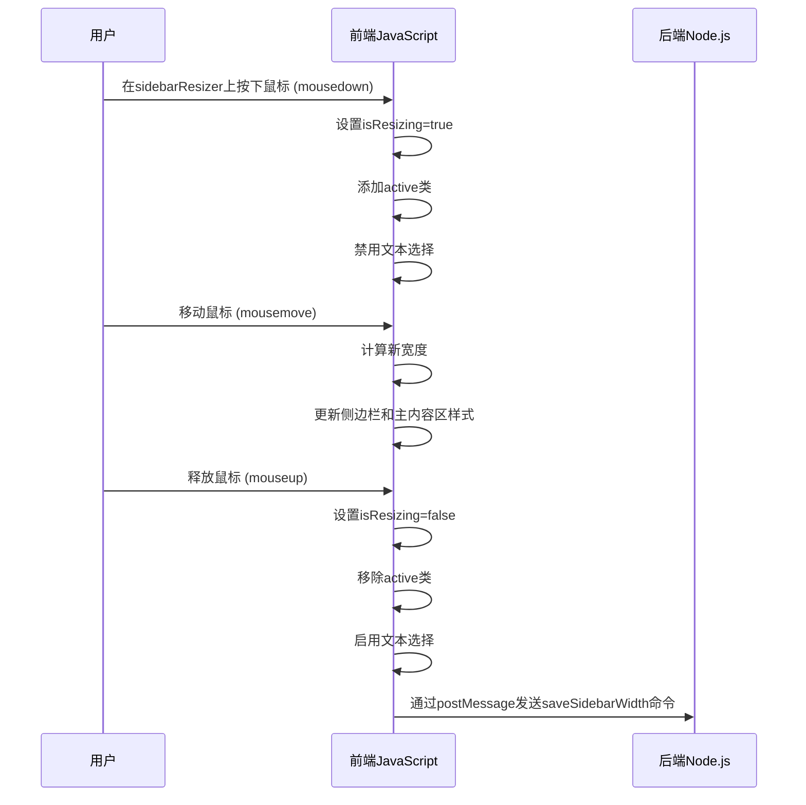
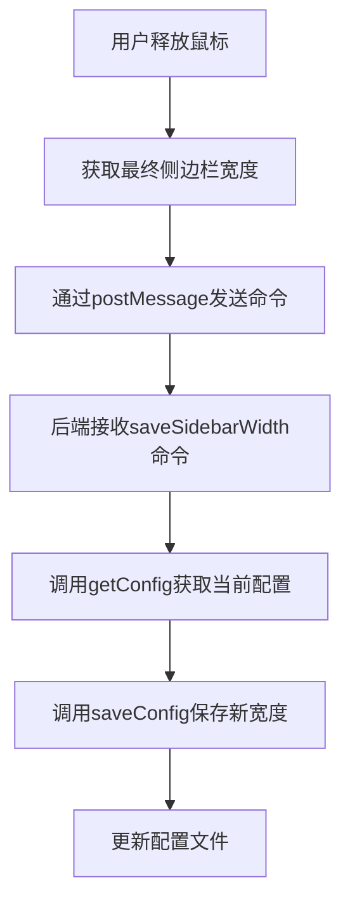
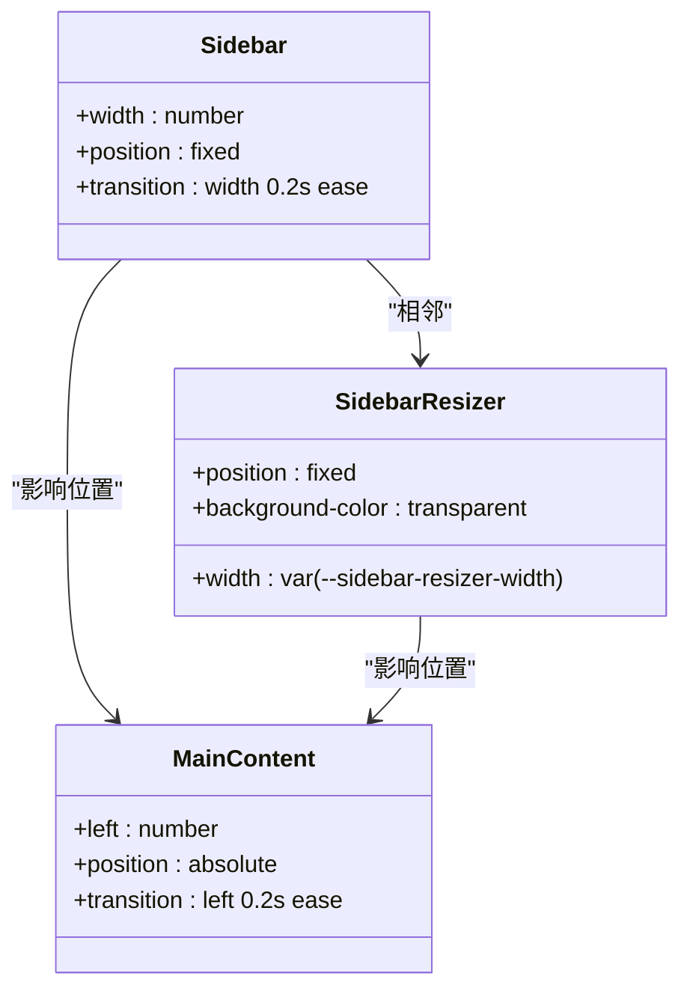

# 可拖动侧边栏

<cite>
**本文档引用的文件**
- [extension.js](file://extension.js)
- [src/q2.js](file://src/q2.js)
- [src/q2.html](file://src/q2.html)
</cite>

## 目录
1. [可拖动侧边栏实现机制](#可拖动侧边栏实现机制)
2. [鼠标事件监听与拖动状态管理](#鼠标事件监听与拖动状态管理)
3. [侧边栏宽度同步与持久化](#侧边栏宽度同步与持久化)
4. [CSS样式与平滑拖动体验](#css样式与平滑拖动体验)
5. [前端与后端通信机制](#前端与后端通信机制)
6. [界面状态恢复机制](#界面状态恢复机制)

## 可拖动侧边栏实现机制

可拖动侧边栏功能通过前端JavaScript与后端Node.js的协同工作实现。前端负责监听用户鼠标事件、管理拖动状态和实时更新UI，后端负责持久化存储用户设置。整个流程始于用户点击侧边栏边缘的`sidebarResizer`元素，通过一系列事件监听和状态管理，最终将用户调整的宽度保存到配置文件中，并在下次启动时恢复。

**Section sources**
- [src/q2.js](file://src/q2.js#L1087-L1124)
- [extension.js](file://extension.js#L2813-L2850)

## 鼠标事件监听与拖动状态管理

侧边栏的拖动功能通过监听`mousedown`、`mousemove`和`mouseup`三个鼠标事件实现。当用户在`sidebarResizer`元素上按下鼠标时，触发`mousedown`事件，前端JavaScript设置`isResizing`标志为`true`，并为`sidebarResizer`元素添加`active`类，同时禁用文本选择以提升用户体验。



**Diagram sources**
- [src/q2.js](file://src/q2.js#L1087-L1124)

**Section sources**
- [src/q2.js](file://src/q2.js#L1087-L1124)

## 侧边栏宽度同步与持久化

在拖动过程中，`mousemove`事件处理器会实时计算新的侧边栏宽度，并同步更新`sidebar`、`sidebarResizer`和`mainContent`三个元素的样式。宽度计算基于鼠标起始位置和当前位置的差值，并通过`Math.max(50, Math.min(500, newWidth))`限制在50到500像素之间，确保用户体验的合理性。

当用户释放鼠标时，`mouseup`事件处理器会获取最终的侧边栏宽度，并通过`vscode.postMessage`向后端发送`saveSidebarWidth`命令。后端接收到命令后，调用`getConfig()`获取当前配置，然后调用`saveConfig()`函数将新的宽度值持久化到配置文件中。



**Diagram sources**
- [src/q2.js](file://src/q2.js#L1108-L1117)
- [extension.js](file://extension.js#L2813-L2850)

**Section sources**
- [src/q2.js](file://src/q2.js#L1108-L1117)
- [extension.js](file://extension.js#L2813-L2850)

## CSS样式与平滑拖动体验

CSS在实现平滑拖动体验中扮演着关键角色。通过使用CSS变量`--sidebar-resizer-width`定义分割线的宽度，可以在不同状态下（悬停、激活）统一管理样式。`position:fixed`定位确保了`sidebar`、`sidebarResizer`和`mainContent`在页面滚动时保持固定位置，提供一致的交互体验。

侧边栏的`transition: width 0.2s ease`属性为宽度变化添加了平滑的过渡动画，而`sidebarResizer`的`:hover`和`.active`状态样式则提供了清晰的视觉反馈，让用户明确知道当前处于可拖动或正在拖动的状态。



**Diagram sources**
- [src/q2.html](file://src/q2.html#L100-L150)

**Section sources**
- [src/q2.html](file://src/q2.html#L100-L150)

## 前端与后端通信机制

前端与后端的通信通过VS Code的`postMessage` API实现。当用户完成侧边栏宽度调整后，前端JavaScript构造一个包含`command`和`width`属性的消息对象，并通过`vscode.postMessage()`发送给后端。后端通过`panel.webview.onDidReceiveMessage()`监听器接收消息，并根据`command`字段的值执行相应的操作。

这种通信机制是异步的，确保了UI的响应性。后端在接收到`saveSidebarWidth`命令后，会调用`saveConfig()`函数，该函数会读取现有配置文件内容，更新`sidebar_width`字段，然后将修改后的内容写回文件，完成持久化存储。

**Section sources**
- [src/q2.js](file://src/q2.js#L1114-L1117)
- [extension.js](file://extension.js#L2813-L2850)

## 界面状态恢复机制

系统通过`{{SIDEBAR_WIDTH}}`占位符在页面加载时恢复用户上次的界面状态。当生成Webview内容时，后端调用`getConfig()`读取配置文件，获取存储的`sidebarWidth`值，并将其插入HTML模板中的`{{SIDEBAR_WIDTH}}`占位符位置。这个过程在`getWebviewContent()`函数中完成，确保用户每次打开对话框时都能看到上次调整的侧边栏宽度。

```mermaid
flowchart LR
A[打开对话框] --> B[调用getWebviewContent]
B --> C[调用getConfig读取配置]
C --> D[获取sidebarWidth值]
D --> E[替换{{SIDEBAR_WIDTH}}占位符]
E --> F[返回包含正确宽度的HTML]
F --> G[显示恢复状态的界面]
```

**Diagram sources**
- [src/q2.js](file://src/q2.js#L1146-L1246)

**Section sources**
- [src/q2.js](file://src/q2.js#L1146-L1246)