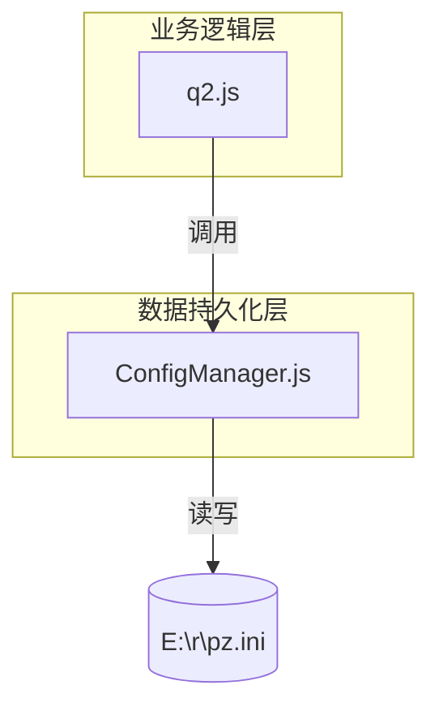
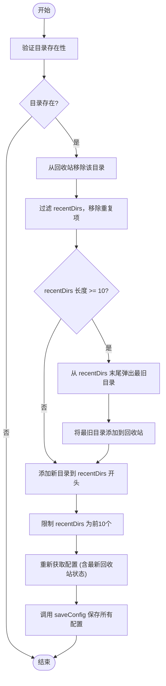
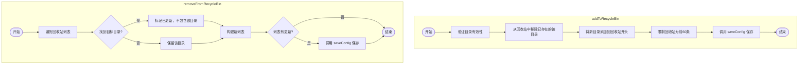
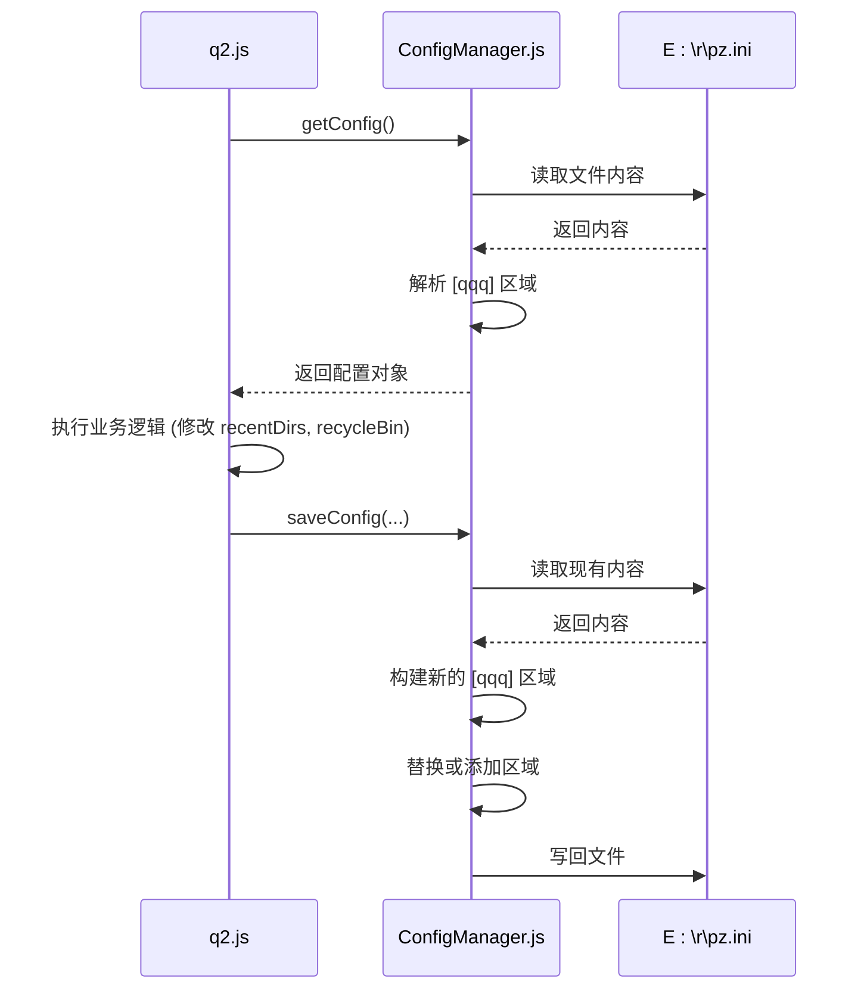
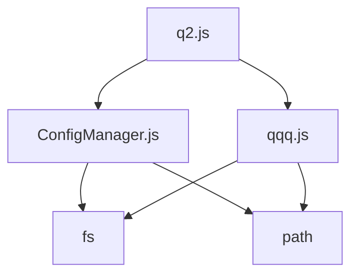

# 历史记录与回收站管理

<cite>
**Referenced Files in This Document**   
- [ConfigManager.js](file://src/ConfigManager.js)
- [q2.js](file://src/q2.js)
- [q2界面完全修复报告.md](file://q2界面完全修复报告.md)
</cite>

## 目录
1. [简介](#简介)
2. [核心组件](#核心组件)
3. [架构概述](#架构概述)
4. [详细组件分析](#详细组件分析)
5. [依赖分析](#依赖分析)
6. [历史记录状态机模型](#历史记录状态机模型)
7. [结论](#结论)

## 简介
本文档系统化地阐述了项目中历史记录与回收站的管理机制。核心功能包括：维护最近10个使用目录的列表（recentDirs），以及最多60条记录的回收站（recycleBin）。当用户访问一个新目录时，系统会将其添加到最近使用列表的开头，并自动将超出10条限制的最旧目录转移到回收站。同时，文档详细说明了`removeFromRecycleBin()`和`addToRecycleBin()`函数如何协同工作来维护`recycle_bin`配置项，以及`ConfigManager.js`与`q2.js`如何共同实现跨会话的配置持久化。此外，结合`q2界面完全修复报告.md`，本文档还说明了回收站HTML占位符`{{RECYCLE_BIN_HTML}}`的修复过程。

## 核心组件
本系统的核心是`q2.js`文件中定义的三个函数：`saveRecentDirectory`、`removeFromRecycleBin`和`addToRecycleBin`。这些函数共同实现了目录历史记录的动态管理。`saveRecentDirectory`是主控逻辑，负责处理新目录的添加、旧目录的转移以及与回收站的交互。`removeFromRecycleBin`和`addToRecycleBin`则专门负责对回收站配置项进行增删操作。这些功能依赖于`ConfigManager.js`提供的底层配置读写能力，确保数据能够持久化到`E:\r\pz.ini`文件中。

**Section sources**
- [q2.js](file://src/q2.js#L321-L419)
- [ConfigManager.js](file://src/ConfigManager.js#L13-L197)

## 架构概述
系统采用分层架构，上层为业务逻辑层（`q2.js`），下层为数据持久化层（`ConfigManager.js`）。`q2.js`负责处理所有与历史记录相关的业务规则，如列表长度限制、目录转移逻辑等。当需要读取或保存配置时，它会调用`getConfig`和`saveConfig`函数，这些函数内部使用`ConfigManager`类来安全地操作INI配置文件。这种分离确保了业务逻辑的清晰性，同时将文件I/O和并发安全等复杂性封装在底层。



**Diagram sources**
- [q2.js](file://src/q2.js#L168-L306)
- [ConfigManager.js](file://src/ConfigManager.js#L13-L197)

## 详细组件分析

### saveRecentDirectory 函数分析
`saveRecentDirectory`函数是整个历史记录管理机制的核心。它在用户访问一个新目录时被调用，执行一系列关键操作来维护`recentDirs`和`recycleBin`两个列表的完整性。

#### 函数调用流程图


**Diagram sources**
- [q2.js](file://src/q2.js#L385-L419)

**Section sources**
- [q2.js](file://src/q2.js#L385-L419)

### removeFromRecycleBin 和 addToRecycleBin 函数分析
这两个函数专门用于管理`recycleBin`配置项，确保其内容的准确性和一致性。

#### 回收站管理函数逻辑


**Diagram sources**
- [q2.js](file://src/q2.js#L321-L379)

**Section sources**
- [q2.js](file://src/q2.js#L321-L379)

### ConfigManager.js 与 q2.js 协同工作分析
`ConfigManager.js`提供了一个通用的、线程安全的INI文件配置管理器，而`q2.js`则利用它来实现特定的业务需求。

#### 配置读写协同流程


**Diagram sources**
- [q2.js](file://src/q2.js#L168-L306)
- [ConfigManager.js](file://src/ConfigManager.js#L13-L197)

**Section sources**
- [q2.js](file://src/q2.js#L168-L306)
- [ConfigManager.js](file://src/ConfigManager.js#L13-L197)

## 依赖分析
`q2.js`模块依赖于`ConfigManager.js`来处理底层的文件I/O和并发安全。`ConfigManager.js`本身依赖Node.js的`fs`和`path`模块。`q2.js`还依赖`qqq.js`中定义的常量，如`CONFIG_PATH`和`SIZE_CONFIG_KEY`，以确保配置路径的一致性。这种依赖关系清晰地分离了关注点，使得`q2.js`可以专注于业务逻辑，而`ConfigManager.js`则专注于数据持久化。



**Diagram sources**
- [q2.js](file://src/q2.js)
- [ConfigManager.js](file://src/ConfigManager.js)
- [qqq.js](file://src/qqq.js)

**Section sources**
- [q2.js](file://src/q2.js)
- [ConfigManager.js](file://src/ConfigManager.js)
- [qqq.js](file://src/qqq.js)

## 历史记录状态机模型
该模型描述了一个目录在系统中的生命周期，它可以在“最近使用”和“回收站”两种状态之间流转。

```mermaid
stateDiagram-v2
[*] --> Idle
state "最近使用" as Recent {
[*] --> InRecentList
InRecentList --> InRecentList : 访问该目录
InRecentList --> InRecycleBin : 被挤出列表
}
state "回收站" as Recycle {
[*] --> InRecycleBin
InRecycleBin --> InRecentList : 被再次访问
InRecycleBin --> Removed : 被手动移除或被新条目挤出
}
InRecentList --> InRecycleBin : 当 recentDirs 满10条时，最旧的目录被转移
InRecycleBin --> InRecentList : 用户访问回收站中的目录，触发 saveRecentDirectory
InRecycleBin --> Removed : 调用 removeFromRecycleBin 或被新条目挤出超过60条
InRecentList --> Removed : 调用 removeAndRecycleRecentDirectory
state "已移除" as Removed {
[*] --> Removed
}
```

**Diagram sources**
- [q2.js](file://src/q2.js#L321-L419)

## 结论
本系统通过`saveRecentDirectory`、`removeFromRecycleBin`和`addToRecycleBin`三个函数，实现了高效且健壮的历史记录管理机制。`recentDirs`列表始终保持最新的10个目录，而`recycleBin`则作为历史记录的缓冲区，最多保存60条。`ConfigManager.js`确保了所有配置的持久化和线程安全。关于`{{RECYCLE_BIN_HTML}}`占位符的修复，根据`q2界面完全修复报告.md`，已通过统一`q2.html`中的占位符命名（从`{{RECYCLE_BIN}}`改为`{{RECYCLE_BIN_HTML}}`）并确保`q2.js`正确生成HTML内容来解决，从而保证了界面与逻辑的正确绑定。整个系统设计清晰，职责分明，为用户提供了一个流畅的目录导航体验。