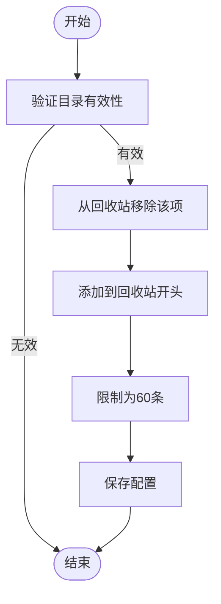
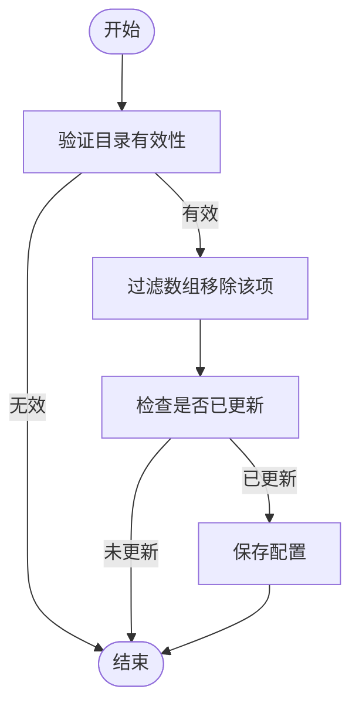
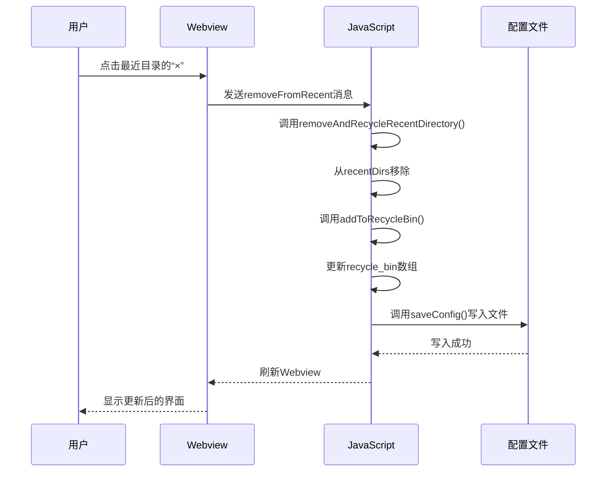

# 回收站管理

<cite>
**本文档引用的文件**   
- [ConfigManager.js](file://src/ConfigManager.js)
- [q2.js](file://src/q2.js)
- [extension.js](file://extension.js)
- [q2.html](file://src/q2.html)
- [q2界面完全修复报告.md](file://q2界面完全修复报告.md)
</cite>

## 目录
1. [简介](#简介)
2. [回收站数据结构与配置管理](#回收站数据结构与配置管理)
3. [核心操作函数分析](#核心操作函数分析)
4. [持久化存储机制](#持久化存储机制)
5. [Webview渲染与占位符修复](#webview渲染与占位符修复)
6. [边界条件与异常处理](#边界条件与异常处理)
7. [与最近目录的联动关系](#与最近目录的联动关系)
8. [调用链路示例](#调用链路示例)
9. [总结](#总结)

## 简介
本文档系统化地文档化了回收站功能的实现机制，重点解析`addToRecycleBin()`和`removeFromRecycleBin()`两个核心函数对`recycle_bin`配置项的操作逻辑。文档详细说明了如何通过`ConfigManager.js`实现最多60条记录的持久化存储与管理，并结合`q2界面完全修复报告.md`，深入描述了`{{RECYCLE_BIN_HTML}}`占位符的修复过程及其在Webview渲染中的关键作用。同时，文档涵盖了回收站的数据结构定义、满60条时的淘汰策略、异常恢复机制，以及与最近目录列表的联动关系。

## 回收站数据结构与配置管理
回收站功能的核心是`recycle_bin`配置项，它是一个存储文件夹路径的字符串数组，作为`qqq`配置节的一部分，持久化存储在`E:\r\pz.ini`文件中。

**数据结构定义**：
- **类型**：字符串数组 `string[]`
- **最大容量**：60条记录
- **存储格式**：在INI配置文件中，以逗号分隔的字符串形式存储，例如：`recycle_bin=C:\path1,D:\path2,E:\path3`

**配置管理**：
`ConfigManager.js` 提供了对INI配置文件的安全读写能力，确保多进程环境下配置操作的原子性和一致性。它通过文件锁机制和格式保留策略，保证了配置文件的稳定性和可读性。`recycle_bin`的读写操作依赖于`ConfigManager`的`readSection`和`writeSection`方法，确保了数据的完整性和安全性。

**Section sources**
- [ConfigManager.js](file://src/ConfigManager.js#L1-L200)
- [q2.js](file://src/q2.js#L168-L245)

## 核心操作函数分析
回收站的核心功能由`addToRecycleBin()`和`removeFromRecycleBin()`两个函数实现，它们均位于`q2.js`和`extension.js`中，逻辑完全一致。

### addToRecycleBin(directory)
该函数负责将一个目录添加到回收站的开头。

**操作逻辑**：
1.  **输入验证**：检查传入的`directory`是否为有效且存在的字符串。
2.  **去重**：使用`filter`方法创建一个新数组，移除`recycle_bin`中所有与`directory`相等的项，确保同一目录不会重复出现。
3.  **添加到开头**：使用`unshift`方法将`directory`插入到新数组的最前面，使其成为最新的回收站项目。
4.  **容量限制**：使用`slice(0, 60)`方法截取数组的前60个元素，如果超过60条，则自动丢弃最旧的记录。
5.  **持久化**：调用`saveConfig`函数，将更新后的`recycle_bin`数组与其他配置项一同保存。

**Diagram sources**
- [q2.js](file://src/q2.js#L349-L379)

### removeFromRecycleBin(directory)
该函数负责从回收站中移除一个指定的目录。

**操作逻辑**：
1.  **输入验证**：与`addToRecycleBin`相同。
2.  **过滤移除**：使用`filter`方法遍历`recycle_bin`数组，创建一个新数组，其中不包含与`directory`相等的项。同时，通过一个`updated`标志位记录是否发生了移除操作。
3.  **条件持久化**：仅当`updated`为`true`（即确实移除了项目）时，才调用`saveConfig`函数保存更新后的配置。这避免了不必要的文件写入操作。

**Diagram sources**
- [q2.js](file://src/q2.js#L321-L344)

**Section sources**
- [q2.js](file://src/q2.js#L321-L379)
- [extension.js](file://extension.js#L788-L844)

## 持久化存储机制
回收站数据的持久化依赖于一个三层架构：`ConfigManager.js` -> `getConfig`/`saveConfig` -> `recycle_bin`配置项。

1.  **`ConfigManager.js`**：作为底层工具，提供对INI文件的通用、安全的读写接口。它负责文件的创建、读取、解析和写入，确保了操作的原子性和格式的完整性。
2.  **`getConfig()` 和 `saveConfig()`**：这两个函数位于`q2.js`和`extension.js`中，是业务逻辑与配置管理器之间的桥梁。`getConfig()`负责从INI文件中解析出`recycle_bin`等配置项，并将其转换为JavaScript对象。`saveConfig()`则负责将更新后的对象（包括`recycle_bin`）序列化并写回INI文件。
3.  **`recycle_bin`配置项**：这是数据的最终存储形式。`saveConfig()`函数在保存时，会将`recycle_bin`数组通过`join(",")`转换为逗号分隔的字符串，然后写入INI文件的`[qqq]`节。

这种分层设计实现了关注点分离，使得回收站功能可以专注于业务逻辑，而无需关心底层文件操作的复杂性。

**Section sources**
- [ConfigManager.js](file://src/ConfigManager.js#L1-L200)
- [q2.js](file://src/q2.js#L250-L306)
- [extension.js](file://extension.js#L700-L778)

## Webview渲染与占位符修复
回收站的UI在Webview中渲染，其内容由`getWebviewContent()`函数动态生成。`{{RECYCLE_BIN_HTML}}`占位符在此过程中扮演了至关重要的角色。

### 修复过程
根据`q2界面完全修复报告.md`，修复过程如下：

1.  **问题发现**：原始的`q2.html`模板文件使用`{{RECYCLE_BIN}}`作为占位符，而`q2.js`代码中尝试替换的是`{{RECYCLE_BIN_HTML}}`，导致占位符不匹配，回收站内容无法显示。
2.  **占位符统一**：修改`q2.html`文件，将`{{RECYCLE_BIN}}`替换为`{{RECYCLE_BIN_HTML}}`，使其与JavaScript代码中的替换逻辑保持一致。
3.  **动态HTML生成**：在`getWebviewContent()`函数中，程序会：
    -   从配置中读取`recycle_bin`数组。
    -   过滤掉不存在的路径，生成`safeRecycleBin`。
    -   使用`map`和`join`方法，将`safeRecycleBin`数组转换为包含HTML标签的字符串（`recycleBinHtml`）。
    -   使用`replace(/\{\{RECYCLE_BIN_HTML\}\}/g, recycleBinHtml)`将生成的HTML字符串注入到模板中。

### 作用
`{{RECYCLE_BIN_HTML}}`是一个**动态HTML注入占位符**。它允许JavaScript代码在运行时生成完整的HTML片段（包括`
`和所有`
`），然后一次性地替换模板中的占位符。这种方式比逐个替换文本占位符更高效、更灵活，是实现复杂动态UI的关键。

**Section sources**
- [q2界面完全修复报告.md](file://q2界面完全修复报告.md#L1-L193)
- [q2.js](file://src/q2.js#L1191-L1231)

## 边界条件与异常处理
系统对回收站功能的边界条件和异常情况进行了周全的处理。

### 边界条件
- **容量上限**：当回收站条目达到60条时，任何新添加的条目都会导致最旧的条目被自动淘汰。这是通过`slice(0, 60)`实现的，确保了数组长度永远不会超过60。
- **空数组操作**：`removeFromRecycleBin()`函数在移除不存在的目录时，会返回`false`且不执行保存操作，避免了无效的文件写入。
- **路径验证**：在读取配置时，`getConfig()`函数会对`recycle_bin`中的每个路径进行存在性检查（`fs.existsSync(dir)`），确保只有有效的路径才会被加载到内存中。

### 异常恢复机制
- **配置文件不存在**：`ConfigManager._ensureConfigFileExists()`方法会自动创建配置文件和目录，防止因文件缺失导致程序崩溃。
- **文件读写异常**：`ConfigManager`中的`readSection`和`writeSection`方法都包裹在`try-catch`块中，捕获并记录错误，保证了程序的健壮性。
- **无效输入**：`addToRecycleBin()`和`removeFromRecycleBin()`函数在接收到无效的`directory`参数时会直接返回，不会进行后续操作。

这些机制共同确保了回收站功能在各种异常情况下都能稳定运行。

**Section sources**
- [ConfigManager.js](file://src/ConfigManager.js#L1-L200)
- [q2.js](file://src/q2.js#L168-L245)
- [q2.js](file://src/q2.js#L321-L379)

## 与最近目录的联动关系
回收站与“最近目录”列表（`recentDirs`）存在紧密的联动关系，共同构成了一个高效的目录管理闭环。

1.  **从最近目录移除**：当用户点击最近目录项旁的“×”按钮时，会触发`removeAndRecycleRecentDirectory(directory)`函数。该函数首先从`recentDirs`中移除该目录，然后**立即调用`addToRecycleBin(directory)`** 将其添加到回收站。这实现了“移除即回收”的便捷操作。
2.  **最近目录满时的淘汰**：当`recentDirs`列表达到10条上限时，再添加新目录会触发淘汰机制。此时，最旧的目录（`oldestDir`）会被**自动调用`addToRecycleBin(oldestDir)`** 添加到回收站，而不是直接丢弃。
3.  **从回收站恢复**：虽然文档未直接描述，但用户可以通过点击回收站中的条目来“恢复”到最近目录。这实际上是通过`navigateTo()`导航到该路径，而`saveRecentDirectory()`函数在导航后会自动将该路径添加到`recentDirs`的开头，从而实现了恢复。

这种联动设计极大地提升了用户体验，确保了用户访问过的路径不会轻易丢失。

**Diagram sources**
- [q2.js](file://src/q2.js#L395-L440)
- [q2.js](file://src/q2.js#L321-L344)

## 调用链路示例
以下是一个完整的调用链路，演示了如何将一个目录添加到回收站：

1.  **用户操作**：用户点击最近目录项旁的“×”按钮。
2.  **Webview消息**：Webview向VS Code插件发送`{ command: 'removeFromRecent', path: 'D:\\some\\path' }`消息。
3.  **消息处理**：`q2.js`中的`panel.webview.onDidReceiveMessage`监听到消息，调用`removeAndRecycleRecentDirectory('D:\\some\\path')`。
4.  **移除并回收**：`removeAndRecycleRecentDirectory`函数执行：
    -   从`recentDirs`中过滤掉`'D:\\some\\path'`。
    -   调用`addToRecycleBin('D:\\some\\path')`。
5.  **添加到回收站**：`addToRecycleBin`函数执行：
    -   从`recycle_bin`中移除`'D:\\some\\path'`（如果存在）。
    -   将`'D:\\some\\path'`添加到`recycle_bin`数组开头。
    -   截取前60条记录。
    -   调用`saveConfig(..., finalRecycleBin, ...)`。
6.  **持久化**：`saveConfig`函数将`finalRecycleBin`数组与其他配置项一起，通过`ConfigManager`写入`E:\r\pz.ini`文件。
7.  **UI更新**：`saveConfig`完成后，`refreshWebview()`被调用，重新生成包含新回收站内容的HTML并刷新Webview。

**Section sources**
- [q2.js](file://src/q2.js#L395-L440)
- [q2.js](file://src/q2.js#L321-L344)
- [q2.js](file://src/q2.js#L250-L306)

## 总结
回收站功能通过`addToRecycleBin()`和`removeFromRecycleBin()`函数，实现了对`recycle_bin`配置项的高效管理。系统利用`ConfigManager.js`确保了数据的持久化和安全性，并通过`{{RECYCLE_BIN_HTML}}`占位符的修复，保证了Webview界面的正确渲染。功能设计上，通过60条的容量限制和路径验证处理了边界条件，并与“最近目录”列表形成了紧密的联动，共同构建了一个健壮、易用的目录管理机制。