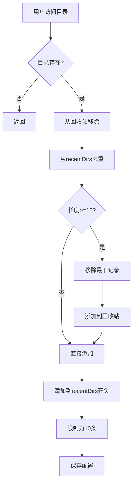
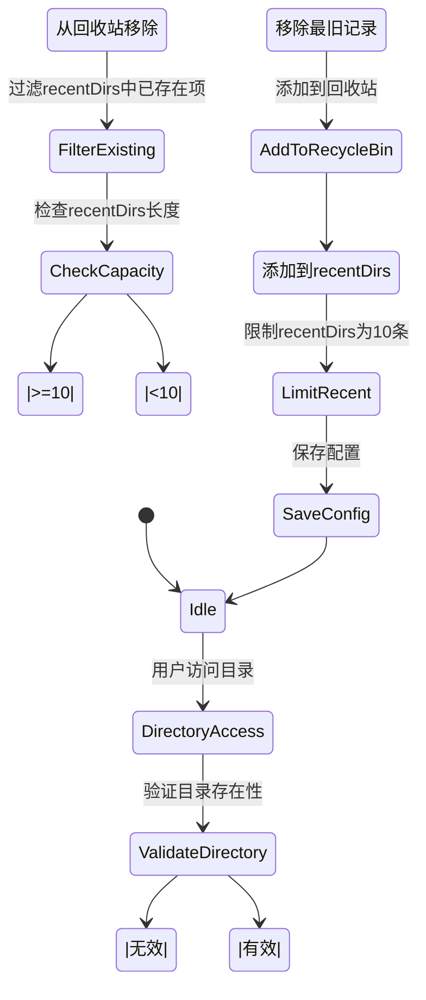

# 最近目录管理

<cite>
**Referenced Files in This Document**   
- [ConfigManager.js](file://src/ConfigManager.js)
- [q2.js](file://src/q2.js)
- [extension.js](file://extension.js)
- [ConfigManager使用指南.md](file://ConfigManager使用指南.md)
</cite>

## 目录
1. [简介](#简介)
2. [核心机制](#核心机制)
3. [目录生命周期](#目录生命周期)
4. [状态流转图示](#状态流转图示)
5. [性能优化建议](#性能优化建议)
6. [结论](#结论)

## 简介

最近目录管理功能旨在为用户提供便捷的目录访问体验，通过维护一个最近使用目录列表（recentDirs）和回收站（recycleBin）来实现历史记录的智能管理。系统采用`ConfigManager.js`作为配置管理核心，确保配置数据的持久化存储和跨会话一致性。当用户访问新目录时，系统会自动更新最近使用列表，并在列表达到10条上限时将最旧记录移至回收站，从而实现高效的历史记录管理。

**Section sources**
- [ConfigManager使用指南.md](file://ConfigManager使用指南.md)

## 核心机制

### saveRecentDirectory函数实现

`saveRecentDirectory`函数是最近目录管理的核心逻辑，负责处理目录的添加、去重和顺序调整。该函数首先通过`getConfig()`获取当前配置，然后执行以下步骤：

1. **从回收站移除**：调用`removeFromRecycleBin(directory)`确保当前目录不在回收站中。
2. **去重与前置**：使用`filter`方法移除`recentDirs`中已存在的相同目录，然后通过`unshift`将新目录添加到数组开头。
3. **容量控制**：检查`recentDirs`长度，若达到或超过10条，则通过`pop()`移除最旧记录并调用`addToRecycleBin()`将其存入回收站。
4. **持久化存储**：调用`saveConfig()`将更新后的配置写入文件。

该函数确保了最近使用列表的时效性和有序性，同时通过回收站机制保留了历史访问记录。

### ConfigManager持久化机制

`ConfigManager.js`通过`get`和`set`方法实现了配置项的持久化存储。`get`方法读取指定键的配置值，若不存在则返回默认值；`set`方法将键值对写入配置文件。该类通过读取和写入INI格式文件，确保了跨会话的数据一致性。配置文件位于`E:\r\pz.ini`，采用`[qqq]`节存储应用特定配置，支持多程序共享同一配置文件。

**Section sources**
- [q2.js](file://src/q2.js#L385-L419)
- [ConfigManager.js](file://src/ConfigManager.js#L172-L186)

## 目录生命周期

### 完整流程说明

目录在最近使用列表中的生命周期包括添加、更新、淘汰和回收四个阶段：

1. **添加**：当用户首次访问某目录时，该目录被添加到`recentDirs`数组开头。
2. **更新**：若目录已存在于列表中，再次访问时会将其移至开头，保持最新状态。
3. **淘汰**：当列表长度达到10条上限时，最旧的目录记录会被移除。
4. **回收**：被淘汰的目录记录被添加到`recycleBin`中，最多保留60条历史记录。

此流程确保了最近使用列表的高效性和实用性，同时通过回收站机制提供了历史记录的追溯功能。

### 代码示例

**Diagram sources**
- [q2.js](file://src/q2.js#L385-L419)

**Section sources**
- [q2.js](file://src/q2.js#L385-L419)

## 状态流转图示

**Diagram sources**
- [q2.js](file://src/q2.js#L385-L419)

## 性能优化建议

### 避免频繁磁盘I/O

为优化性能，应尽量减少对磁盘的频繁读写操作：

1. **批量操作**：在可能的情况下，将多个配置更新合并为一次`saveConfig`调用，而不是每次更改都立即保存。
2. **内存缓存**：考虑在内存中缓存配置对象，仅在必要时才进行持久化存储。
3. **延迟写入**：对于非关键配置，可采用延迟写入策略，在用户操作结束后统一保存。

### 代码调用分析

通过`grep`搜索发现，`saveRecentDirectory`函数在多个位置被调用，包括目录切换、文件操作等场景。建议对这些调用点进行评估，确保不会在短时间内产生大量重复调用，从而避免不必要的磁盘I/O。

**Section sources**
- [extension.js](file://extension.js#L848-L882)
- [q2.js](file://src/q2.js#L385-L419)

## 结论

最近目录管理机制通过`saveRecentDirectory`函数和`ConfigManager`类的协同工作，实现了高效的历史记录管理。系统通过维护`recentDirs`和`recycleBin`两个列表，既保证了最近使用目录的快速访问，又保留了历史访问记录。配置的持久化存储确保了跨会话的数据一致性。通过合理的性能优化措施，可以进一步提升系统的响应速度和用户体验。