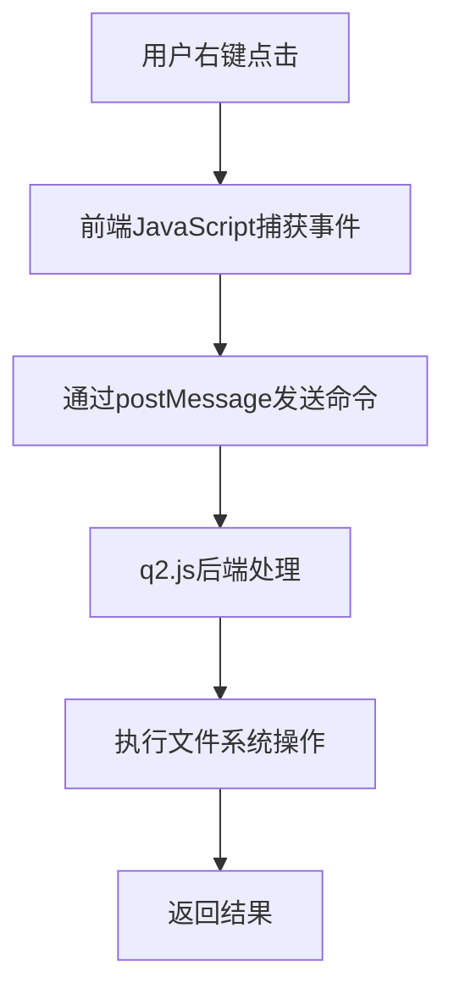
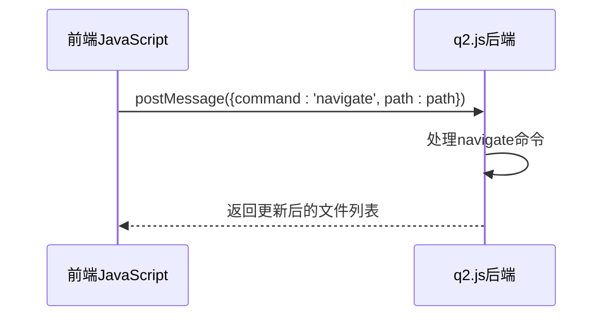
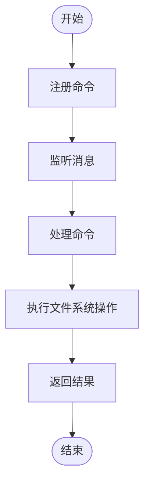
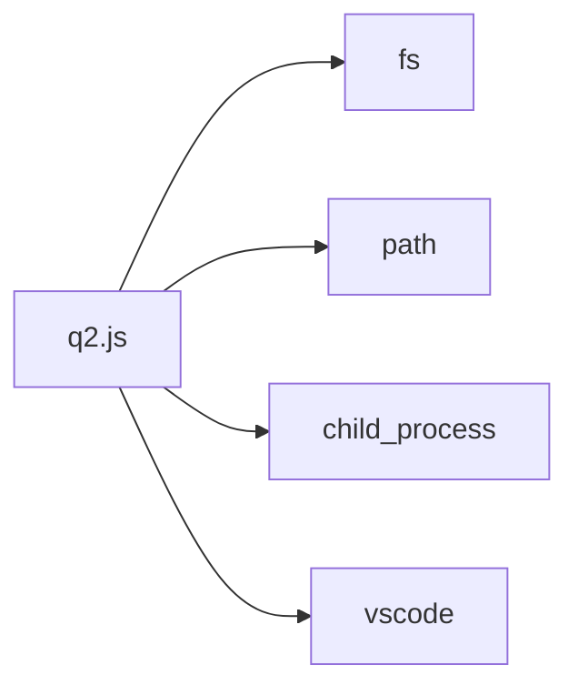

# 上下文菜单数据流

<cite>
**本文档引用的文件**  
- [q2.js](file://src/q2.js)
- [extension.js](file://extension.js)
- [q2.html](file://src/q2.html)
- [qqq.js](file://src/qqq.js)
</cite>

## 目录
1. [简介](#简介)
2. [项目结构](#项目结构)
3. [核心组件](#核心组件)
4. [架构概览](#架构概览)
5. [详细组件分析](#详细组件分析)
6. [依赖分析](#依赖分析)
7. [性能考量](#性能考量)
8. [故障排除指南](#故障排除指南)
9. [结论](#结论)

## 简介
本文档全面分析了用户右键点击 → 前端JavaScript捕获事件 → 通过postMessage发送命令 → q2.js后端处理 → 执行文件系统操作的完整数据流动路径。重点说明了message通信机制的实现，包括命令类型、数据格式和错误处理。

## 项目结构
项目结构清晰，主要分为`src`目录下的核心模块文件和根目录下的配置与文档文件。`src`目录包含`q2.js`、`q2.html`、`qqq.js`等关键文件，负责上下文菜单功能的实现。

**Section sources**
- [q2.js](file://src/q2.js#L1-L1954)
- [extension.js](file://extension.js#L1-L3187)

## 核心组件
核心组件包括`q2.js`中的消息处理逻辑、`extension.js`中的命令注册与执行、以及`q2.html`中的前端界面交互。这些组件共同实现了上下文菜单的数据流动。

**Section sources**
- [q2.js](file://src/q2.js#L1-L1954)
- [extension.js](file://extension.js#L1-L3187)
- [q2.html](file://src/q2.html#L1-L877)

## 架构概览
系统采用前后端分离架构，前端通过`postMessage`与后端通信，后端处理文件系统操作并返回结果。这种架构确保了界面与逻辑的解耦，提高了系统的可维护性。

**Diagram sources**
- [q2.js](file://src/q2.js#L1-L1954)
- [extension.js](file://extension.js#L1-L3187)

## 详细组件分析
### q2.js模块分析
`q2.js`模块负责处理来自前端的消息，执行相应的文件系统操作，并返回结果。它通过`window.addEventListener('message', ...)`监听消息，根据`command`字段执行不同的操作。

#### 消息处理流程

**Diagram sources**
- [q2.js](file://src/q2.js#L711-L899)

### extension.js模块分析
`extension.js`模块注册了所有命令，并处理来自`q2.js`的请求。它通过`vscode.commands.registerCommand`注册命令，并在命令执行时调用相应的处理函数。

#### 命令注册与执行

**Diagram sources**
- [extension.js](file://extension.js#L2027-L2219)

## 依赖分析
项目依赖于Node.js的`fs`、`path`、`child_process`等模块进行文件系统操作，以及`vscode`模块与VS Code集成。这些依赖确保了功能的完整性和稳定性。

**Diagram sources**
- [q2.js](file://src/q2.js#L1-L10)
- [extension.js](file://extension.js#L1-L10)

## 性能考量
系统在处理大量文件时可能会遇到性能瓶颈。建议优化文件大小计算逻辑，避免重复计算，并使用缓存机制提高响应速度。

## 故障排除指南
常见问题包括消息传递失败、文件系统操作错误等。建议检查`postMessage`的调用是否正确，以及文件路径是否存在。

**Section sources**
- [q2.js](file://src/q2.js#L570-L580)
- [extension.js](file://extension.js#L1858-L1871)

## 结论
本文档详细分析了上下文菜单的数据流动路径，展示了从用户交互到后端处理的完整流程。通过合理的架构设计和模块化实现，系统能够高效地处理文件系统操作。