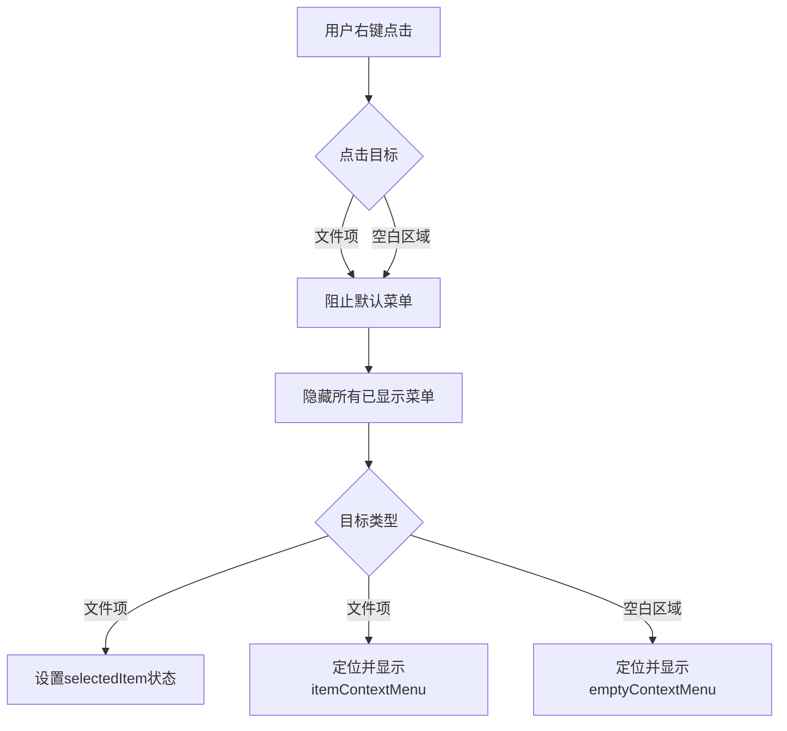
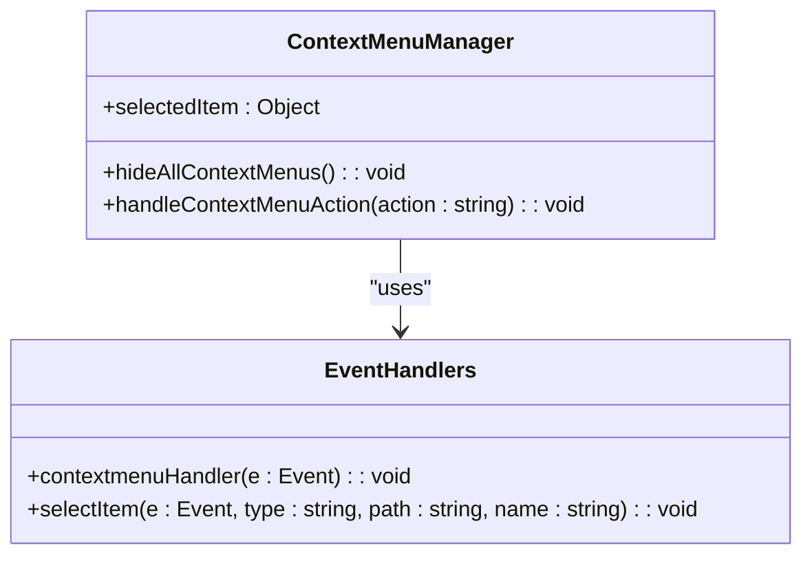
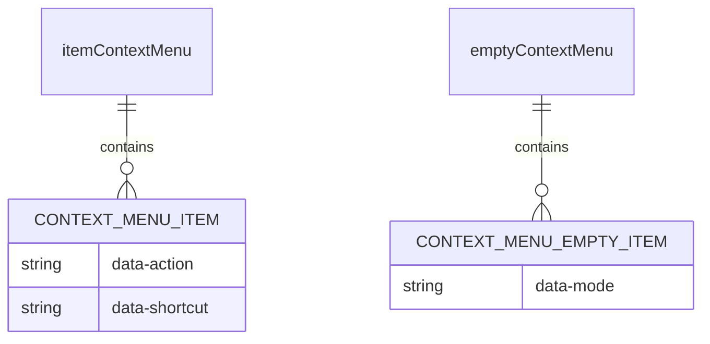

# 右键菜单JavaScript实现逻辑

<cite>
**Referenced Files in This Document**  
- [src/q2.js](file://src/q2.js)
- [src/q2.html](file://src/q2.html)
</cite>

## 目录
1. [事件监听机制](#事件监听机制)
2. [右键点击事件捕获与处理](#右键点击事件捕获与处理)
3. [菜单显示逻辑与坐标定位](#菜单显示逻辑与坐标定位)
4. [上下文菜单清理与状态管理](#上下文菜单清理与状态管理)
5. [HTML结构与菜单元素](#html结构与菜单元素)

## 事件监听机制

该实现通过在文件列表容器上绑定`contextmenu`事件监听器来捕获用户的右键点击行为。此机制确保了无论用户点击的是文件项还是空白区域，都能被统一处理。

**Section sources**
- [src/q2.js](file://src/q2.js#L1005-L1038)

## 右键点击事件捕获与处理

系统通过`document.getElementById('fileList').addEventListener('contextmenu', (e) => {...})`捕获右键点击事件。当事件触发时，首先调用`e.preventDefault()`阻止浏览器默认的上下文菜单弹出，从而为自定义菜单的显示创造条件。

事件处理器通过`e.target.closest('.file-item')`判断点击目标是否为文件项。若存在匹配的文件项元素，则解析其`data-path`、`data-name`和`data-type`属性以获取文件路径、名称和类型，并调用`selectItem`函数选中该项，同时更新全局`selectedItem`状态。若点击目标非文件项，则视为在空白区域点击。

**Section sources**
- [src/q2.js](file://src/q2.js#L1005-L1038)

## 菜单显示逻辑与坐标定位

根据点击目标的类型，系统动态决定显示`itemContextMenu`（文件项右键菜单）或`emptyContextMenu`（空白区域右键菜单）。菜单的定位通过事件对象的`clientX`和`clientY`属性实现，将菜单的CSS `left`和`top`样式设置为`e.clientX + 'px'`和`e.clientY + 'px'`，确保菜单在鼠标指针附近弹出。

**Diagram sources**  
- [src/q2.js](file://src/q2.js#L1005-L1038)

**Section sources**
- [src/q2.js](file://src/q2.js#L1005-L1038)

## 上下文菜单清理与状态管理

在每次显示新菜单前，系统强制调用`hideAllContextMenus`函数，该函数将`itemContextMenu`和`emptyContextMenu`的`display`样式设置为`'none'`，确保不会同时存在多个菜单实例，避免界面混乱。

数据传递的核心是`selectedItem`对象，它在`selectItem`函数中被赋值，存储了当前选中文件项的类型、路径和名称。当用户从`itemContextMenu`中选择一个操作（如重命名、打开）时，`handleContextMenuAction`函数会读取`selectedItem`的状态，并执行相应的命令。

**Diagram sources**  
- [src/q2.js](file://src/q2.js#L1039-L1048)
- [src/q2.js](file://src/q2.js#L958-L965)
- [src/q2.js](file://src/q2.js#L948-L956)

**Section sources**
- [src/q2.js](file://src/q2.js#L948-L965)
- [src/q2.js](file://src/q2.js#L1005-L1038)

## HTML结构与菜单元素

HTML文件中定义了两个关键的`div`元素作为右键菜单的容器：`id="itemContextMenu"`用于文件项操作，`id="emptyContextMenu"`用于设置文件大小显示模式。这两个容器的初始`display`样式为`'none'`，并通过JavaScript动态修改其`display`为`'flex'`来实现显示。

**Diagram sources**  
- [src/q2.html](file://src/q2.html#L350-L380)

**Section sources**
- [src/q2.html](file://src/q2.html#L350-L380)