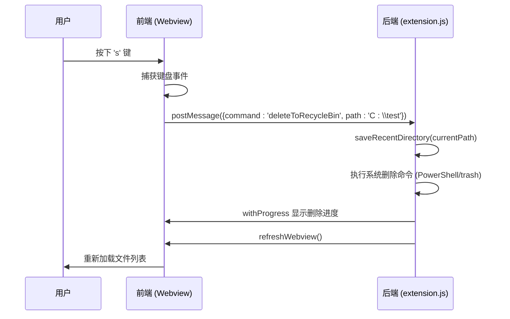

# 删除文件快捷键 (s)

<cite>
**本文档引用的文件**  
- [extension.js](file://extension.js)
- [src/q2.js](file://src/q2.js)
- [问题修复报告.md](file://问题修复报告.md)
</cite>

## 目录
1. [功能概述](#功能概述)
2. [前端事件处理流程](#前端事件处理流程)
3. [后端配置更新与回收站操作](#后端配置更新与回收站操作)
4. [问题修复分析](#问题修复分析)
5. [数据流与交互时序图](#数据流与交互时序图)
6. [配置文件格式规范](#配置文件格式规范)

## 功能概述

本功能实现了通过按下键盘 `s` 键将选中的文件或文件夹移至系统回收站。该操作涉及前端用户界面的按键事件捕获、消息传递，以及后端对配置文件的读取、更新和系统级删除命令的执行。整个流程确保了用户操作的即时响应与配置状态的持久化。

## 前端事件处理流程

当用户在文件列表中选中一个项目并按下 `s` 键时，前端 Webview 会触发一系列操作。首先，通过 `keydown` 事件监听器捕获到 `s` 键，然后调用 `performDeleteAction` 函数。该函数会立即通过 `postMessage` 向后端发送一个包含 `deleteToRecycleBin` 命令的消息，同时在视觉上隐藏被删除的 DOM 元素，以提供即时反馈。

**Section sources**
- [src/q2.js](file://src/q2.js#L1234-L1250)

## 后端配置更新与回收站操作

后端接收到 `deleteToRecycleBin` 命令后，执行以下核心逻辑：
1.  **更新最近目录**：调用 `saveRecentDirectory` 函数，将当前路径记录为最近使用的目录。
2.  **执行删除**：使用平台特定的命令（如 Windows 的 PowerShell 脚本）将指定路径的文件或文件夹移至系统回收站。
3.  **刷新界面**：删除操作完成后，调用 `refreshWebview` 函数重新加载文件列表，反映最新的目录状态。

**Section sources**
- [extension.js](file://extension.js#L2980-L3050)

## 问题修复分析

此前，删除功能出现异常，导致界面显示空白。经排查，根本原因在于配置文件的分隔符不一致。

### 问题根源

在重构后的 `src/q2.js` 文件中，读取和保存配置时错误地使用了分号 (`;`) 作为数组分隔符，而原始的 `extension.js` 和配置文件 `E:\r\pz.ini` 均使用逗号 (`,`) 进行分隔。

```javascript
// 修复前 (src/q2.js) - 错误使用分号
const dirs = recentDirsMatch[1].split(";")
const bins = recycleBinMatch[1].split(";")
const newConfigs = {
    recent_dirs: recentDirs.join(";"),
    recycle_bin: recycleBin.join(";"),
};
```

由于配置文件中的数据是以逗号分隔的，使用 `split(";")` 无法正确解析，导致 `recentDirs` 和 `recycleBin` 数组为空，进而引发界面无数据显示的空白问题。

### 修复方案

已将 `src/q2.js` 中所有涉及配置读取和保存的分隔符从分号 (`;`) 统一修改为逗号 (`,`)，与原始代码和配置文件格式保持一致。

```javascript
// 修复后 (src/q2.js) - 正确使用逗号
const dirs = recentDirsMatch[1].split(",")
const bins = recycleBinMatch[1].split(",")
const newConfigs = {
    recent_dirs: recentDirs.join(","),
    recycle_bin: recycleBin.join(","),
};
```

**Section sources**
- [问题修复报告.md](file://问题修复报告.md#L1-L230)
- [src/q2.js](file://src/q2.js#L197-L287)

## 数据流与交互时序图



**Diagram sources**
- [src/q2.js](file://src/q2.js#L1234-L1250)
- [extension.js](file://extension.js#L2980-L3050)

## 配置文件格式规范

配置文件 `E:\r\pz.ini` 必须遵循以下格式规范以确保功能正常：

```ini
[qqq]
recent_dirs=E:\project1,E:\project2,E:\project3
line_spacing=-2
sidebar_width=150
recycle_bin=E:\old1,E:\old2,E:\old3
is_pinned=false
size_mode=none
```

**重要规则**：
- ✅ 数组值（如 `recent_dirs`, `recycle_bin`）必须使用**逗号 (`,`)** 分隔。
- ✅ 不要在逗号后添加空格。
- ✅ 路径直接拼接，不需要引号。
- ✅ 布尔值使用字符串 `"true"` / `"false"`。

**Section sources**
- [问题修复报告.md](file://问题修复报告.md#L150-L180)