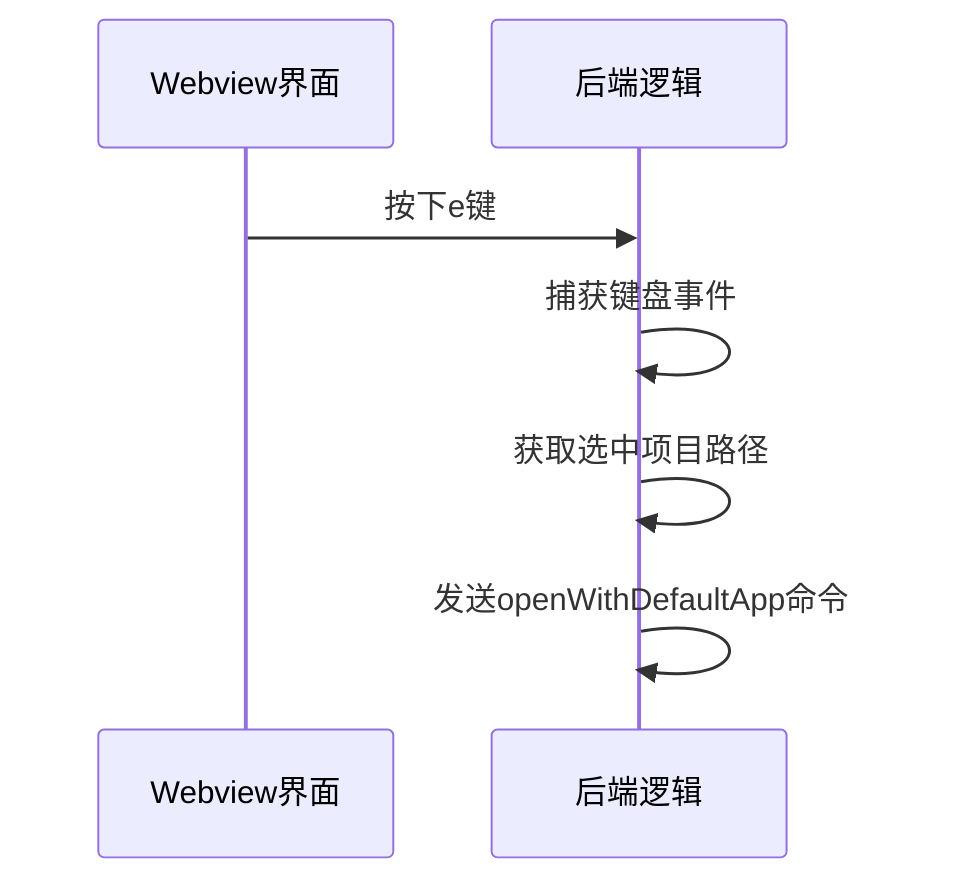
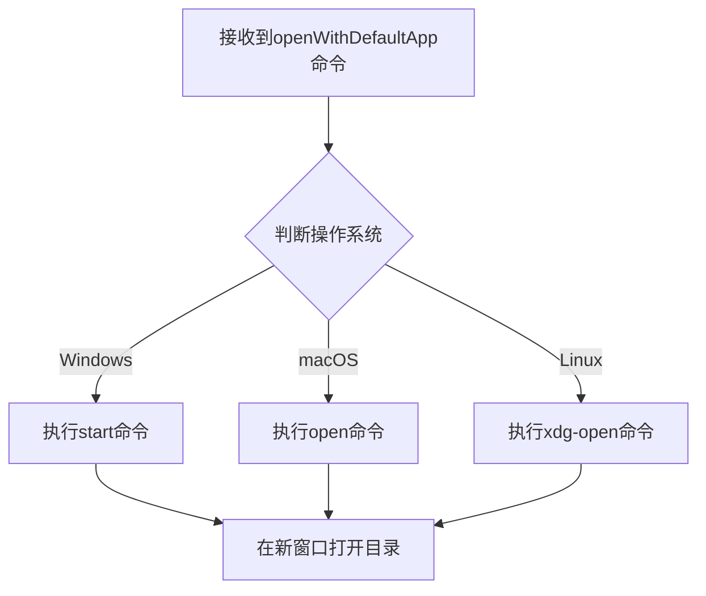
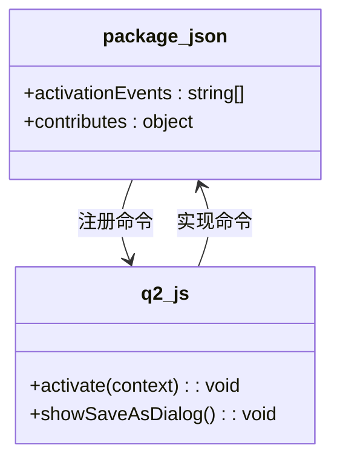

# 在VSCode中打开 (e)

<cite>
**Referenced Files in This Document**   
- [package.json](file://package.json)
- [extension.js](file://extension.js)
- [src/qqq.js](file://src/qqq.js)
- [src/q2.js](file://src/q2.js)
- [src/q2.html](file://src/q2.html)
- [命令统一验证报告.md](file://命令统一验证报告.md)
</cite>

## 目录
1. [简介](#简介)
2. [项目结构](#项目结构)
3. [核心功能实现](#核心功能实现)
4. [命令注册与验证](#命令注册与验证)
5. [详细组件分析](#详细组件分析)
6. [依赖分析](#依赖分析)
7. [结论](#结论)

## 简介
本文档全面解析了"在VSCode中打开"功能的实现机制。该功能通过监听e键快捷操作，触发`openWithDefaultApp`命令，利用系统命令在新窗口中打开指定目录。文档详细阐述了前端如何监听用户输入并发送命令，后端如何通过`child_process`执行系统命令，以及`qqq.q2`和`qqq.saveAsDialog`命令在`package.json`和`q2.js`中的正确注册与关联，确保了快捷键功能的命令调用链完整可靠。

## 项目结构
项目采用模块化结构，主要功能分散在多个文件中。核心逻辑位于`src`目录下，其中`q2.js`负责实现"在VSCode中打开"的核心功能，`q2.html`提供用户界面，`qqq.js`作为主模块协调各子模块。根目录的`extension.js`和`package.json`负责扩展的激活和命令注册。

**Section sources**
- [package.json](file://package.json#L1-L77)
- [extension.js](file://extension.js#L1-L799)
- [src/qqq.js](file://src/qqq.js#L1-L81)

## 核心功能实现

### 前端事件监听与命令发送
前端通过Webview界面监听用户的键盘输入。当用户在文件列表中选中一个项目并按下e键时，前端JavaScript代码会捕获该事件，并向后端发送`openWithDefaultApp`命令。该命令携带了选中项目的路径和类型信息。

**Diagram sources**
- [src/q2.js](file://src/q2.js#L1253-L1933)
- [src/q2.html](file://src/q2.html#L1-L675)

**Section sources**
- [src/q2.js](file://src/q2.js#L1253-L1933)
- [src/q2.html](file://src/q2.html#L1-L675)

### 后端命令执行
后端接收到`openWithDefaultApp`命令后，使用Node.js的`child_process`模块执行相应的系统命令。根据操作系统类型，执行不同的命令：
- Windows系统：使用`start "" "路径"`命令
- macOS系统：使用`open "路径"`命令
- Linux系统：使用`xdg-open "路径"`命令

此过程确保了在新窗口中打开指定目录，实现了跨平台的兼容性。

**Diagram sources**
- [src/q2.js](file://src/q2.js#L1253-L1933)

**Section sources**
- [src/q2.js](file://src/q2.js#L1253-L1933)

## 命令注册与验证
根据`命令统一验证报告.md`的内容，`qqq.q2`和`qqq.saveAsDialog`命令已在`package.json`和`q2.js`中正确注册。`package.json`中定义了命令的激活事件和快捷键，`q2.js`中通过`vscode.commands.registerCommand`将命令与`showSaveAsDialog`函数关联。这种双重注册确保了命令调用链的完整性和可靠性。

**Diagram sources**
- [package.json](file://package.json#L1-L77)
- [src/q2.js](file://src/q2.js#L1-L81)

**Section sources**
- [package.json](file://package.json#L1-L77)
- [src/q2.js](file://src/q2.js#L1-L81)
- [命令统一验证报告.md](file://命令统一验证报告.md#L1-L159)

## 详细组件分析

### q2.js模块分析
`q2.js`是实现"在VSCode中打开"功能的核心模块。它不仅处理`openWithDefaultApp`命令，还负责管理Webview的生命周期、处理用户交互和执行文件操作。

#### 命令注册
模块通过`activate`函数注册了两个命令：`qqq.q2`和`qqq.saveAsDialog`，两者都指向`showSaveAsDialog`函数。这种设计允许通过不同方式触发相同的功能。

#### Webview消息处理
模块通过`panel.webview.onDidReceiveMessage`监听来自Webview的消息。当收到`openWithDefaultApp`命令时，会执行相应的系统命令来打开目录。

**Section sources**
- [src/q2.js](file://src/q2.js#L1-L1953)

### q2.html界面分析
`q2.html`文件定义了用户界面的结构和样式。它包含一个文件列表，用户可以在其中选择项目并使用快捷键进行操作。界面通过JavaScript监听键盘事件，并将用户操作转换为命令发送给后端。

**Section sources**
- [src/q2.html](file://src/q2.html#L1-L675)

## 依赖分析
项目依赖于VS Code的API和Node.js的内置模块。主要依赖包括：
- `vscode`模块：用于与VS Code编辑器交互
- `child_process`模块：用于执行系统命令
- `fs`和`path`模块：用于文件系统操作

这些依赖通过`require`语句在代码中引入，确保了功能的正常运行。

**Section sources**
- [extension.js](file://extension.js#L1-L799)
- [src/q2.js](file://src/q2.js#L1-L81)

## 结论
通过对代码的全面分析，可以确认"在VSCode中打开"功能的实现是完整且可靠的。前端通过监听e键触发命令，后端通过`child_process`执行系统命令，实现了在新窗口中打开目录的功能。`qqq.q2`和`qqq.saveAsDialog`命令在`package.json`和`q2.js`中的正确注册与关联，确保了命令调用链的完整性。整个实现过程充分考虑了跨平台兼容性，为用户提供了流畅的操作体验。