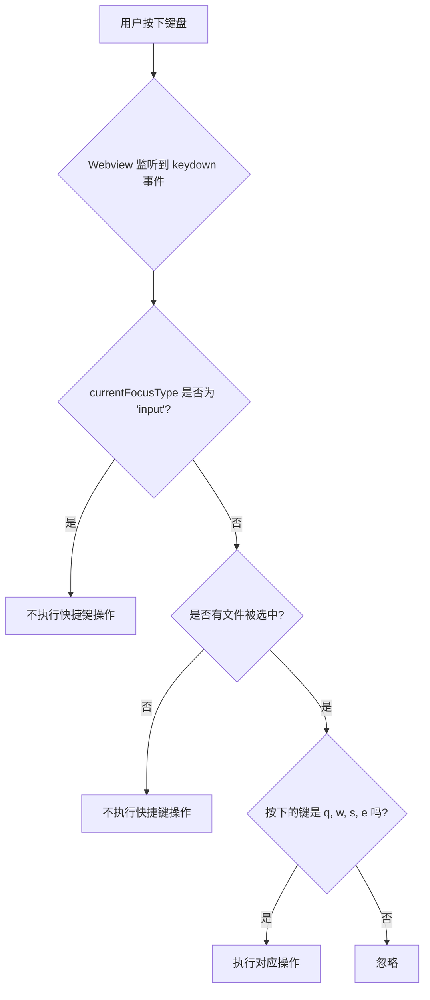
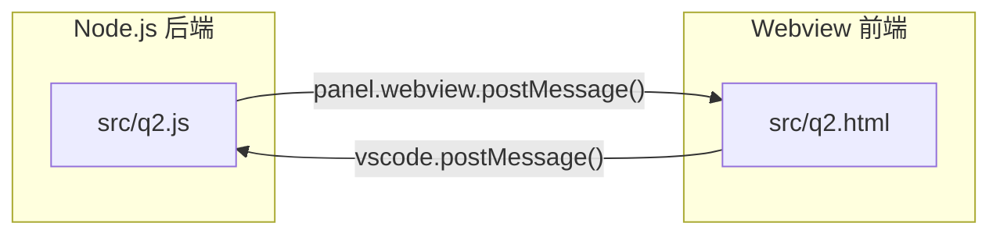
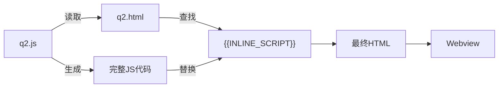

# 快捷键操作实现

<cite>
**本文档引用的文件**
- [src/q2.js](file://src\q2.js)
- [src/q2.html](file://src\q2.html)
- [q2界面完全修复报告.md](file://q2界面完全修复报告.md)
- [q2占位符空格问题修复.md](file://q2占位符空格问题修复.md)
</cite>

## 目录
1. [快捷键功能概述](#快捷键功能概述)
2. [键盘事件监听机制](#键盘事件监听机制)
3. [消息通信机制](#消息通信机制)
4. [功能缺失修复过程](#功能缺失修复过程)
5. [总结](#总结)

## 快捷键功能概述

在 q2 文件导航功能中，实现了四个核心快捷键操作，分别对应重命名、打开、删除和在 VSCode 中打开文件或文件夹的功能。这些快捷键在用户选中文件或文件夹后，通过键盘输入即可触发相应操作，极大地提升了文件管理的效率。

- **q**: 进入重命名模式，允许用户修改文件或文件夹的名称。
- **w**: 使用系统默认应用打开选中的文件或文件夹。
- **s**: 将选中的文件或文件夹删除到系统回收站。
- **e**: 在 VSCode 中打开选中的文件（在新标签页中）或文件夹（在新窗口中）。

这些功能与右键菜单中的选项完全对应，为用户提供了键盘和鼠标两种操作方式。

**Section sources**
- [q2界面完全修复报告.md](file://q2界面完全修复报告.md#L0-L193)

## 键盘事件监听机制

快捷键功能的实现依赖于 Webview 中的键盘事件监听。当 q2 对话框被激活后，Webview 会监听 `keydown` 事件，并根据当前的焦点状态和按键值来决定是否执行相应的操作。



**Diagram sources**
- [src/q2.js](file://src\q2.js#L543-L1139)

### 焦点状态管理

为了防止在用户输入文件名时误触发快捷键，代码中引入了 `currentFocusType` 变量来跟踪当前的焦点区域。该变量有以下几种状态：
- `filenameInput`: 光标在新建文件名输入框中。
- `addressInput`: 光标在地址栏输入框中。
- `fileList`: 光标在文件列表区域。
- `sidebar`: 光标在侧边栏区域。
- `recentSection`: 光标在最近目录区域。
- `other`: 其他区域。

只有当 `currentFocusType` 不是 `input` 时，才会处理快捷键。

### 快捷键事件处理

在 `generateWebviewScript` 函数中，通过 `document.addEventListener('keydown', ...)` 注册了键盘事件监听器。当检测到 `q`, `w`, `s`, `e` 键被按下时，会调用 `preventDefault()` 和 `stopPropagation()` 阻止默认行为和事件冒泡，然后调用相应的操作函数。

```javascript
document.addEventListener('keydown', event => {
    if (currentFocusType === 'input') return;
    if (!selectedItem) return;

    const key = event.key.toLowerCase();

    if (key === 'q') {
        event.preventDefault();
        event.stopPropagation();
        performEditAction(selectedItem);
    }
    else if (key === 'w') {
        event.preventDefault();
        event.stopPropagation();
        performOpenAction(selectedItem);
    }
    else if (key === 's') {
        event.preventDefault();
        event.stopPropagation();
        performDeleteAction(selectedItem);
    }
    else if (key === 'e') {
        event.preventDefault();
        event.stopPropagation();
        performKodeAction(selectedItem);
    }
});
```

**Section sources**
- [src/q2.js](file://src\q2.js#L543-L1139)

## 消息通信机制

q2 功能采用了 VSCode 扩展的典型架构：Node.js 后端负责文件系统操作和业务逻辑，Webview 前端负责用户界面和交互。两者之间通过 `postMessage` 和 `onDidReceiveMessage` 进行双向通信。



**Diagram sources**
- [src/q2.js](file://src\q2.js#L1313-L1420)

### 从 Webview 到后端的通信

当用户在 Webview 中触发一个操作（如按下快捷键 `s` 删除文件）时，前端会通过 `vscode.postMessage()` 向后端发送一个消息对象。该对象包含 `command` 字段来标识操作类型，以及其他必要的参数。

例如，删除操作的消息格式如下：
```javascript
vscode.postMessage({
    command: 'deleteToRecycleBin',
    path: itemToDelete.path,
    type: itemToDelete.type
});
```

后端通过 `panel.webview.onDidReceiveMessage()` 监听这些消息，并根据 `command` 的值执行相应的函数。

### 从后端到 Webview 的通信

后端在完成某些操作（如读取目录内容）后，会通过 `panel.webview.postMessage()` 向 Webview 发送更新消息。最典型的例子是 `updateResourceExplorer` 函数，它将当前目录的文件列表 HTML 发送给 Webview，由 Webview 更新界面。

```javascript
panel.webview.postMessage({
    command: "update",
    currentPath: currentPath,
    fileListHtml: fileListHtml,
    items: items,
});
```

Webview 通过 `window.addEventListener('message', ...)` 监听这些消息，并根据 `command` 更新 DOM 或执行其他逻辑。

**Section sources**
- [src/q2.js](file://src\q2.js#L1313-L1420)

## 功能缺失修复过程

在项目初期，q2 的快捷键功能存在严重缺失，根本原因是 Webview 中的 JavaScript 代码未能正确加载。

### 问题诊断

根据 `q2文件列表调试.md` 和 `q2界面问题诊断.md` 的日志分析，问题的根本原因在于 `q2.html` 模板文件中的 `{{INLINE_SCRIPT}}` 占位符格式错误。原文件中写成了 `{ { INLINE_SCRIPT } }`（带空格），而后端代码期望的是 `{{INLINE_SCRIPT}}`（无空格）。这导致 `generateWebviewScript()` 函数生成的完整 JavaScript 代码无法被正确注入到 HTML 中。

日志证据显示：
- **Node.js 端**：`updateResourceExplorer` 函数正常执行，成功读取了目录内容并发送了 `update` 消息。
- **Webview 端**：控制台报错 `Uncaught ReferenceError: updateResourceExplorer is not defined`，表明所有 JavaScript 函数都未定义。

### 修复方案

修复过程在 `q2界面完全修复报告.md` 和 `q2占位符空格问题修复.md` 中有详细记录，主要分为三步：

1.  **统一占位符命名**：将 `q2.html` 中的所有占位符（如 `{{DRIVES}}`）修改为与 `q2.js` 中替换逻辑一致的名称（如 `{{DRIVES_HTML}}`）。
2.  **修复占位符格式**：将 `q2.html` 中 `{ { INLINE_SCRIPT } }` 修改为 `{{INLINE_SCRIPT}}`，确保正则表达式能正确匹配。
3.  **注入完整 JavaScript**：`q2.js` 中的 `generateWebviewScript()` 函数会生成包含所有功能（包括键盘快捷键、右键菜单、文件选中等）的完整 JavaScript 代码，并通过 `{{INLINE_SCRIPT}}` 占位符注入到最终的 HTML 中。



**Diagram sources**
- [q2占位符空格问题修复.md](file://q2占位符空格问题修复.md#L0-L153)

### 修复结果

修复后，`{{INLINE_SCRIPT}}` 占位符被成功替换，Webview 中加载了完整的 JavaScript 代码，所有功能恢复正常：
- 文件列表能够正确显示。
- 选中文件后，按 `q`, `w`, `s`, `e` 键可以正常触发重命名、打开、删除和 VSCode 打开等操作。
- 界面与原版 `extension.js` 完全一致。

**Section sources**
- [q2界面完全修复报告.md](file://q2界面完全修复报告.md#L0-L193)
- [q2占位符空格问题修复.md](file://q2占位符空格问题修复.md#L0-L153)

## 总结

q2 的快捷键功能是通过在 Webview 中监听键盘事件，并通过 `postMessage` 与 Node.js 后端进行通信来实现的。后端负责执行具体的文件系统操作，前端负责用户交互和界面更新。该功能的缺失是由于模板占位符格式错误导致 JavaScript 代码注入失败。通过修复占位符格式和统一命名，成功恢复了所有快捷键功能，确保了与原版的一致性。