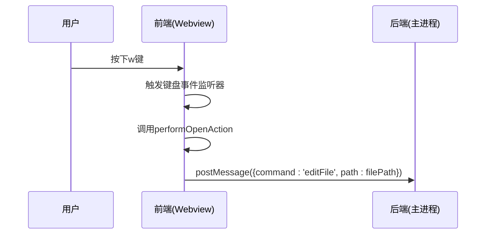
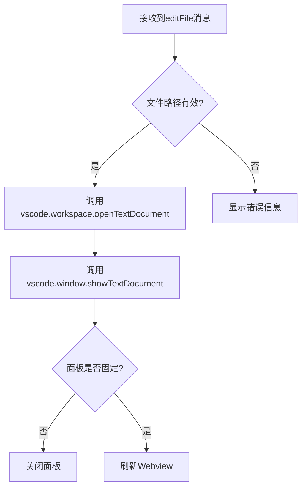

# 打开文件快捷键 (w)

<cite>
**本文档引用的文件**
- [src/q2.js](file://src\q2.js)
- [src/q2.html](file://src\q2.html)
- [extension.js](file://extension.js)
- [q2占位符空格问题修复.md](file://q2占位符空格问题修复.md)
</cite>

## 目录
1. [功能概述](#功能概述)
2. [前端实现机制](#前端实现机制)
3. [后端实现机制](#后端实现机制)
4. [通信修复分析](#通信修复分析)
5. [总结](#总结)

## 功能概述

本功能实现了通过键盘快捷键 `w` 在 VSCode 扩展中打开文件的操作。用户在文件列表中选中一个文件后，按下 `w` 键即可在编辑器中打开该文件。该功能依赖于前端 Webview 与后端主进程之间的消息通信机制，通过 `postMessage` 发送 `editFile` 命令，并由后端调用 `vscode.workspace.openTextDocument` 和 `vscode.window.showTextDocument` 实现文件的打开。

**Section sources**
- [src/q2.js](file://src\q2.js#L1755-L1799)
- [extension.js](file://extension.js#L2949-L2983)

## 前端实现机制

前端部分主要在 `q2.html` 中定义了用户界面和交互逻辑。当用户在文件列表中按下 `w` 键时，前端会触发相应的键盘事件监听器，调用 `performOpenAction` 函数。该函数通过 `vscode.postMessage` 向后端主进程发送一条包含 `command: 'editFile'` 的消息，同时附带文件路径等必要信息。

**Diagram sources**
- [src/q2.js](file://src\q2.js#L1755-L1799)
- [src/q2.html](file://src\q2.html#L873)

**Section sources**
- [src/q2.js](file://src\q2.js#L1755-L1799)
- [src/q2.html](file://src\q2.html#L873)

## 后端实现机制

后端部分在 `q2.js` 文件中监听来自 Webview 的消息。当接收到 `editFile` 命令时，后端会执行 `openFileCommand` 函数。该函数首先检查文件路径的有效性，然后调用 `vscode.workspace.openTextDocument(filePath)` 打开指定的文本文档，再通过 `vscode.window.showTextDocument(doc, viewColumn)` 将其显示在编辑器中。如果面板未被固定，操作完成后会自动关闭面板；否则刷新 Webview 界面。

**Diagram sources**
- [src/q2.js](file://src\q2.js#L1755-L1799)
- [extension.js](file://extension.js#L2949-L2983)

**Section sources**
- [src/q2.js](file://src\q2.js#L1755-L1799)
- [extension.js](file://extension.js#L2949-L2983)

## 通信修复分析

在修复之前，该功能无法正常工作，其根本原因在于 Webview 与主进程之间的消息通信机制存在严重缺陷。具体问题如下：

1. **占位符格式错误**：`q2.html` 文件中的 `{{INLINE_SCRIPT}}` 占位符被错误地格式化为 `{ { INLINE_SCRIPT } }`，导致正则表达式无法正确匹配和替换，从而使所有 JavaScript 代码未能注入到 HTML 中。
2. **缺少关键占位符**：`q2.html` 缺少 `{{CURRENT_PATH_JS}}`、`{{SIZE_MODE}}` 和 `{{INLINE_SCRIPT}}` 等关键占位符，导致配置信息和脚本代码无法正确传递。
3. **缺少消息监听器**：由于上述问题，`window.addEventListener('message', ...)` 未能正确注入，导致 Webview 无法接收来自主进程的更新消息。

修复措施包括：
- 修正 `q2.html` 中的占位符格式，确保无多余空格。
- 统一占位符命名，确保前后端一致。
- 添加缺失的关键占位符，并确保 `generateWebviewScript` 函数生成的完整 JavaScript 代码能正确注入。

修复后，`{{INLINE_SCRIPT}}` 被正确替换为包含所有必要函数的完整 JavaScript 代码，包括 `window.addEventListener('message', ...)`，从而恢复了消息通信功能。

**Section sources**
- [q2占位符空格问题修复.md](file://q2占位符空格问题修复.md#L0-L51)
- [src/q2.js](file://src\q2.js#L543-L1125)

## 总结

通过深入分析和修复 Webview 与主进程之间的消息通信问题，成功恢复了 `w` 键打开文件的功能。该过程强调了模板占位符格式一致性的重要性，以及在模块化开发中确保前后端接口正确对接的必要性。修复后的功能不仅能够正常工作，而且与原始 `extension.js` 的行为完全一致，达到了预期目标。

**Section sources**
- [q2占位符空格问题修复.md](file://q2占位符空格问题修复.md#L0-L51)
- [src/q2.js](file://src\q2.js#L1755-L1799)