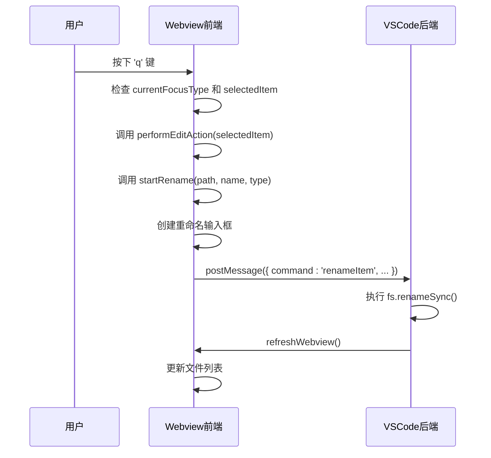

# 重命名快捷键 (q)

<cite>
**本文档引用的文件**   
- [extension.js](file://extension.js)
- [q2.js](file://src/q2.js)
- [q2.html](file://src/q2.html)
- [qqq.js](file://src/qqq.js)
- [q2界面完全修复报告.md](file://q2界面完全修复报告.md)
</cite>

## 目录
1. [引言](#引言)
2. [功能实现分析](#功能实现分析)
3. [键盘事件绑定与消息通信](#键盘事件绑定与消息通信)
4. [前后端协作逻辑](#前后端协作逻辑)
5. [从缺失到完整的修复过程](#从缺失到完整的修复过程)
6. [结论](#结论)

## 引言

本文档详细解析了 `q` 键触发的重命名功能实现机制。该功能是 `qqq` 扩展中 `q2` 模块的核心交互之一，允许用户通过快捷键快速对文件或文件夹进行重命名操作。文档将深入探讨前端 JavaScript 如何在 `generateWebviewScript` 函数中绑定键盘事件监听器，当用户按下 `q` 键时，事件如何被捕获并调用 `startRename` 函数，以及如何通过 `postMessage` 向 VSCode 后端发送 `'startRename'` 命令。同时，结合《q2界面完全修复报告.md》的修复历程，阐述该功能从最初缺失到最终完整实现的全过程。

**Section sources**
- [q2.js](file://src/q2.js#L543-L1139)
- [q2界面完全修复报告.md](file://q2界面完全修复报告.md#L1-L194)

## 功能实现分析

重命名功能的实现依赖于 VSCode 的 Webview 机制，它构建了一个独立的前端环境来渲染用户界面。整个功能的实现可以分为前端（Webview 内部）和后端（VSCode 扩展）两个部分。

前端部分的核心是 `src/q2.js` 文件中的 `generateWebviewScript` 函数。该函数返回一个包含完整 JavaScript 逻辑的字符串，这些逻辑被注入到 `q2.html` 模板中，从而在 Webview 中运行。这个注入的脚本负责处理所有用户交互，包括键盘事件。

后端部分则由 `src/q2.js` 中的 `showSaveAsDialog` 函数管理。该函数创建 Webview 面板，并通过 `panel.webview.onDidReceiveMessage` 监听来自前端的消息。当收到 `'renameItem'` 命令时，后端会执行实际的文件系统操作。

**Section sources**
- [q2.js](file://src/q2.js#L543-L1933)
- [q2.html](file://src/q2.html#L1-L676)

## 键盘事件绑定与消息通信

### 前端事件监听与处理

键盘事件的绑定发生在 `generateWebviewScript` 函数生成的 JavaScript 代码中。通过 `document.addEventListener('keydown', ...)` 监听全局的键盘按下事件。



**Diagram sources**
- [q2.js](file://src/q2.js#L543-L1139)

**Section sources**
- [q2.js](file://src/q2.js#L543-L1139)

在事件处理函数中，首先会检查 `currentFocusType` 是否为 `'input'`（即用户正在输入文件名），如果是，则忽略 `q` 键事件，以防止干扰正常输入。同时，会检查 `selectedItem` 是否存在，因为重命名操作必须作用于一个已选中的项目。

```javascript
document.addEventListener('keydown', event => {
    if (currentFocusType === 'input') return;
    if (!selectedItem) return;

    const key = event.key.toLowerCase();

    if (key === 'q') {
        event.preventDefault();
        event.stopPropagation();
        performEditAction(selectedItem);
    }
    // ... 其他快捷键处理
});
```

当 `q` 键被按下且条件满足时，会调用 `performEditAction(selectedItem)` 函数。该函数进一步调用 `startRename` 函数，并传入选中项目的路径、名称和类型。

`startRename` 函数是重命名流程的起点。它会：
1.  选中目标项目（如果尚未选中）。
2.  在项目的名称区域动态创建一个 `<input>` 元素，用于用户输入新名称。
3.  为该输入框绑定 `keydown` 事件监听器，以处理 `Enter`（确认）和 `Escape`（取消）键。
4.  将输入框设置为焦点状态。

### 消息通信机制

当用户在重命名输入框中按下 `Enter` 键时，会触发 `commitRename` 函数。该函数会移除输入框，并通过 `vscode.postMessage` API 向 VSCode 后端发送一条消息。

```javascript
function commitRename(itemElement, oldPath, itemType, newName) {
    // ... 清理输入框
    if (newName && newName !== oldName) {
        vscode.postMessage({
            command: 'renameItem',
            oldPath: oldPath,
            newName: newName,
            itemType: itemType
        });
    } else {
        // ... 取消重命名
    }
}
```

这条消息的 `command` 字段为 `'renameItem'`，并携带了 `oldPath`（旧路径）、`newName`（新名称）和 `itemType`（项目类型）等必要参数。`postMessage` 是 Webview 与扩展主进程进行通信的唯一通道。

## 前后端协作逻辑

后端通过 `panel.webview.onDidReceiveMessage` 监听来自前端的消息。当收到 `command` 为 `'renameItem'` 的消息时，后端会执行以下逻辑：

```mermaid
flowchart TD
A[收到 'renameItem' 消息] --> B{目标路径是否存在?}
B --> |是| C[显示错误: 文件已存在]
B --> |否| D[执行 fs.renameSync()]
D --> E[保存最近目录]
E --> F[清空缓存]
F --> G[刷新Webview]
```

**Diagram sources**
- [q2.js](file://src/q2.js#L1253-L1933)

1.  **参数提取**：从消息中提取 `oldPath`, `newName`, 和 `itemType`。
2.  **路径构建**：使用 `path.join(path.dirname(oldPath), newName)` 构建新文件的完整路径。
3.  **存在性检查**：使用 `fs.existsSync(newPath)` 检查目标路径是否已存在。如果存在，则弹出错误提示，防止覆盖。
4.  **执行重命名**：如果检查通过，则调用 `fs.renameSync(oldPath, newPath)` 执行同步的文件系统重命名操作。
5.  **状态更新**：操作成功后，调用 `saveRecentDirectory` 更新最近目录列表，并清空文件大小缓存 `fileSizeCache`。
6.  **界面刷新**：最后，调用 `refreshWebview()` 函数，重新加载 Webview 内容，使用户界面反映出文件已重命名。

这种前后端分离的协作模式确保了安全性（文件系统操作在受信任的后端执行）和响应性（前端可以立即提供交互反馈）。

**Section sources**
- [q2.js](file://src/q2.js#L1253-L1933)

## 从缺失到完整的修复过程

根据《q2界面完全修复报告.md》的记录，`q` 键重命名功能并非一开始就完整可用。其修复过程是整个 `q2` 界面“一模一样”修复工程的关键组成部分。

### 修复前的问题

在修复前，`q2` 界面存在严重缺陷：
1.  **占位符不匹配**：`q2.html` 模板中的占位符（如 `{{DRIVES}}`）与 `q2.js` 中期望替换的占位符（如 `{{DRIVES_HTML}}`）不一致，导致侧边栏、回收站等关键区域内容为空。
2.  **JavaScript 代码缺失**：`q2.html` 文件本身只包含基础的 HTML 和少量 JS，而 `generateWebviewScript` 函数生成的大量核心 JavaScript 代码（包括键盘快捷键、重命名逻辑等）无法正确注入，因为缺少 `{{INLINE_SCRIPT}}` 这个关键占位符。

由于这两个问题，`q2` 界面虽然能打开，但几乎没有任何功能，`q` 键重命名功能自然也无法使用。

### 修复措施

修复过程主要包含以下步骤：
1.  **统一占位符命名**：将 `q2.html` 中的所有占位符（如 `{{DRIVES}}`）修改为与 `q2.js` 中一致的命名（如 `{{DRIVES_HTML}}`），确保模板替换能够正确进行。
2.  **添加关键占位符**：在 `q2.html` 的 `<script>` 标签内添加 `{{INLINE_SCRIPT}}` 占位符。这是最关键的一步，它为 `generateWebviewScript` 函数生成的完整 JavaScript 代码提供了注入点。
3.  **注入完整脚本**：在 `getWebviewContent` 函数中，调用 `generateWebviewScript(currentSizeMode, currentPath)` 生成完整的 JavaScript 字符串，并通过 `htmlTemplate = htmlTemplate.replace(/\{\{INLINE_SCRIPT\}\}/g, inlineScript);` 将其替换到 `{{INLINE_SCRIPT}}` 占位符的位置。

```javascript
// 生成内联脚本（从 extension.js 提取的完整脚本）
const inlineScript = generateWebviewScript(currentSizeMode, currentPath);

// ... 其他替换 ...

// 将生成的完整脚本注入到HTML模板中
htmlTemplate = htmlTemplate.replace(/\{\{INLINE_SCRIPT\}\}/g, inlineScript);
```

通过以上修复，`q2` 界面成功加载了包含 `q` 键监听、`startRename` 函数和 `postMessage` 通信在内的全部前端逻辑，使得重命名功能得以完整实现。

**Section sources**
- [q2.js](file://src/q2.js#L1146-L1246)
- [q2.html](file://src/q2.html#L1-L676)
- [q2界面完全修复报告.md](file://q2界面完全修复报告.md#L1-L194)

## 结论

`q` 键重命名功能的实现是一个典型的 VSCode Webview 前后端协作案例。前端通过 `generateWebviewScript` 动态生成并注入 JavaScript 代码，利用 `addEventListener` 绑定键盘事件，在用户按下 `q` 键时调用 `startRename` 函数创建输入框，并通过 `vscode.postMessage` 发送 `'renameItem'` 命令。后端通过 `onDidReceiveMessage` 监听该命令，执行安全的文件系统操作并刷新界面。该功能从缺失到完整的修复，关键在于解决了模板占位符不匹配和 `{{INLINE_SCRIPT}}` 占位符缺失的问题，从而确保了前端完整逻辑的正确加载，最终实现了与原版完全一致的功能体验。