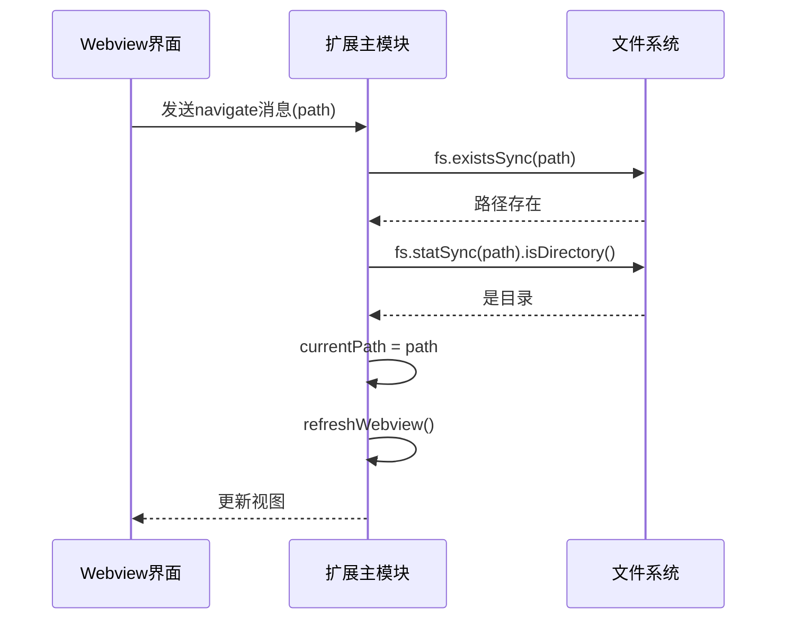
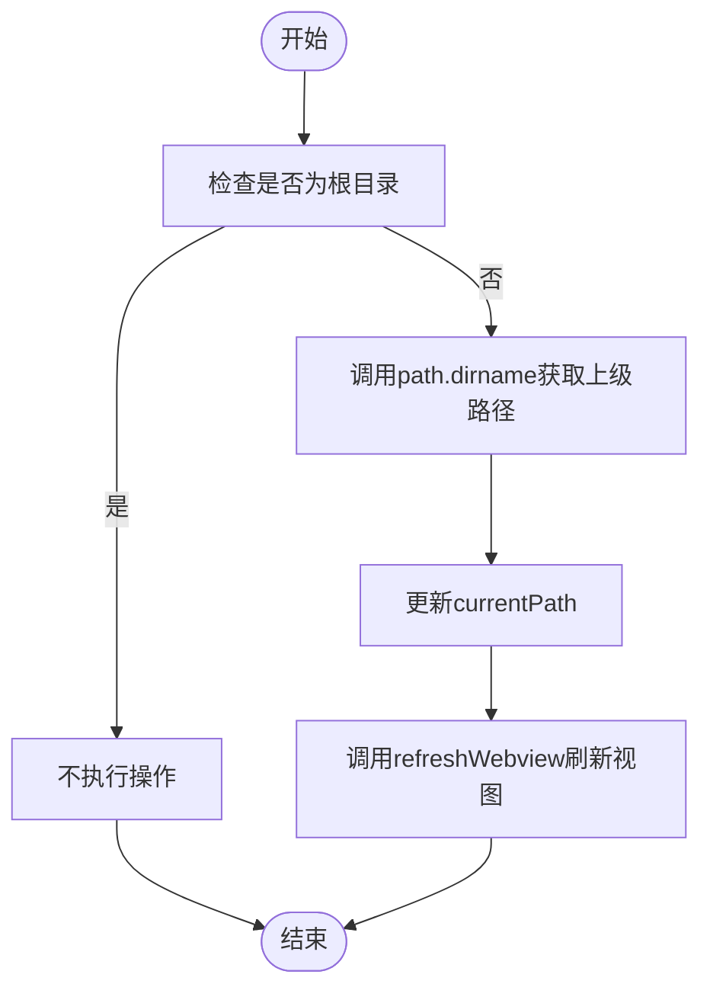
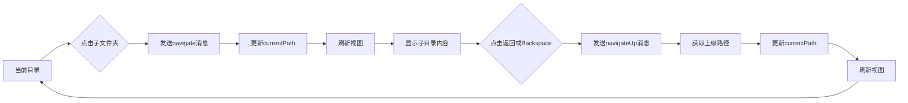
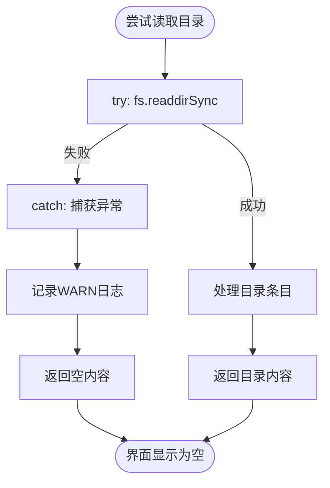

# 文件夹递归展开与上级目录处理

<cite>
**本文档引用文件**  
- [extension.js](file://extension.js)
- [src/q2.js](file://src/q2.js)
- [src/q1_temp.txt](file://src/q1_temp.txt)
</cite>

## 目录

1. [引言](#引言)  
2. [文件夹递归展开机制](#文件夹递归展开机制)  
3. [上级目录（..）的特殊处理逻辑](#上级目录（..）的特殊处理逻辑)  
4. [路径拼接与边界情况处理](#路径拼接与边界情况处理)  
5. [用户交互流程分析](#用户交互流程分析)  
6. [异常处理示例](#异常处理示例)  
7. [结论](#结论)

## 引言

本文档深入解析文件夹递归展开的实现机制，重点说明用户点击文件夹条目时如何触发 `navigateIntoFolder` 函数并更新视图。同时，详细描述上级目录（..）的特殊处理逻辑、路径拼接规则及边界情况，并结合用户工作流说明从当前目录进入子目录再返回上级的完整交互路径，最后提供访问被拒绝等异常情况的处理机制。

**Section sources**  
- [extension.js](file://extension.js#L2750-L2949)  
- [src/q2.js](file://src/q2.js#L1500-L1700)

## 文件夹递归展开机制

当用户在文件资源管理器中点击某个文件夹条目时，前端 Webview 会调用 `navigateIntoFolder(path)` 函数，该函数通过 `vscode.postMessage` 向主扩展模块发送 `navigate` 命令，并携带目标路径作为参数。

主扩展模块接收到 `navigate` 消息后，执行以下逻辑：

1. 对于 Windows 平台，若路径为盘符（如 `C:`），自动补全为 `C:\\`。
2. 使用 `fs.existsSync` 和 `fs.statSync` 验证路径是否存在且为目录。
3. 若验证通过，将全局变量 `currentPath` 更新为目标路径。
4. 调用 `refreshWebview()` 重新渲染视图，加载新目录内容。

此机制确保了用户点击文件夹后能正确导航并刷新界面。

**Diagram sources**  
- [extension.js](file://extension.js#L2786-L2811)  
- [src/q2.js](file://src/q2.js#L1578-L1624)

**Section sources**  
- [extension.js](file://extension.js#L2786-L2811)  
- [src/q2.js](file://src/q2.js#L1578-L1624)

## 上级目录（..）的特殊处理逻辑

上级目录（..）的导航通过 `navigateUp` 命令实现。其处理逻辑包含对根目录的特殊判断，防止向上越界。

具体实现如下：

- 当用户点击“返回上级”按钮或按下 Backspace 键时，触发 `navigateUp` 消息。
- 扩展模块接收到消息后，检查当前路径是否为根目录：
  - 对于 Windows，根目录形式为 `\\` 或 `C:\\`（盘符根）。
  - 使用 `currentPath !== "\\"` 和 `currentPath !== currentPath.split("\\")[0] + "\\"` 进行判断。
- 若非根目录，则调用 `path.dirname(currentPath)` 获取上级路径并更新 `currentPath`。
- 最后调用 `refreshWebview()` 刷新视图。

该逻辑确保用户在根目录时无法继续向上导航，避免路径错误。

**Diagram sources**  
- [extension.js](file://extension.js#L2800-L2811)  
- [src/q2.js](file://src/q2.js#L1615-L1624)

**Section sources**  
- [extension.js](file://extension.js#L2800-L2811)  
- [src/q2.js](file://src/q2.js#L1615-L1624)

## 路径拼接与边界情况处理

路径拼接主要使用 Node.js 的 `path.join()` 方法，确保跨平台兼容性。例如，在重命名文件或创建新文件夹时，通过 `path.join(oldDir, newName)` 构造完整路径。

边界情况处理包括：

- **根目录限制**：如前所述，根目录无法向上导航。
- **路径格式化**：Windows 下盘符路径（如 `C:`）需补全为 `C:\\` 才能正确识别为目录。
- **路径存在性检查**：在导航前使用 `fs.existsSync` 和 `fs.statSync().isDirectory()` 双重验证，防止无效路径导致错误。

这些处理确保了路径操作的健壮性和安全性。

**Section sources**  
- [extension.js](file://extension.js#L2786-L2811)  
- [src/q2.js](file://src/q2.js#L1578-L1624)

## 用户交互流程分析

用户从当前目录进入子目录再返回上级的完整交互路径如下：

1. **进入子目录**：
   - 用户点击子文件夹条目。
   - Webview 发送 `navigate` 消息。
   - 扩展模块验证路径并更新 `currentPath`。
   - 调用 `refreshWebview()` 加载子目录内容。

2. **返回上级目录**：
   - 用户点击“返回”按钮或按 Backspace 键。
   - Webview 发送 `navigateUp` 消息。
   - 扩展模块判断非根目录后，调用 `path.dirname()` 获取上级路径。
   - 更新 `currentPath` 并刷新视图。

此流程形成闭环，支持用户在目录树中自由导航。

**Diagram sources**  
- [extension.js](file://extension.js#L2786-L2811)  
- [src/q2.js](file://src/q2.js#L1578-L1624)

**Section sources**  
- [extension.js](file://extension.js#L2750-L2949)  
- [src/q2.js](file://src/q2.js#L1500-L1700)

## 异常处理示例

系统对多种异常情况进行了处理，例如访问被拒绝的目录：

- 当 `fs.readdirSync` 无法读取目录时（如权限不足），代码通过 `try-catch` 捕获异常。
- 在 `getDirectoryContents` 函数中，若 `fs.readdirSync` 抛出异常，会记录警告日志并返回空内容，避免程序崩溃。
- 用户界面将显示为空列表，表示无法访问该目录。

此外，导航失败时会通过 `vscode.window.showErrorMessage` 显示错误提示，如“无效的目录路径”或“导航失败”，并记录详细错误日志。

**Diagram sources**  
- [src/q2.js](file://src/q2.js#L481-L542)  
- [src/q1_temp.txt](file://src/q1_temp.txt#L387-L425)

**Section sources**  
- [src/q2.js](file://src/q2.js#L481-L542)  
- [src/q1_temp.txt](file://src/q1_temp.txt#L387-L425)

## 结论

本系统通过 `navigate` 和 `navigateUp` 命令实现了完整的目录导航功能。文件夹递归展开依赖路径验证与视图刷新机制，上级目录处理通过根目录判断防止越界，路径拼接使用 `path.join` 保证兼容性，异常情况通过 `try-catch` 和用户提示确保稳定性。整体设计合理，用户体验流畅。