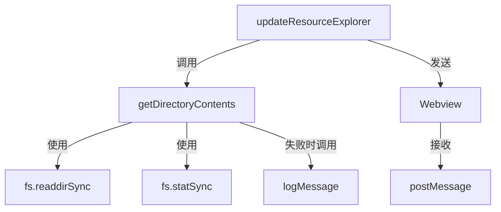

# 目录内容读取与排序

<cite>
**本文档引用的文件**
- [src/q2.js](file://src/q2.js#L495-L538)
- [extension.js](file://extension.js#L952-L995)
- [src/q2.js](file://src/q2.js#L1313-L1420)
- [extension.js](file://extension.js#L1055-L1152)
- [src/q2.js](file://src/q2.js#L543-L1139)
- [src/qqq.js](file://src/qqq.js#L16-L26)
- [extension.js](file://extension.js#L32-L42)
</cite>

## 目录

1. [函数实现逻辑](#函数实现逻辑)
2. [返回对象结构](#返回对象结构)
3. [排序机制](#排序机制)
4. [在文件浏览中的核心作用](#在文件浏览中的核心作用)
5. [错误处理策略](#错误处理策略)
6. [与Webview数据传递的关系](#与webview数据传递的关系)
7. [调用关系图](#调用关系图)

## 函数实现逻辑

`getDirectoryContents` 函数用于同步读取指定目录下的所有条目，并区分文件夹和文件。该函数在 `src/q2.js` 和 `extension.js` 中均有实现，逻辑完全一致。

函数首先使用 `fs.readdirSync` 方法同步读取目录内容，并通过 `{ withFileTypes: true }` 选项获取每个条目的类型信息。随后，遍历这些条目，对每个条目使用 `path.join` 构造完整路径，并通过 `fs.statSync` 获取其详细状态信息。根据条目类型（通过 `entry.isDirectory()` 判断），将其信息分别推入 `dirs` 或 `files` 数组。

**Section sources**
- [src/q2.js](file://src/q2.js#L495-L538)
- [extension.js](file://extension.js#L952-L995)

## 返回对象结构

该函数返回一个包含 `dirs` 和 `files` 两个数组的对象。每个数组中的条目都是一个对象，包含以下四个属性：

- **name**: 条目的名称（不包含路径）。
- **path**: 条目的完整绝对路径。
- **isDir**: 布尔值，明确标识该条目是否为文件夹。
- **mtime**: 条目的最后修改时间，以 ISO 8601 格式的字符串表示（由 `stat.mtime.toISOString()` 生成）。

这种结构清晰地分离了文件夹和文件，便于前端进行分类展示。

**Section sources**
- [src/q2.js](file://src/q2.js#L495-L538)
- [extension.js](file://extension.js#L952-L995)

## 排序机制

在收集完所有目录条目后，函数会对 `dirs` 和 `files` 两个数组分别进行排序。排序的依据是条目的 `mtime`（最后修改时间）属性。

排序逻辑通过 `Array.sort()` 方法实现，使用 `(a, b) => new Date(b.mtime) - new Date(a.mtime)` 作为比较函数。该函数将 `mtime` 字符串转换为 `Date` 对象进行比较，`b.mtime` 在前确保了结果是按修改时间从近到远（降序）排列。这种排序方式使得用户在浏览文件时，最新的文件夹和文件会排在最前面，便于快速访问。

**Section sources**
- [src/q2.js](file://src/q2.js#L495-L538)
- [extension.js](file://extension.js#L952-L995)

## 在文件浏览中的核心作用

`getDirectoryContents` 函数是文件浏览功能的核心数据提供者。它被 `updateResourceExplorer` 函数直接调用，为文件资源管理器提供当前目录的完整内容列表。

`updateResourceExplorer` 函数利用 `getDirectoryContents` 的返回结果，动态生成用于在 Webview 中显示的 HTML 内容。它会遍历 `dirs` 和 `files` 数组，为每个条目创建相应的 HTML 元素（如 `
`），并设置数据属性（`data-path`, `data-name`, `data-type`），这些属性在后续的用户交互中至关重要。

**Section sources**
- [src/q2.js](file://src/q2.js#L1313-L1420)
- [extension.js](file://extension.js#L1055-L1152)

## 错误处理策略

该函数采用了稳健的错误处理策略，以确保在遇到权限不足或损坏的文件/目录时，整个程序不会崩溃。

函数主体被包裹在一个 `try...catch` 块中，用于捕获 `fs.readdirSync` 调用时可能发生的错误（例如，目录不存在或无访问权限）。如果发生此类错误，函数会通过 `logMessage` 记录一条错误日志，然后返回一个空的 `{ dirs: [], files: [] }` 对象。

此外，在遍历每个条目时，对 `fs.statSync` 的调用也包裹在独立的 `try...catch` 块中。如果某个特定条目无法访问（如被其他进程锁定），该条目会被简单地忽略，而不会中断对其他条目的处理。这种“忽略无法访问的条目”的策略保证了文件浏览器的健壮性。

**Section sources**
- [src/q2.js](file://src/q2.js#L495-L538)
- [extension.js](file://extension.js#L952-L995)
- [src/qqq.js](file://src/qqq.js#L16-L26)
- [extension.js](file://extension.js#L32-L42)

## 与Webview数据传递的关系

`getDirectoryContents` 函数是后端（Node.js）与前端（Webview）之间数据传递的关键环节。

`updateResourceExplorer` 函数在调用 `getDirectoryContents` 获取数据后，会将生成的 `fileListHtml` 字符串和包含所有条目路径的 `items` 数组，通过 `panel.webview.postMessage` 方法发送给 Webview。Webview 接收到 `command: "update"` 消息后，会将其 `fileListHtml` 插入到 DOM 中，从而更新文件列表的视觉呈现。

同时，`items` 数组中的路径信息被 Webview 用来异步请求文件大小等附加信息。这表明 `getDirectoryContents` 不仅提供了基础的文件/文件夹列表，还为后续的异步数据加载提供了必要的元数据。

**Section sources**
- [src/q2.js](file://src/q2.js#L1313-L1420)
- [extension.js](file://extension.js#L1055-L1152)
- [src/q2.js](file://src/q2.js#L543-L1139)

## 调用关系图

该图展示了 `getDirectoryContents` 函数在代码中的调用链路。

**Diagram sources**
- [src/q2.js](file://src/q2.js#L1313-L1420)
- [src/q2.js](file://src/q2.js#L495-L538)
- [src/qqq.js](file://src/qqq.js#L16-L26)

**Section sources**
- [src/q2.js](file://src/q2.js#L1313-L1420)
- [src/q2.js](file://src/q2.js#L495-L538)
- [src/qqq.js](file://src/qqq.js#L16-L26)