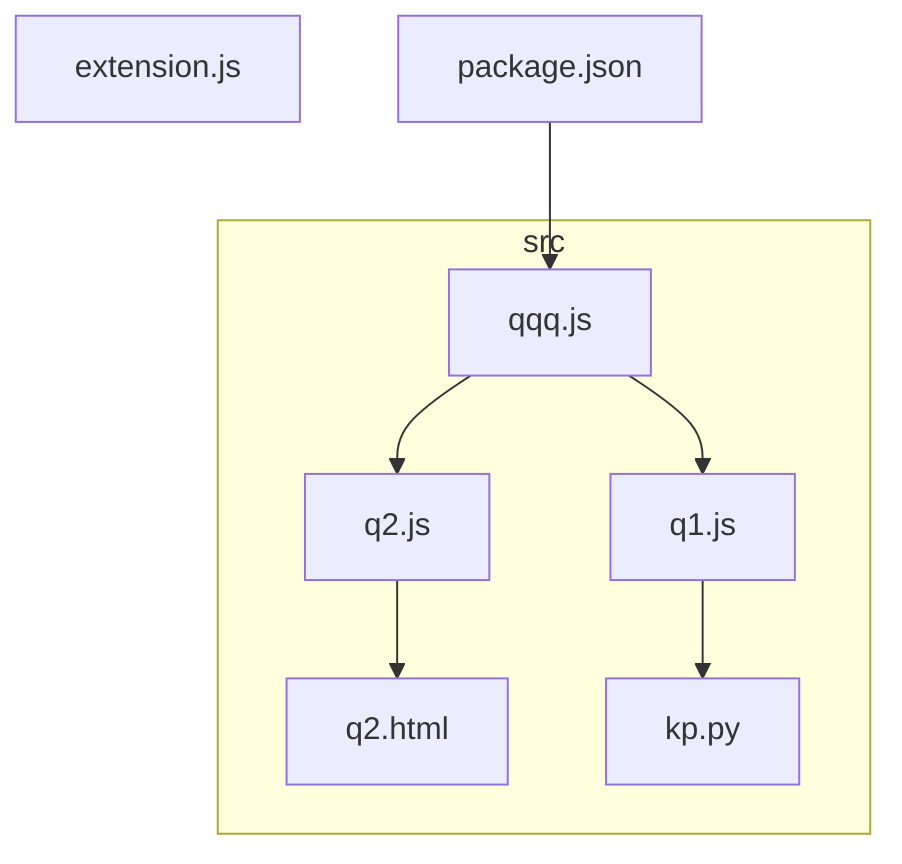
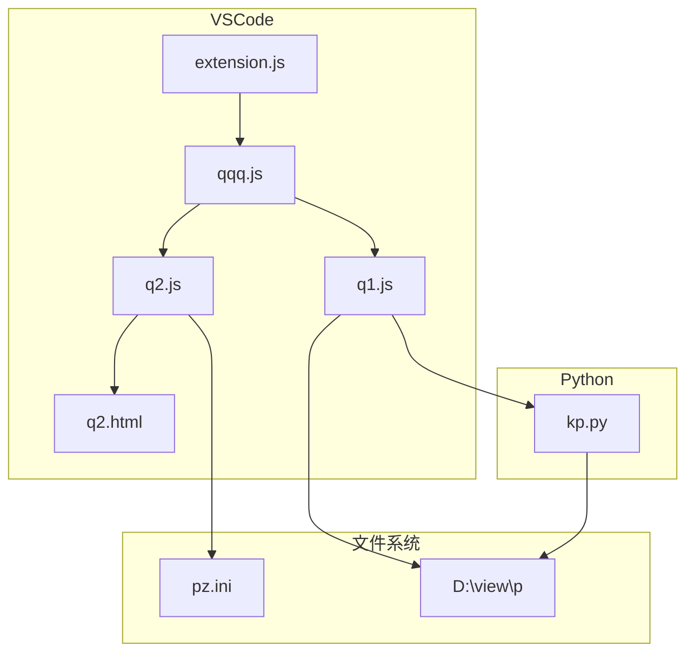
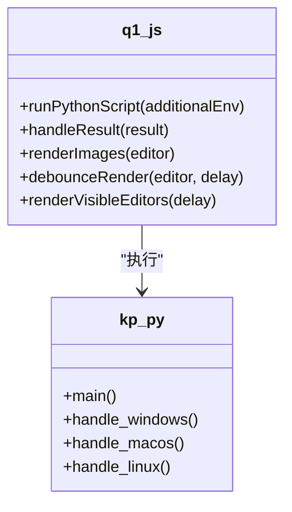
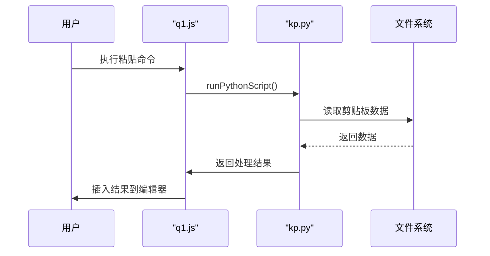
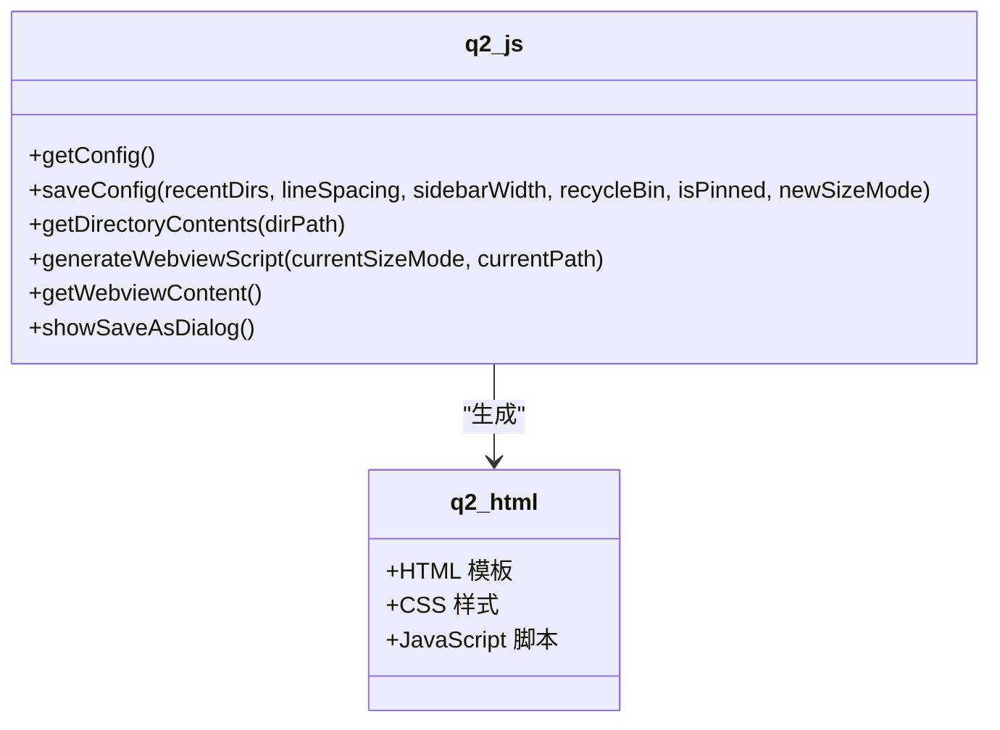
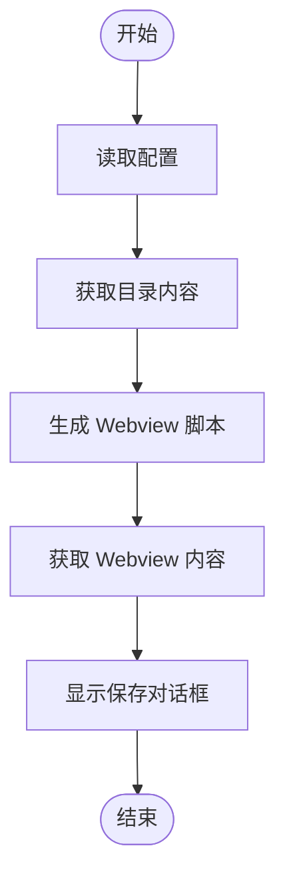
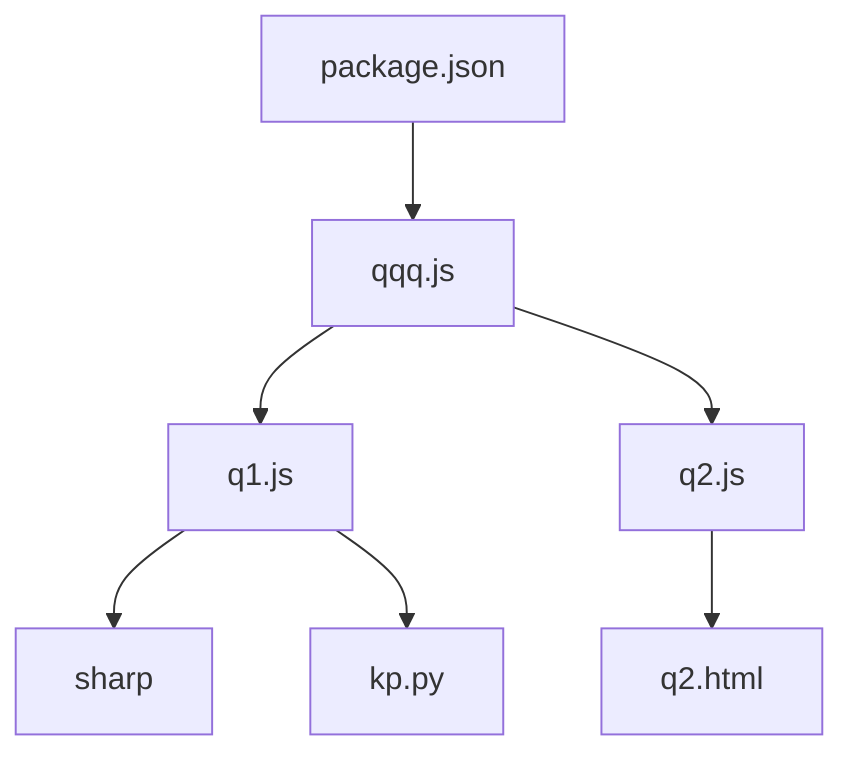

# 技术架构

<cite>
**本文档引用的文件**   
- [qqq.js](file://src/qqq.js)
- [q1.js](file://src/q1.js)
- [q2.js](file://src/q2.js)
- [q2.html](file://src/q2.html)
- [extension.js](file://extension.js)
- [package.json](file://package.json)
- [kp.py](file://src/kp.py)
- [重构完成报告.md](file://重构完成报告.md)
</cite>

## 目录
1. [简介](#简介)
2. [项目结构](#项目结构)
3. [核心组件](#核心组件)
4. [架构概述](#架构概述)
5. [详细组件分析](#详细组件分析)
6. [依赖分析](#依赖分析)
7. [性能考虑](#性能考虑)
8. [故障排除指南](#故障排除指南)
9. [结论](#结论)

## 简介
本技术架构文档旨在深入分析以 `qqq.js` 为核心的模块化架构设计。项目通过单一职责原则将功能划分为独立的 Q1 和 Q2 模块，并通过主入口进行注册与协调。文档详细阐述了 MVC 模式在 Q2 模块中的应用，其中 `q2.html` 为视图层，`q2.js` 为控制层，文件系统为模型层。同时，文档解析了插件式架构如何通过 `activationEvents` 和 `contributes` 实现 VSCode 集成，以及 HTML/JS 分离策略的优势。结合《重构完成报告.md》，文档说明了从混乱代码到清晰分层的演进过程，并通过系统上下文图、组件交互图和数据流图，展示用户操作→命令触发→JS处理→Python执行→结果返回的完整路径。

## 项目结构
项目采用模块化设计，将功能划分为独立的模块，以提高代码的可维护性和可扩展性。主入口 `qqq.js` 负责协调各个模块的激活和注册，而 `q1.js` 和 `q2.js` 分别负责不同的功能模块。

**图源**
- [qqq.js](file://src/qqq.js)
- [q1.js](file://src/q1.js)
- [q2.js](file://src/q2.js)
- [q2.html](file://src/q2.html)
- [kp.py](file://src/kp.py)
- [package.json](file://package.json)

**章节源**
- [qqq.js](file://src/qqq.js)
- [q1.js](file://src/q1.js)
- [q2.js](file://src/q2.js)
- [q2.html](file://src/q2.html)
- [kp.py](file://src/kp.py)
- [package.json](file://package.json)

## 核心组件
`qqq.js` 作为主入口文件，负责导出公共配置常量和工具函数，并激活 `q1` 和 `q2` 模块。`q1.js` 负责处理粘贴逻辑、图片渲染和 CodeLens 提供器，而 `q2.js` 则负责文件导航和配置管理。`q2.html` 作为独立的 HTML 模板文件，通过占位符系统与 `q2.js` 进行交互。

**章节源**
- [qqq.js](file://src/qqq.js)
- [q1.js](file://src/q1.js)
- [q2.js](file://src/q2.js)
- [q2.html](file://src/q2.html)

## 架构概述
项目采用模块化架构，通过 `qqq.js` 作为主入口，协调 `q1` 和 `q2` 模块的激活和注册。`q1` 模块负责处理粘贴逻辑和图片渲染，而 `q2` 模块则负责文件导航和配置管理。MVC 模式在 `q2` 模块中得到应用，其中 `q2.html` 为视图层，`q2.js` 为控制层，文件系统为模型层。

**图源**
- [qqq.js](file://src/qqq.js)
- [q1.js](file://src/q1.js)
- [q2.js](file://src/q2.js)
- [q2.html](file://src/q2.html)
- [kp.py](file://src/kp.py)
- [config.ini](file://E:\r\pz.ini)
- [view_p](file://D:\view\p)

**章节源**
- [qqq.js](file://src/qqq.js)
- [q1.js](file://src/q1.js)
- [q2.js](file://src/q2.js)
- [q2.html](file://src/q2.html)
- [kp.py](file://src/kp.py)

## 详细组件分析
### Q1 模块分析
`q1.js` 模块负责处理粘贴逻辑、图片渲染和 CodeLens 提供器。它通过 `runPythonScript` 函数执行 Python 脚本 `kp.py`，并将结果插入到编辑器中。`renderImages` 函数负责渲染图片，支持使用 `sharp` 库调整图片尺寸。

#### 对象导向组件

**图源**
- [q1.js](file://src/q1.js)
- [kp.py](file://src/kp.py)

#### API/服务组件

**图源**
- [q1.js](file://src/q1.js)
- [kp.py](file://src/kp.py)

**章节源**
- [q1.js](file://src/q1.js)
- [kp.py](file://src/kp.py)

### Q2 模块分析
`q2.js` 模块负责文件导航和配置管理。它通过 `getConfig` 和 `saveConfig` 函数读取和保存配置，通过 `getDirectoryContents` 函数获取目录内容，并通过 `generateWebviewScript` 函数生成 Webview 脚本。

#### 对象导向组件

**图源**
- [q2.js](file://src/q2.js)
- [q2.html](file://src/q2.html)

#### 复杂逻辑组件

**图源**
- [q2.js](file://src/q2.js)

**章节源**
- [q2.js](file://src/q2.js)
- [q2.html](file://src/q2.html)

## 依赖分析
项目依赖于 `sharp` 库来调整图片尺寸，并通过 `package.json` 中的 `activationEvents` 和 `contributes` 实现 VSCode 集成。`qqq.js` 作为主入口，依赖于 `q1.js` 和 `q2.js` 模块。

**图源**
- [package.json](file://package.json)
- [qqq.js](file://src/qqq.js)
- [q1.js](file://src/q1.js)
- [q2.js](file://src/q2.js)
- [q2.html](file://src/q2.html)
- [kp.py](file://src/kp.py)
- [sharp](file://node_modules/sharp)

**章节源**
- [package.json](file://package.json)
- [qqq.js](file://src/qqq.js)
- [q1.js](file://src/q1.js)
- [q2.js](file://src/q2.js)
- [q2.html](file://src/q2.html)
- [kp.py](file://src/kp.py)

## 性能考虑
项目通过防抖处理函数 `debounceRender` 避免短时间内多次触发渲染，提高性能。同时，通过缓存文件大小和配置，减少重复计算和读取。

## 故障排除指南
- **问题：无法读取配置文件**
  - **解决方案**：检查 `pz.ini` 文件是否存在，路径是否正确。
- **问题：图片渲染失败**
  - **解决方案**：检查 `sharp` 库是否安装，图片路径是否正确。
- **问题：命令未找到**
  - **解决方案**：检查 `package.json` 中的 `activationEvents` 和 `contributes` 配置是否正确。

**章节源**
- [qqq.js](file://src/qqq.js)
- [q1.js](file://src/q1.js)
- [q2.js](file://src/q2.js)
- [kp.py](file://src/kp.py)
- [package.json](file://package.json)

## 结论
本项目通过模块化架构设计，实现了功能的清晰分离和高可维护性。`qqq.js` 作为主入口，协调 `q1` 和 `q2` 模块的激活和注册，`q1.js` 和 `q2.js` 分别负责不同的功能模块。MVC 模式在 `q2` 模块中得到应用，HTML/JS 分离策略提高了代码的可读性和可维护性。通过 `activationEvents` 和 `contributes` 实现了 VSCode 集成，确保了扩展的灵活性和可扩展性。