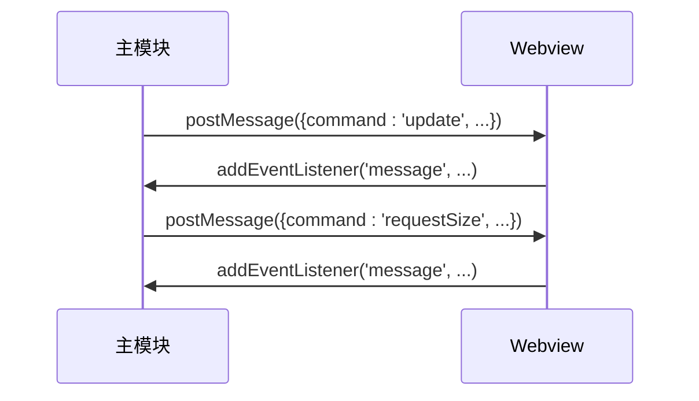

<!-- File: .qoder/repowiki/zh/content/故障排除/Q2界面加载失败诊断.md -->
# Q2界面加载失败诊断

<cite>
**本文档引用文件**
- [q2.html](file://src\q2.html)
- [q2.js](file://src\q2.js)
- [q2占位符空格问题修复.md](file://q2占位符空格问题修复.md)
- [q2界面完全修复报告.md](file://q2界面完全修复报告.md)
- [q2界面问题诊断.md](file://q2界面问题诊断.md)
</cite>

## 目录
1. [引言](#引言)
2. [HTML模板占位符替换逻辑错误](#html模板占位符替换逻辑错误)
3. [动态资源路径解析失败](#动态资源路径解析失败)
4. [CSS样式未正确注入](#css样式未正确注入)
5. [JavaScript消息通信机制](#javascript消息通信机制)
6. [调试技巧与验证方法](#调试技巧与验证方法)
7. [典型故障案例分析](#典型故障案例分析)
8. [结论](#结论)

## 引言
Q2 Webview界面加载失败是开发过程中常见的问题，主要涉及HTML模板中占位符替换逻辑错误、动态资源路径解析失败、CSS样式未正确注入等。本文将系统性地解析这些问题，并结合q2.js中的webviewPanel和HTML消息通信机制，说明JavaScript如何向Webview注入内容及常见中断点。同时提供调试技巧和典型故障案例，帮助开发者快速定位和解决问题。

## HTML模板占位符替换逻辑错误
### 占位符格式不一致
在q2.html文件中，占位符的格式必须与q2.js中的替换逻辑完全一致。例如，如果q2.html中的占位符为`{{INLINE_SCRIPT}}`，则q2.js中的替换代码必须为`htmlTemplate.replace(/\{\{INLINE_SCRIPT\}\}/g, inlineScript);`。任何格式上的不一致（如多出空格）都会导致替换失败。

### 替换逻辑错误
q2.js中的`getWebviewContent`函数负责读取q2.html模板并替换占位符。如果替换逻辑有误，例如正则表达式不匹配或替换顺序错误，会导致占位符未被正确替换，从而影响Webview的正常加载。

**Section sources**
- [q2.html](file://src\q2.html)
- [q2.js](file://src\q2.js)

## 动态资源路径解析失败
### 路径转义问题
在Windows系统中，路径分隔符为反斜杠`\`，而在JavaScript中反斜杠是转义字符。因此，在将路径插入HTML模板时，必须对路径进行正确的转义处理。例如，`C:\Users\Name`应转义为`C:\\Users\\Name`。

### 路径不存在
如果指定的资源路径不存在，Webview将无法加载相应的资源。确保所有动态资源路径在插入模板前都经过存在性检查。

**Section sources**
- [q2.js](file://src\q2.js)

## CSS样式未正确注入
### 内联样式与外部样式
q2.html中的CSS样式可以通过内联方式直接写在`<style>`标签中，也可以通过外部链接引入。确保CSS文件路径正确且可访问。

### 样式优先级
当多个CSS规则应用于同一元素时，优先级较高的规则会覆盖优先级较低的规则。确保关键样式具有足够的优先级，避免被其他样式覆盖。

**Section sources**
- [q2.html](file://src\q2.html)

## JavaScript消息通信机制
### WebviewPanel与HTML通信
q2.js通过`vscode.postMessage`向Webview发送消息，Webview通过`window.addEventListener('message', ...)`接收消息。这种双向通信机制允许主模块与Webview之间交换数据和指令。

### 消息类型与处理
常见的消息类型包括`update`（更新文件列表）、`requestSize`（请求文件大小）、`navigate`（导航到指定路径）等。每种消息类型都有对应的处理逻辑，确保消息的正确解析和响应。

**Diagram sources**
- [q2.js](file://src\q2.js)

## 调试技巧与验证方法
### 启用Webview开发者工具
通过右键点击Webview并选择“检查”来启用开发者工具，可以查看HTML、CSS和JavaScript的实时状态，帮助定位问题。

### 检查Content-Security-Policy限制
确保`<meta http-equiv="Content-Security-Policy">`标签中的策略允许必要的资源加载。例如，`script-src 'unsafe-inline'`允许内联脚本执行。

### 验证本地资源URI转换
使用`vscode.Uri.file`将本地文件路径转换为Webview可识别的URI格式，确保资源能够正确加载。

**Section sources**
- [q2.html](file://src\q2.html)
- [q2.js](file://src\q2.js)

## 典型故障案例分析
### 空格导致的路径解析异常
在q2.html中，如果占位符`{{INLINE_SCRIPT}}`被错误地写成`{ { INLINE_SCRIPT } }`（多出空格），则q2.js中的正则表达式无法匹配，导致JavaScript代码未被注入，Webview中所有函数未定义。

### 未等待DOM加载完成即发送消息
在Webview的`DOMContentLoaded`事件触发前发送消息，可能导致消息处理函数尚未定义，从而引发错误。确保在DOM完全加载后再发送消息。

**Section sources**
- [q2占位符空格问题修复.md](file://q2占位符空格问题修复.md)
- [q2界面完全修复报告.md](file://q2界面完全修复报告.md)
- [q2界面问题诊断.md](file://q2界面问题诊断.md)

## 结论
Q2 Webview界面加载失败的原因多种多样，但通过系统性的分析和调试，大多数问题都可以得到有效解决。关键在于确保HTML模板中的占位符格式正确、动态资源路径解析无误、CSS样式正确注入，并充分利用JavaScript消息通信机制进行调试和验证。希望本文提供的方法和案例能帮助开发者快速定位和解决相关问题。