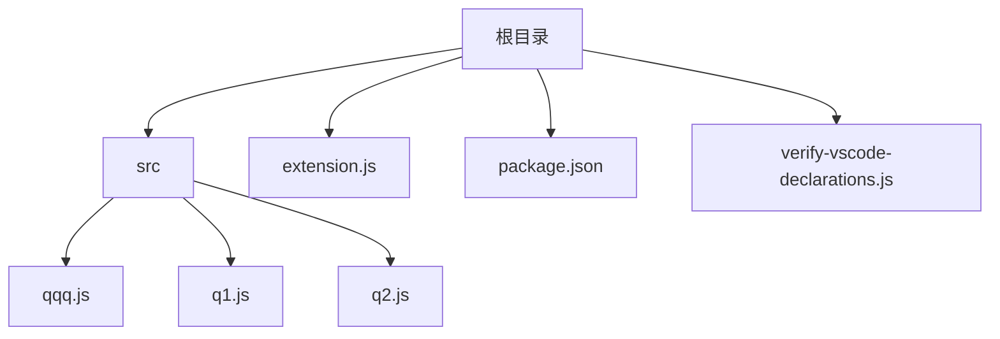
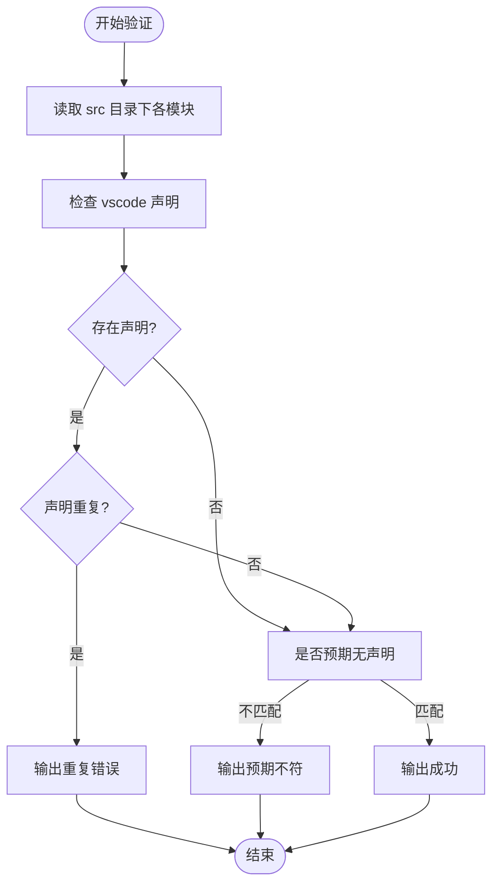

<!-- File: .qoder/repowiki/zh/content/故障排除/VSCode类型声明冲突解决.md -->
# VSCode类型声明冲突解决

<cite>
**本文档引用的文件**
- [package.json](file://package.json)
- [verify-vscode-declarations.js](file://verify-vscode-declarations.js)
- [extension.js](file://extension.js)
- [src/qqq.js](file://src/qqq.js)
- [src/q1.js](file://src/q1.js)
- [src/q2.js](file://src/q2.js)
</cite>

## 目录
1. [引言](#引言)
2. [项目结构](#项目结构)
3. [核心问题分析](#核心问题分析)
4. [VSCode类型声明冲突的根本原因](#vscode类型声明冲突的根本原因)
5. [依赖配置分析](#依赖配置分析)
6. [重复声明检测机制](#重复声明检测机制)
7. [解决方案与最佳实践](#解决方案与最佳实践)
8. [tsconfig.json配置建议](#tsconfigjson配置建议)
9. [工程化预防措施](#工程化预防措施)
10. [结论](#结论)

## 引言
本项目为一个VSCode扩展，旨在提供增强的编辑器功能。在开发过程中，出现了因`@types/vscode`版本不一致导致的类型声明冲突问题。本文将深入分析该问题的根本原因，结合现有脚本和配置，提出系统性解决方案，并建立长期预防机制。

## 项目结构
项目采用典型的VSCode扩展结构，包含源码目录、主入口文件、类型检测脚本及配置文件。



**Diagram sources**
- [package.json](file://package.json#L1-L77)
- [extension.js](file://extension.js#L1-L3187)

**Section sources**
- [package.json](file://package.json#L1-L77)
- [extension.js](file://extension.js#L1-L3187)

## 核心问题分析
项目中存在多个模块对`vscode`模块的引用需求，但缺乏统一的类型声明管理机制，导致潜在的重复声明和版本冲突风险。

**Section sources**
- [extension.js](file://extension.js#L1-L3187)
- [src/qqq.js](file://src/qqq.js)
- [src/q1.js](file://src/q1.js)
- [src/q2.js](file://src/q2.js)

## VSCode类型声明冲突的根本原因
### 多模块依赖下的命名空间污染
当多个源文件通过`require('vscode')`引入VSCode API时，若未统一类型定义版本，TypeScript编译器可能加载多个不同版本的`@types/vscode`，造成类型重复定义。

### 全局安装与本地依赖冲突
若开发者全局安装了`@types/vscode`，而项目中又声明了不同版本的本地依赖，Node.js模块解析机制可能导致类型定义来源混乱。

### 版本不一致引发的编译错误
`package.json`中`@types/vscode`版本为`^1.70.0`，若其他依赖间接引入不同主版本的类型定义，将导致接口不兼容、编译失败。

**Section sources**
- [package.json](file://package.json#L65-L66)

## 依赖配置分析
项目当前依赖配置如下：

```json
"dependencies": {
  "sharp": "^0.34.4"
},
"devDependencies": {
  "@types/vscode": "^1.70.0",
  "@types/node": "^18.0.0",
  "vsce": "^2.15.0"
}
```

该配置将`@types/vscode`置于`devDependencies`是正确的做法，因为类型定义仅在开发时需要。

**Diagram sources**
- [package.json](file://package.json#L58-L77)

**Section sources**
- [package.json](file://package.json#L58-L77)

## 重复声明检测机制
### verify-vscode-declarations.js 脚本分析
该脚本用于验证各模块中`vscode`声明的正确性，其核心逻辑包括：

1. 定义每个文件是否应包含`vscode`声明的预期
2. 读取文件内容并查找`const vscode = require("vscode")`模式
3. 检查声明是否存在、是否重复
4. 输出验证结果并设置退出码



**Diagram sources**
- [verify-vscode-declarations.js](file://verify-vscode-declarations.js#L1-L71)

**Section sources**
- [verify-vscode-declarations.js](file://verify-vscode-declarations.js#L1-L71)

## 解决方案与最佳实践
### 统一依赖版本
确保所有环境中`@types/vscode`版本一致：
```bash
npm install --save-dev @types/vscode@1.70.0
```

### 使用包管理器强制版本
#### Yarn Resolutions
```json
"resolutions": {
  "@types/vscode": "1.70.0"
}
```

#### npm Overrides (npm v8.3+)
```json
"overrides": {
  "@types/vscode": "1.70.0"
}
```

### 移除重复安装
检查并移除全局或其他位置重复的`@types/vscode`安装：
```bash
npm list -g @types/vscode
npm uninstall -g @types/vscode
```

### 模块化引入规范
在`src`目录下的模块中，应遵循以下规范：
- `q1.js`和`q2.js`：必须包含`vscode`声明
- `qqq.js`：作为主入口，不应直接依赖`vscode`
- 所有文件：禁止重复声明`vscode`

**Section sources**
- [verify-vscode-declarations.js](file://verify-vscode-declarations.js#L4-L18)
- [extension.js](file://extension.js#L1)

## tsconfig.json配置建议
虽然项目中未提供`tsconfig.json`，但建议创建以控制类型解析：

```json
{
  "compilerOptions": {
    "types": ["vscode", "node"],
    "typeRoots": ["./node_modules/@types"]
  },
  "include": [
    "src"
  ]
}
```

其中`types`字段显式指定允许的类型包，防止意外引入其他类型定义。

## 工程化预防措施
### 依赖审计流程
建立定期依赖审查机制：
```bash
npm audit
npm ls @types/vscode
```

### CI检查规则
在持续集成流程中加入类型声明验证：
```yaml
- run: node verify-vscode-declarations.js
  name: 验证VSCode声明
```

### 脚本自动化
将验证脚本加入`package.json`：
```json
"scripts": {
  "verify": "node verify-vscode-declarations.js"
}
```

**Section sources**
- [package.json](file://package.json#L50-L56)
- [verify-vscode-declarations.js](file://verify-vscode-declarations.js)

## 结论
VSCode类型声明冲突问题源于版本不一致和缺乏统一管理。通过规范依赖配置、使用版本锁定机制、实施自动化检测，可有效解决并预防此类问题。建议将`verify-vscode-declarations.js`作为标准验证步骤纳入开发流程，确保代码库的类型安全性。