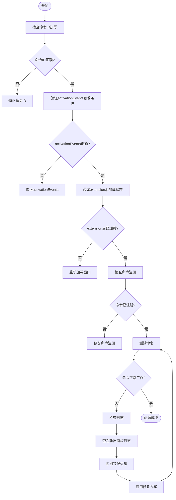

# 命令未找到问题排查

<cite>
**本文档引用文件**  
- [package.json](file://package.json)
- [extension.js](file://extension.js)
- [src/qqq.js](file://src/qqq.js)
- [src/q1.js](file://src/q1.js)
- [src/q2.js](file://src/q2.js)
- [命令未找到诊断.md](file://命令未找到诊断.md)
- [vscode重复声明修复报告.md](file://vscode重复声明修复报告.md)
- [立即测试-修复完成.md](file://立即测试-修复完成.md)
</cite>

## 目录
1. [简介](#简介)
2. [VSCode扩展命令注册机制](#vscode扩展命令注册机制)
3. [activationEvents与package.json配置分析](#activationevents与packagejson配置分析)
4. [主入口extension.js命令注册分析](#主入口extensionjs命令注册分析)
5. [延迟激活导致的命令不可用场景](#延迟激活导致的命令不可用场景)
6. [命令未找到问题诊断流程图](#命令未找到问题诊断流程图)
7. [常见错误示例与修复方案](#常见错误示例与修复方案)
8. [开发者工具使用指南](#开发者工具使用指南)
9. [结论](#结论)

## 简介
本文档旨在为开发者提供针对“命令未找到”问题的专项排查指南。通过分析VSCode扩展的命令注册机制，详细解释`activationEvents`与`package.json`中`contributes.commands`的匹配关系，并结合代码实例说明主入口`extension.js`如何通过`registerCommand`注册命令。文档还涵盖了延迟激活导致的命令不可用场景，提供完整的诊断流程图，从检查命令ID拼写、验证`activationEvents`触发条件到调试`extension.js`加载状态。此外，文档包含常见错误示例，如事件未正确订阅、上下文环境不满足、贡献点配置缺失等，并给出相应的修复方案。最后，指导开发者使用开发者工具查看命令面板日志和输出通道信息。

## VSCode扩展命令注册机制
VSCode扩展的命令注册机制是基于事件驱动的，扩展的激活依赖于`package.json`文件中的`activationEvents`字段。当指定的事件被触发时，VSCode会加载并执行扩展的主入口文件（由`main`字段指定），从而注册扩展提供的所有命令。

### 命令注册流程
1. **扩展激活**：当`activationEvents`中定义的事件发生时，VSCode会激活扩展。
2. **主入口执行**：VSCode执行`main`字段指定的入口文件中的`activate`函数。
3. **命令注册**：在`activate`函数中，通过`vscode.commands.registerCommand`方法注册命令。
4. **命令可用**：注册完成后，命令即可在命令面板中使用。

### 核心组件
- **`package.json`**：定义扩展的元数据、激活事件和贡献点。
- **`main`字段**：指定扩展的主入口文件。
- **`activationEvents`字段**：定义触发扩展激活的事件。
- **`contributes.commands`字段**：定义扩展提供的命令。
- **`extension.js`**：扩展的主入口文件，包含`activate`和`deactivate`函数。

**Section sources**
- [package.json](file://package.json#L1-L77)
- [extension.js](file://extension.js#L3115-L3179)

## activationEvents与package.json配置分析
`package.json`文件中的`activationEvents`和`contributes.commands`字段是扩展命令注册的核心配置。`activationEvents`定义了扩展激活的条件，而`contributes.commands`定义了扩展提供的命令。

### activationEvents配置
`activationEvents`字段包含一系列事件，当这些事件发生时，VSCode会激活扩展。常见的激活事件包括：
- `*`：扩展在VSCode启动时立即激活。
- `onCommand:commandId`：当指定的命令被调用时激活扩展。
- `onLanguage:languageId`：当指定语言的文件打开时激活扩展。
- `onFileSystem:scheme`：当指定文件系统的文件被访问时激活扩展。

在本项目中，`activationEvents`配置如下：
```json
"activationEvents": [
    "*",
    "onCommand:qqq.q1",
    "onCommand:qqq.q2",
    "onCommand:qqq.toggleBlockMode"
]
```
这表示扩展在VSCode启动时立即激活，或者当`qqq.q1`、`qqq.q2`或`qqq.toggleBlockMode`命令被调用时激活。

### contributes.commands配置
`contributes.commands`字段定义了扩展提供的命令，每个命令包含`command`和`title`两个属性。`command`是命令的唯一标识符，`title`是命令在命令面板中显示的名称。

在本项目中，`contributes.commands`配置如下：
```json
"commands": [
    {
        "command": "qqq.q1",
        "title": "q1"
    },
    {
        "command": "qqq.toggleBlockMode",
        "title": "切换块模式"
    },
    {
        "command": "qqq.q2",
        "title": "q2"
    },
    {
        "command": "qqq.saveAsDialog",
        "title": "qqq: 新建文件..."
    }
]
```
这表示扩展提供了四个命令：`qqq.q1`、`qqq.toggleBlockMode`、`qqq.q2`和`qqq.saveAsDialog`。

### 配置匹配关系
`activationEvents`中的`onCommand:commandId`必须与`contributes.commands`中的`command`匹配，否则命令无法被正确激活。例如，`onCommand:qqq.q1`必须与`contributes.commands`中的`command: "qqq.q1"`匹配。

**Section sources**
- [package.json](file://package.json#L1-L77)

## 主入口extension.js命令注册分析
主入口文件`extension.js`（或`src/qqq.js`）中的`activate`函数负责注册扩展的所有命令。通过`vscode.commands.registerCommand`方法，将命令ID与对应的处理函数关联起来。

### 命令注册代码
在`src/qqq.js`中，`activate`函数通过调用子模块的`activate`函数来注册命令。`q1.js`和`q2.js`分别负责注册各自的命令。

```javascript
function activate(context) {
    // 导入子模块
    const q1 = require('./q1');
    const q2 = require('./q2');

    // 注册 q1 模块的所有命令
    if (q1 && typeof q1.activate === 'function') {
        q1.activate(context);
    }

    // 注册 q2 模块的所有命令
    if (q2 && typeof q2.activate === 'function') {
        q2.activate(context);
    }
}
```

在`src/q1.js`中，`activate`函数注册了`qqq.q1`、`qqq.toggleBlockMode`和`qqq.openFile`命令：
```javascript
function activate(context) {
    context.subscriptions.push(
        vscode.commands.registerCommand("qqq.q1", executeClipboardCommand),
        vscode.commands.registerCommand("qqq.toggleBlockMode", toggleBlockMode),
        vscode.commands.registerCommand("qqq.openFile", openFileCommand),
        vscode.languages.registerCodeLensProvider(
            { scheme: "file" },
            new FileCodeLensProvider(),
        ),
    );
}
```

在`src/q2.js`中，`activate`函数注册了`qqq.q2`和`qqq.saveAsDialog`命令：
```javascript
function activate(context) {
    context.subscriptions.push(
        vscode.commands.registerCommand("qqq.q2", showSaveAsDialog),
        vscode.commands.registerCommand("qqq.saveAsDialog", showSaveAsDialog),
    );
}
```

### 命令注册流程
1. **扩展激活**：当`activationEvents`中的事件触发时，VSCode执行`src/qqq.js`中的`activate`函数。
2. **子模块加载**：`activate`函数加载`q1.js`和`q2.js`模块。
3. **命令注册**：`q1.js`和`q2.js`中的`activate`函数分别注册各自的命令。
4. **事件监听**：注册命令的同时，还注册了事件监听器，如`onDidChangeActiveTextEditor`和`onDidChangeTextDocument`，以响应编辑器状态的变化。

**Section sources**
- [src/qqq.js](file://src/qqq.js#L34-L60)
- [src/q1.js](file://src/q1.js#L352-L380)
- [src/q2.js](file://src/q2.js#L1931-L1940)

## 延迟激活导致的命令不可用场景
延迟激活是指扩展在特定事件发生时才被激活，而不是在VSCode启动时立即激活。这种机制可以提高VSCode的启动性能，但可能导致命令在激活前不可用。

### 延迟激活场景
1. **`onCommand`事件**：当用户尝试执行一个命令时，如果该命令对应的扩展尚未激活，VSCode会先激活扩展，然后执行命令。如果扩展激活失败，命令将无法执行。
2. **`onLanguage`事件**：当用户打开特定语言的文件时，VSCode会激活对应的扩展。如果扩展激活失败，该语言相关的功能将不可用。
3. **`onFileSystem`事件**：当用户访问特定文件系统的文件时，VSCode会激活对应的扩展。如果扩展激活失败，文件访问功能将不可用。

### 延迟激活问题排查
1. **检查`activationEvents`配置**：确保`activationEvents`中的事件与`contributes.commands`中的命令匹配。
2. **检查扩展激活日志**：在VSCode的输出面板中查看“Log (Extension Host)”日志，确认扩展是否成功激活。
3. **重新加载窗口**：如果扩展未正确激活，可以尝试重新加载VSCode窗口，以清除缓存并重新激活扩展。

**Section sources**
- [package.json](file://package.json#L1-L77)
- [命令未找到诊断.md](file://命令未找到诊断.md#L0-L220)

## 命令未找到问题诊断流程图
以下是“命令未找到”问题的完整诊断流程图，帮助开发者系统地排查问题。



**Diagram sources**
- [package.json](file://package.json#L1-L77)
- [extension.js](file://extension.js#L3115-L3179)
- [命令未找到诊断.md](file://命令未找到诊断.md#L0-L220)

## 常见错误示例与修复方案
### 1. vscode重复声明错误
**错误信息**：
```
Identifier 'vscode' has already been declared
```

**根本原因**：
`qqq.js`、`q1.js`和`q2.js`都声明了`const vscode = require("vscode")`，导致模块加载时出现重复声明错误。

**修复方案**：
- `qqq.js`不需要直接使用`vscode` API，只应导出公共配置和工具函数。
- 删除`qqq.js`中的`const vscode = require("vscode")`声明。

**修复后代码**：
```javascript
// src/qqq.js (✅ 正确)
const fs = require("fs");      // ✅ 只需要 fs
const path = require("path");  // ✅ 只需要 path

// ... 公共配置和工具函数

function activate(context) {
    const q1 = require('./q1');
    const q2 = require('./q2');

    q1.activate(context);  // q1 内部有自己的 vscode
    q2.activate(context);  // q2 内部有自己的 vscode
}
```

**Section sources**
- [vscode重复声明修复报告.md](file://vscode重复声明修复报告.md#L0-L162)

### 2. undefined_publisher警告
**错误信息**：
```
Activating extension 'undefined_publisher.qqq' failed
```

**根本原因**：
`package.json`中缺少`publisher`字段，导致VSCode无法识别扩展的发布者。

**修复方案**：
- 在`package.json`中添加`"publisher": "qqq"`。

**修复后代码**：
```json
{
  "name": "qqq",
  "displayName": "qqq",
  "publisher": "qqq",
  "version": "1.0.0",
  "engines": {
    "vscode": "^1.70.0"
  },
  "activationEvents": [
    "*",
    "onCommand:qqq.q1",
    "onCommand:qqq.q2",
    "onCommand:qqq.toggleBlockMode"
  ],
  "main": "./src/qqq.js",
  "contributes": {
    "configuration": [
      {
        "title": "QQQ 扩展设置",
        "properties": {
          "qqq.showHistoryRecycleBin": {
            "type": "boolean",
            "default": true,
            "description": "是否在文件导航中显示历史回收站。"
          }
        }
      }
    ],
    "commands": [
      {
        "command": "qqq.q1",
        "title": "q1"
      },
      {
        "command": "qqq.toggleBlockMode",
        "title": "切换块模式"
      },
      {
        "command": "qqq.q2",
        "title": "q2"
      },
      {
        "command": "qqq.saveAsDialog",
        "title": "qqq: 新建文件..."
      }
    ],
    "keybindings": [
      {
        "command": "qqq.q1",
        "key": "ctrl+v",
        "when": "editorTextFocus && !editorReadonly"
      },
      {
        "command": "qqq.q1",
        "key": "cmd+v",
        "when": "editorTextFocus && !editorReadonly"
      },
      {
        "command": "qqq.q2",
        "key": "f2",
        "when": "editorTextFocus && !editorReadonly"
      }
    ]
  },
  "scripts": {
    "package": "vsce package --allow-missing-repository",
    "publish": "vsce publish",
    "test": "echo \"Running tests...\" && exit 0"
  },
  "dependencies": {
    "sharp": "^0.34.4"
  },
  "devDependencies": {
    "@types/vscode": "^1.70.0",
    "@types/node": "^18.0.0",
    "vsce": "^2.15.0"
  }
}
```

**Section sources**
- [立即测试-修复完成.md](file://立即测试-修复完成.md#L0-L186)

### 3. 命令注册代码问题
**错误信息**：
```
command 'qqq.q1' not found
command 'qqq.q2' not found
```

**根本原因**：
- `qqq.js`中的`activate`函数未正确调用`q1.js`和`q2.js`的`activate`函数。
- `q1.js`和`q2.js`中的`activate`函数未正确注册命令。

**修复方案**：
- 确保`qqq.js`中的`activate`函数正确调用`q1.js`和`q2.js`的`activate`函数。
- 确保`q1.js`和`q2.js`中的`activate`函数正确注册命令。

**修复后代码**：
```javascript
// src/qqq.js
function activate(context) {
    const q1 = require('./q1');
    const q2 = require('./q2');

    if (q1 && typeof q1.activate === 'function') {
        q1.activate(context);
        console.log('q1.activate 执行完成');
    } else {
        console.error('q1.activate 不存在或不是函数!');
    }

    if (q2 && typeof q2.activate === 'function') {
        q2.activate(context);
        console.log('q2.activate 执行完成');
    } else {
        console.error('q2.activate 不存在或不是函数!');
    }

    console.log('所有命令注册完成');
}
```

**Section sources**
- [命令未找到诊断.md](file://命令未找到诊断.md#L0-L220)

## 开发者工具使用指南
### 1. 查看调试控制台
1. 在VSCode中按`Ctrl+Shift+Y`打开输出面板。
2. 选择“日志(扩展主机)”或“Log (Extension Host)”。
3. 查看扩展激活和命令注册的日志信息。

### 2. 查看开发者工具
1. 在“扩展开发主机”窗口中，按`F1`或`Ctrl+Shift+P`。
2. 输入“开发人员: 切换开发人员工具”。
3. 查看“Console”标签中的错误信息。

### 3. 验证命令注册
1. 按`F1`或`Ctrl+Shift+P`打开命令面板。
2. 输入`qqq`，查看是否显示`q1`、`q2`、`qqq: 新建文件...`和`切换块模式`命令。

### 4. 重新加载窗口
1. 按`Ctrl+Shift+P`。
2. 输入“Developer: Reload Window”。
3. 按回车键重新加载窗口。

**Section sources**
- [命令未找到诊断.md](file://命令未找到诊断.md#L0-L220)
- [立即测试-修复完成.md](file://立即测试-修复完成.md#L0-L186)

## 结论
本文档详细分析了VSCode扩展命令注册机制，解释了`activationEvents`与`package.json`中`contributes.commands`的匹配关系，并结合代码实例说明了主入口`extension.js`如何通过`registerCommand`注册命令。文档还涵盖了延迟激活导致的命令不可用场景，提供了完整的诊断流程图，并给出了常见错误示例的修复方案。通过使用开发者工具查看命令面板日志和输出通道信息，开发者可以有效地排查和解决“命令未找到”问题。确保`activationEvents`和`contributes.commands`配置正确，避免`vscode`重复声明，并正确调用子模块的`activate`函数，是保证扩展命令正常工作的关键。