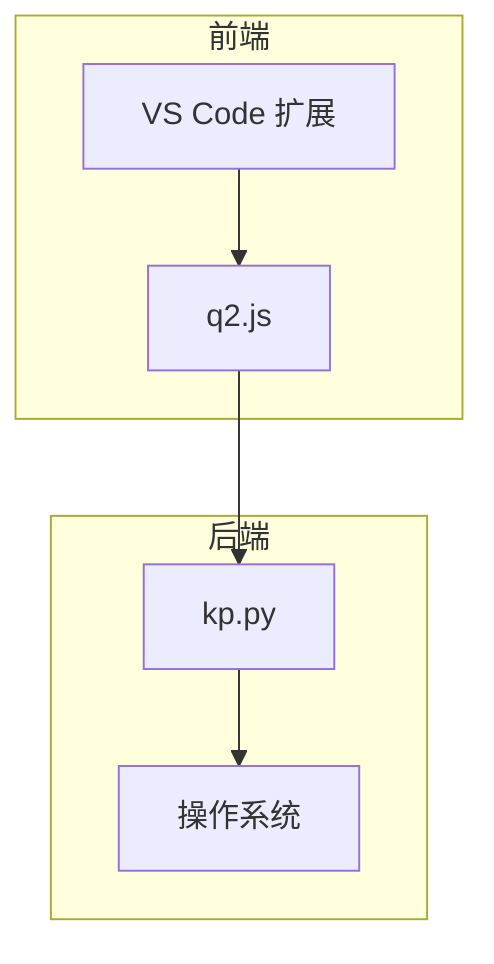
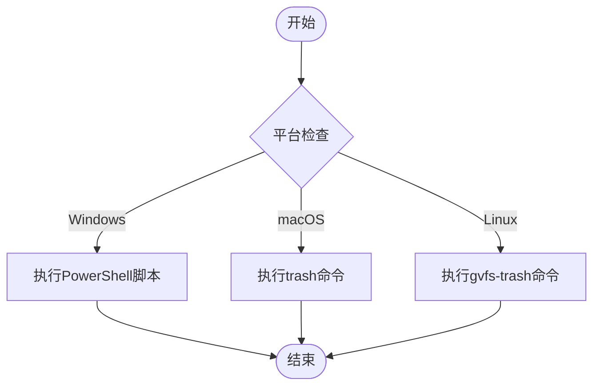
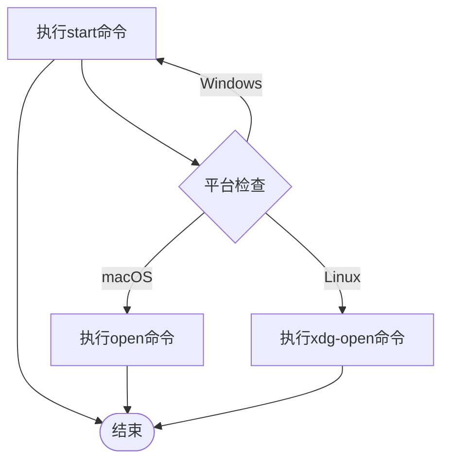
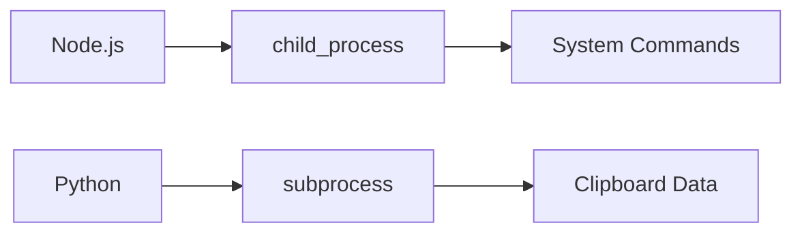

# 跨平台兼容性问题

<cite>
**Referenced Files in This Document**   
- [kp.py](file://src/kp.py)
- [q2.js](file://src/q2.js)
- [extension.js](file://extension.js)
</cite>

## 目录
1. [简介](#简介)
2. [项目结构](#项目结构)
3. [核心组件](#核心组件)
4. [架构概述](#架构概述)
5. [详细组件分析](#详细组件分析)
6. [依赖分析](#依赖分析)
7. [性能考虑](#性能考虑)
8. [故障排除指南](#故障排除指南)
9. [结论](#结论)

## 简介
本文档旨在解决在macOS和Linux系统上因缺少系统命令导致的功能失效问题，特别是回收站操作不可用的情况。通过分析`kp.py`中调用系统命令（如move to trash）的平台差异性，对比Windows与Unix-like系统的实现机制，提供降级方案和UI优化建议。文档详细说明了如何通过Node.js的`os.platform()`判断运行环境，并动态调整功能可用性，同时记录了已知平台限制和功能兼容性矩阵。

## 项目结构
项目结构包含多个JavaScript和Python文件，主要功能集中在`src`目录下。`kp.py`负责处理剪贴板数据和文件操作，`q2.js`和`extension.js`则负责VS Code扩展的UI和命令处理。

**Section sources**
- [kp.py](file://src/kp.py)
- [q2.js](file://src/q2.js)
- [extension.js](file://extension.js)

## 核心组件
核心组件包括`kp.py`中的跨平台剪贴板处理逻辑和`q2.js`中的文件操作命令。`kp.py`根据操作系统类型调用不同的系统命令来处理剪贴板数据，而`q2.js`则通过Node.js的`process.platform`属性来判断运行环境并执行相应的操作。

**Section sources**
- [kp.py](file://src/kp.py#L494-L530)
- [q2.js](file://src/q2.js#L1836-L1872)

## 架构概述
系统架构分为前端（VS Code扩展）和后端（Python脚本）两部分。前端通过Node.js调用后端Python脚本处理剪贴板数据，并根据操作系统类型执行相应的文件操作命令。

**Diagram sources **
- [q2.js](file://src/q2.js)
- [kp.py](file://src/kp.py)

## 详细组件分析

### 回收站操作分析
`q2.js`中的`deleteToRecycleBin`命令负责将文件移至回收站。该命令根据操作系统类型调用不同的系统命令：Windows使用PowerShell，macOS使用`trash`命令，Linux使用`gvfs-trash`命令。

#### 回收站操作流程图

**Diagram sources **
- [q2.js](file://src/q2.js#L1836-L1872)

### 文件打开分析
`q2.js`中的`openWithDefaultApp`命令负责用默认应用程序打开文件或文件夹。该命令同样根据操作系统类型调用不同的系统命令。

#### 文件打开流程图

**Diagram sources **
- [q2.js](file://src/q2.js#L1836-L1872)

## 依赖分析
项目依赖于Node.js的`child_process`模块来执行系统命令，以及Python的`subprocess`模块来处理剪贴板数据。这些依赖使得跨平台操作成为可能，但也带来了平台特定命令的兼容性问题。

**Diagram sources **
- [q2.js](file://src/q2.js)
- [kp.py](file://src/kp.py)

**Section sources**
- [q2.js](file://src/q2.js)
- [kp.py](file://src/kp.py)

## 性能考虑
在执行系统命令时，应考虑命令执行的延迟和资源消耗。建议在UI上合理隐藏或禁用不支持的功能项，避免用户困惑。同时，应记录已知平台限制并在文档中标注功能兼容性矩阵。

## 故障排除指南
当回收站操作失败时，可能是因为缺少相应的系统命令。建议提供降级方案：当原生回收站不可用时提示用户直接删除或打开文件管理器。同时，应检查系统命令是否已正确安装。

**Section sources**
- [q2.js](file://src/q2.js#L1836-L1872)

## 结论
通过分析`kp.py`和`q2.js`中的跨平台操作，我们可以看到不同操作系统之间的实现差异。为了解决这些问题，建议使用Node.js的`os.platform()`判断运行环境，并动态调整功能可用性。同时，应在UI上合理隐藏或禁用不支持的功能项，避免用户困惑，并记录已知平台限制和功能兼容性矩阵。