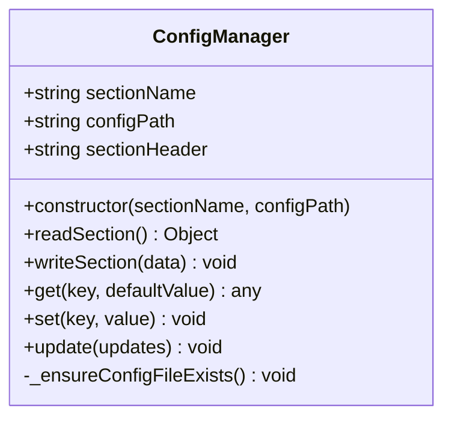
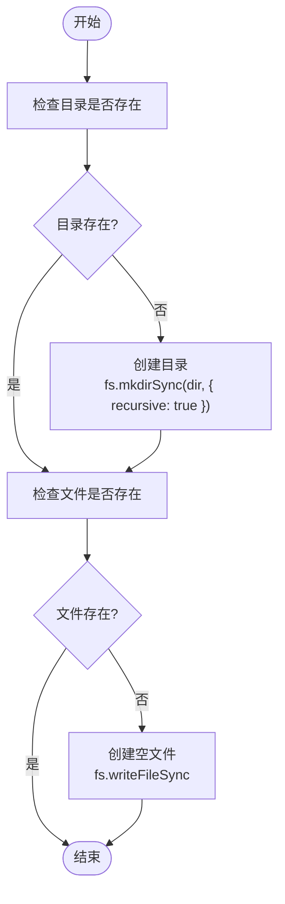
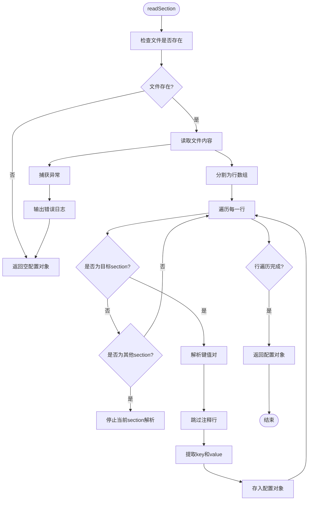
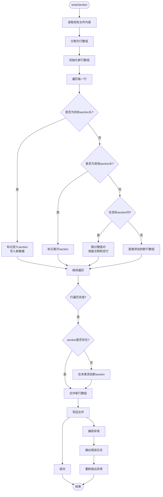
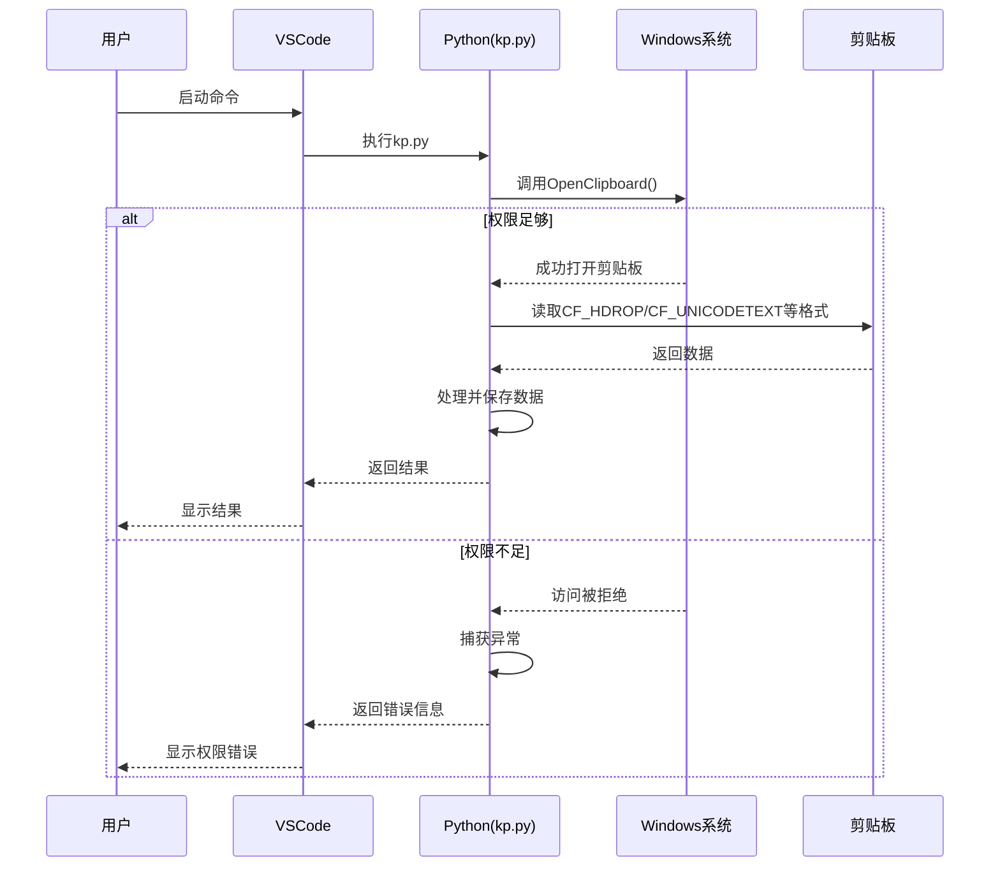

# 配置与权限问题处理

<cite>
**Referenced Files in This Document**   
- [ConfigManager.js](file://src/ConfigManager.js)
- [kp.py](file://src/kp.py)
- [ConfigManager使用指南.md](file://ConfigManager使用指南.md)
</cite>

## 目录
1. [简介](#简介)
2. [配置管理异常处理](#配置管理异常处理)
3. [系统权限不足问题](#系统权限不足问题)
4. [配置文件损坏恢复策略](#配置文件损坏恢复策略)
5. [配置路径验证与日志定位](#配置路径验证与日志定位)
6. [结论](#结论)

## 简介
本文档旨在全面解析项目中涉及的配置管理异常与系统权限不足问题。重点分析`ConfigManager.js`如何实现跨进程安全读写INI配置文件，探讨文件锁定、权限拒绝、路径不存在等异常场景的处理机制。同时，针对`kp.py`调用Windows剪贴板API时可能出现的权限受限问题，提供诊断方法和解决方案。此外，还说明了配置文件损坏后的恢复策略，并指导用户验证配置路径的可读写性。

## 配置管理异常处理

### ConfigManager.js跨进程安全机制
`ConfigManager.js`实现了多进程环境下对共享INI配置文件的安全读写操作。该模块通过文件系统操作和结构化解析，确保多个程序能够安全地共享同一配置文件（默认路径为`E:\r\pz.ini`），同时各自管理独立的配置区域（section）。



**Diagram sources**
- [ConfigManager.js](file://src/ConfigManager.js#L13-L197)

**Section sources**
- [ConfigManager.js](file://src/ConfigManager.js#L1-L201)
- [ConfigManager使用指南.md](file://ConfigManager使用指南.md#L1-L349)

### 异常场景处理机制
`ConfigManager.js`在设计上充分考虑了多种异常情况，确保配置操作的健壮性。

#### 文件与目录不存在
当配置文件或其所在目录不存在时，`_ensureConfigFileExists`方法会自动创建必要的目录结构和空配置文件。


**Diagram sources**
- [ConfigManager.js](file://src/ConfigManager.js#L25-L35)

#### 读取异常处理
在读取配置文件时，代码通过`try-catch`块捕获可能的I/O异常，并输出错误日志，但不会中断程序执行，而是返回一个空对象作为默认值。


**Diagram sources**
- [ConfigManager.js](file://src/ConfigManager.js#L40-L80)

#### 写入异常处理
写入操作同样使用`try-catch`进行异常捕获。与读取不同的是，写入失败时会重新抛出异常，确保调用者能感知到写入错误。


**Diagram sources**
- [ConfigManager.js](file://src/ConfigManager.js#L85-L150)

## 系统权限不足问题

### kp.py剪贴板权限问题分析
`kp.py`脚本在Windows系统上通过`pywin32`库调用`OpenClipboard`和`CloseClipboard`等API来访问系统剪贴板。当运行环境权限不足时，可能导致剪贴板访问失败。



**Diagram sources**
- [kp.py](file://src/kp.py#L120-L126)

### 诊断与解决方案
当遇到剪贴板访问权限问题时，应采取以下步骤进行诊断和解决。

#### 进程权限级别检查
首先，确认当前VSCode进程的运行权限级别。可以通过任务管理器查看VSCode进程是否以管理员身份运行。如果VSCode是以标准用户权限启动的，而剪贴板内容来自一个以管理员身份运行的程序，则可能会出现权限隔离问题。

#### 解决方案：以管理员身份运行
最直接的解决方案是确保VSCode以管理员身份运行。
1. 关闭所有VSCode实例。
2. 右键点击VSCode快捷方式。
3. 选择"以管理员身份运行"。
4. 在VSCode中重新执行相关命令。

此操作确保了`kp.py`脚本继承了管理员权限，从而能够无障碍地访问系统剪贴板。

## 配置文件损坏恢复策略

### 默认值重置机制
`ConfigManager.js`通过`get`方法的`defaultValue`参数实现了默认值重置功能。当配置项不存在或读取失败时，系统会自动返回预设的默认值，保证程序的稳定运行。
```javascript
// 示例：读取配置项，提供默认值
const sidebarWidth = config.get('sidebar_width', '100'); // 如果不存在，返回'100'
const isPinned = config.get('is_pinned', 'false') === 'true'; // 布尔值处理
```

### 备份机制
虽然当前`ConfigManager.js`实现中未包含自动备份功能，但其设计为非破坏性写入，即在写入时会保留文件中的其他section和注释，这在一定程度上降低了配置损坏的风险。建议在生产环境中，通过外部脚本或操作系统功能（如Windows文件历史记录）定期备份`E:\r\pz.ini`文件。

## 配置路径验证与日志定位

### 验证配置路径可读写性
用户应验证目标配置路径``的可读写性。可以通过以下步骤进行：
1. 打开文件资源管理器，导航至``。
2. 尝试创建一个临时文件，确认写入权限。
3. 确认该路径对运行VSCode的用户账户是可访问的。

### 日志定位建议
`ConfigManager.js`在发生错误时会通过`console.error`输出日志。这些日志信息是诊断问题的关键。
- **配置文件初始化失败**：检查`_ensureConfigFileExists`方法中的错误日志，通常与目录创建权限有关。
- **读取配置失败**：检查`readSection`方法中的错误日志，可能与文件被占用或损坏有关。
- **写入配置失败**：检查`writeSection`方法中的错误日志，这是最严重的错误，需要立即处理。

日志信息会直接输出到VSCode的开发者控制台或集成终端中，用户应检查这些输出以获取具体的错误原因。

## 结论
本文档详细分析了`ConfigManager.js`的异常处理机制和`kp.py`的权限问题。`ConfigManager.js`通过完善的错误处理和非破坏性写入策略，确保了配置管理的可靠性。对于系统权限问题，建议以管理员身份运行VSCode来解决剪贴板访问限制。用户应定期验证配置路径的可访问性，并通过日志监控来及时发现和解决问题。