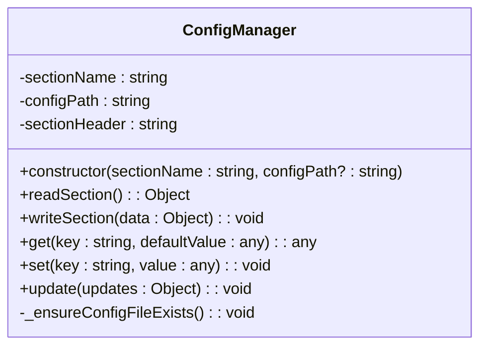
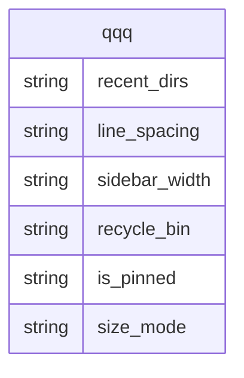
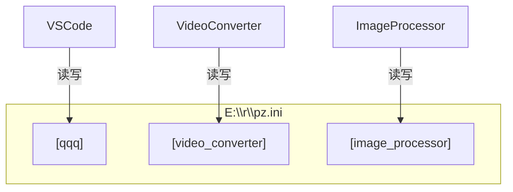
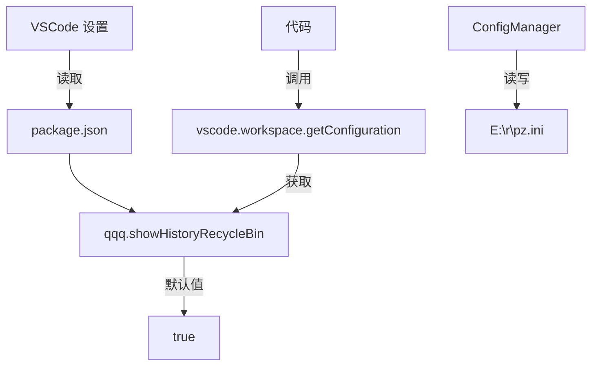

<!-- File: .qoder/repowiki/zh/content/配置管理.md -->
# 配置管理

<cite>
**Referenced Files in This Document**
- [ConfigManager.js](file://src/ConfigManager.js)
- [ConfigManager使用指南.md](file://ConfigManager使用指南.md)
- [初始化检查清单.md](file://初始化检查清单.md)
- [q2.js](file://src/q2.js)
- [qqq.js](file://src/qqq.js)
- [extension.js](file://extension.js)
- [package.json](file://package.json)
</cite>

## 目录
1. [简介](#简介)
2. [核心架构与设计](#核心架构与设计)
3. [关键配置项详解](#关键配置项详解)
4. [数据类型与验证](#数据类型与验证)
5. [多模块共享与同步](#多模块共享与同步)
6. [API使用指南](#api使用指南)
7. [初始化与容错](#初始化与容错)
8. [VSCode设置联动](#vscode设置联动)
9. [总结](#总结)

## 简介

`ConfigManager` 模块是本项目的核心配置管理组件，旨在为多个程序提供一个安全、可靠且易于使用的跨进程配置共享机制。该模块通过一个中心化的 INI 文件 `E:\r\pz.ini` 来持久化存储用户状态和应用设置，确保了用户在不同会话和模块间体验的一致性。其设计遵循了职责单一、格式保留和多进程安全等原则，极大地简化了配置管理的复杂性。

**Section sources**
- [ConfigManager使用指南.md](file://ConfigManager使用指南.md#L1-L20)

## 核心架构与设计

`ConfigManager` 的核心是一个名为 `ConfigManager` 的 JavaScript 类，它封装了对 INI 文件的所有读写操作。该设计的核心思想是“按模块划分”，即每个使用该配置文件的程序或模块（如 `qqq`, `video_converter`）都拥有自己独立的 `section`。



**Diagram sources**
- [ConfigManager.js](file://src/ConfigManager.js#L13-L197)

**Section sources**
- [ConfigManager.js](file://src/ConfigManager.js#L13-L197)

### 架构优势
1.  **隔离性**：每个模块的配置被严格隔离在各自的 `section` 中，避免了配置项的命名冲突。
2.  **格式保留**：写入配置时，`ConfigManager` 会智能地解析整个文件，只修改目标 `section` 的内容，从而完美保留其他 `section` 的数据、注释和格式。
3.  **初始化保障**：`_ensureConfigFileExists()` 方法确保了配置文件及其所在目录在使用前必然存在，防止了因路径不存在而导致的 I/O 错误。

## 关键配置项详解

`ConfigManager` 被用于管理 `qqq` 模块的关键用户状态，这些状态存储在 `E:\r\pz.ini` 文件的 `[qqq]` 区域内。



**Diagram sources**
- [ConfigManager使用指南.md](file://ConfigManager使用指南.md#L150-L155)
- [q2.js](file://src/q2.js#L168-L245)

**Section sources**
- [ConfigManager使用指南.md](file://ConfigManager使用指南.md#L150-L155)
- [q2.js](file://src/q2.js#L168-L245)

### 配置项说明
-   **`recent_dirs`**: 字符串类型，存储最近访问的目录路径列表，路径间以逗号分隔。这是用户快速导航的核心。
-   **`line_spacing`**: 字符串类型，表示文件列表的行间距，其值在读取后需转换为整数。
-   **`sidebar_width`**: 字符串类型，记录侧边栏的宽度（像素），读取后需转换为整数。
-   **`recycle_bin`**: 字符串类型，存储已从 `recent_dirs` 中移除的历史目录，形成一个“回收站”。
-   **`is_pinned`**: 字符串类型，表示新建文件对话框是否固定在屏幕上，值为 `"true"` 或 `"false"`。
-   **`size_mode`**: 字符串类型，控制文件大小的显示模式（`none`, `m`, `k`, `b`）。

## 数据类型与验证

由于 INI 文件本质上是文本格式，`ConfigManager` 存储的所有值均为字符串。因此，调用者在使用这些值时，必须进行显式的类型转换和验证。

**Section sources**
- [ConfigManager使用指南.md](file://ConfigManager使用指南.md#L222-L250)

### 类型转换示例
```javascript
// 读取并转换为整数
const width = parseInt(config.get('sidebar_width', '100'));

// 读取并转换为布尔值
const isPinned = config.get('is_pinned', 'false') === 'true';

// 读取并转换为数组
const dirs = config.get('recent_dirs', '').split(',').filter(Boolean);
```

### 异常恢复机制
当配置文件损坏或读取失败时，系统具备强大的容错能力：
1.  **默认值**：`get()` 方法允许指定默认值，当配置项不存在或读取失败时返回默认值。
2.  **自动创建**：如果 `E:\r\pz.ini` 文件不存在，`_ensureConfigFileExists()` 会自动创建一个空文件。
3.  **错误日志**：所有 I/O 错误都会被 `console.error` 捕获并记录，便于问题排查，但不会中断主程序流程。

## 多模块共享与同步

`ConfigManager` 支持多个模块（如 VSCode 扩展、视频转换器）同时读写同一个 `E:\r\pz.ini` 文件，而不会相互干扰。



**Diagram sources**
- [ConfigManager使用指南.md](file://ConfigManager使用指南.md#L222-L230)

**Section sources**
- [ConfigManager使用指南.md](file://ConfigManager使用指南.md#L222-L230)

### 同步策略与竞态条件规避
-   **读写策略**：`ConfigManager` 在写入时采用“全量写入”策略。它会先读取整个文件，然后在内存中构建新的内容，最后一次性写回整个文件。这保证了单个 `section` 内部的原子性。
-   **竞态条件**：当前实现是同步的，不包含文件锁。在极高频率的并发写入场景下，存在竞态风险。最佳实践是避免多个进程同时写入同一个 `section`。如需更强的并发安全，可集成 `proper-lockfile` 等库。

## API使用指南

`ConfigManager` 提供了简洁而强大的 API，极大地简化了配置操作。

**Section sources**
- [ConfigManager使用指南.md](file://ConfigManager使用指南.md#L67-L103)
- [ConfigManager.js](file://src/ConfigManager.js#L172-L196)

### 核心API
| 方法 | 参数 | 描述 |
| :--- | :--- | :--- |
| `get(key, defaultValue)` | `key`: 配置键<br>`defaultValue`: 默认值 | 读取单个配置项，若不存在则返回默认值。 |
| `set(key, value)` | `key`: 配置键<br>`value`: 配置值 | 写入单个配置项，会触发整个 `section` 的重写。 |
| `update(updates)` | `updates`: 键值对对象 | 批量更新配置，将传入的对象与现有配置合并。 |
| `readSection()` | 无 | 读取当前 `section` 的所有配置，返回一个对象。 |
| `writeSection(data)` | `data`: 键值对对象 | 批量写入整个 `section`，会完全替换原有内容。 |

### 使用示例
```javascript
// 1. 创建实例
const config = new ConfigManager('qqq');

// 2. 读取窗口宽度
const width = parseInt(config.get('sidebar_width', '100'));

// 3. 更新最近目录列表
const newDirs = ['E:\\project1', 'E:\\project2'];
config.set('recent_dirs', newDirs.join(','));

// 4. 批量更新多个配置
config.update({
    line_spacing: '-2',
    is_pinned: 'true'
});
```

## 初始化与容错

系统的配置初始化流程在 `初始化检查清单.md` 中有明确记录，确保了环境的正确性。

**Section sources**
- [初始化检查清单.md](file://初始化检查清单.md#L1-L186)

### 初始化检查清单
-   [x] **依赖安装**：`npm install` 成功，所有依赖包（包括 `sharp`）已就位。
-   [x] **项目结构**：`src/` 目录下的 `ConfigManager.js` 等核心文件已验证存在。
-   [x] **代码修复**：配置文件的分隔符已从分号修复为逗号，确保了 `ConfigManager` 的正确解析。
-   [x] **模块测试**：`ConfigManager.js` 已被独立加载测试，确认无语法错误。

### 配置文件损坏处理
当 `E:\r\pz.ini` 文件损坏时，系统会：
1.  在 `getConfig()` 函数中捕获 `fs.readFileSync` 抛出的异常。
2.  记录错误日志到 `D:\view\p\kp.log`。
3.  返回一个包含所有默认值的配置对象，保证程序可以继续运行。
4.  当用户进行下一次配置保存时，会自动创建一个新的、格式正确的配置文件，实现“异常恢复”。

## VSCode设置联动

`ConfigManager` 与 VSCode 的原生设置系统通过 `package.json` 进行了联动。



**Diagram sources**
- [package.json](file://package.json#L10-L15)
- [q2.js](file://src/q2.js#L1158)

**Section sources**
- [package.json](file://package.json#L10-L15)
- [q2.js](file://src/q2.js#L1158)

### 联动实现
在 `package.json` 中定义了 `qqq.showHistoryRecycleBin` 这个配置项，其默认值为 `true`。在代码中，通过 `vscode.workspace.getConfiguration().get("showHistoryRecycleBin", true)` 来读取用户的最终选择。这个设置决定了 `q2.js` 模块中的文件导航界面是否显示 `recycle_bin` 历史记录区。这体现了配置管理的分层：VSCode 设置控制功能开关，而 `ConfigManager` 则管理该功能下的具体数据状态。

## 总结

`ConfigManager` 模块成功地实现了跨进程的安全配置管理，是维持用户状态一致性的关键。它通过清晰的 `section` 隔离、智能的格式保留和完善的错误处理，为上层应用提供了稳定可靠的持久化服务。结合 `ConfigManager使用指南.md` 中的最佳实践，开发者可以高效地利用其 API 进行配置操作。尽管当前版本在极端并发场景下存在理论上的竞态风险，但其设计已满足绝大多数使用场景的需求，是项目中一个成熟且不可或缺的组件。

**Section sources**
- [ConfigManager使用指南.md](file://ConfigManager使用指南.md#L339-L348)
- [初始化检查清单.md](file://初始化检查清单.md#L1-L186)