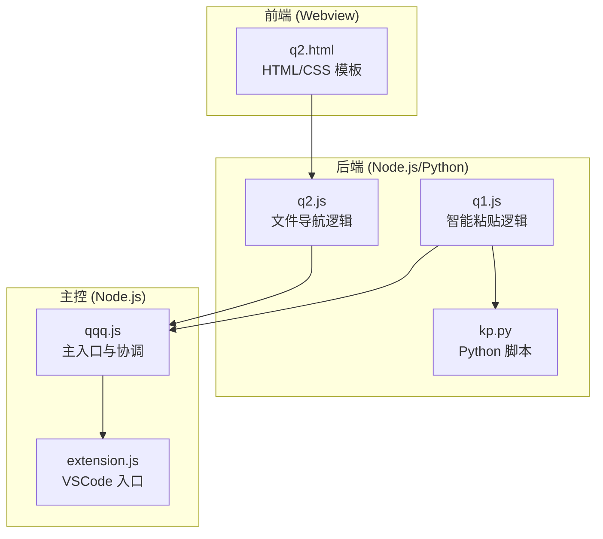

<!-- File: .qoder/repowiki/zh/content/项目概述.md -->
# 项目概述

<cite>
**本文档引用的文件**
- [README-NEW.md](file://README-NEW.md)
- [package.json](file://package.json)
- [extension.js](file://extension.js)
- [src/qqq.js](file://src/qqq.js)
- [src/q1.js](file://src/q1.js)
- [src/q2.js](file://src/q2.js)
- [src/kp.py](file://src/kp.py)
- [src/q2.html](file://src/q2.html)
</cite>

## 目录
1. [简介](#简介)
2. [核心功能](#核心功能)
3. [项目架构](#项目架构)
4. [模块化设计](#模块化设计)
5. [技术栈与实现](#技术栈与实现)
6. [使用场景](#使用场景)
7. [配置与持久化](#配置与持久化)
8. [结论](#结论)

## 简介

qqq 是一个功能强大的 Visual Studio Code 扩展，旨在通过智能文件操作、图片预览和文件导航功能显著提升开发者的效率。该扩展以模块化设计为核心，将复杂的功能分解为独立且可维护的组件，确保代码的清晰性和可扩展性。其主要功能分为两大核心模块：Q1（智能粘贴与图片预览）和 Q2（强大的文件导航）。通过与 VSCode API 的深度集成，qqq 能够在编辑器中提供无缝的用户体验，例如通过 `Ctrl+V` 触发智能粘贴或按 `F2` 打开文件导航器。

**Section sources**
- [README-NEW.md](file://README-NEW.md#L1-L10)

## 核心功能

qqq 扩展的核心价值在于其两大功能模块：Q1 和 Q2。

### Q1 - 智能粘贴与图片预览

Q1 模块彻底革新了传统的粘贴操作。当用户从系统剪贴板复制内容（如文本、文件路径、图片截图或文件）时，Q1 会拦截 `Ctrl+V` 命令，并通过一个 Python 脚本 `kp.py` 进行处理。处理后的结果会以结构化的方式插入到编辑器中。例如，粘贴一张图片时，它不会直接插入二进制数据，而是插入一个类似 `[D:\view\p\2025.10.15一001Ab 14.30.45.png]` 的路径标记。随后，扩展会利用 VSCode 的装饰器（Decoration）功能，在编辑器中直接预览该图片，支持自动缩放至 512x288 的标准尺寸。此外，它还为这些路径提供 CodeLens 功能，允许用户一键快速打开文件。

### Q2 - 强大的文件导航

Q2 模块提供了一个独立的可视化文件浏览界面。用户可以通过 `F2` 快捷键或命令面板打开一个 Webview 对话框。该界面包含一个可拖动的侧边栏，显示系统驱动器和最近访问的目录。主区域则展示当前目录下的文件和文件夹列表，支持通过键盘快捷键进行高效操作，如 `q` 重命名、`w` 用默认应用打开、`s` 删除到回收站等。Q2 还引入了“历史回收站”功能，安全地保存被移除的最近目录记录，方便用户恢复。

**Section sources**
- [README-NEW.md](file://README-NEW.md#L12-L50)

## 项目架构

qqq 扩展采用了清晰的分层架构，将前端界面、后端逻辑和主控模块分离。



**Diagram sources**
- [src/qqq.js](file://src/qqq.js)
- [src/q1.js](file://src/q1.js)
- [src/q2.js](file://src/q2.js)
- [src/kp.py](file://src/kp.py)
- [src/q2.html](file://src/q2.html)

## 模块化设计

qqq 扩展的代码结构体现了高度的模块化原则，各司其职，降低了耦合度。

### qqq.js：核心协调者

`qqq.js` 作为扩展的主入口和公共工具库，扮演着核心协调者的角色。它定义了所有模块共享的常量（如日志路径 `LOG_PATH`、配置文件路径 `CONFIG_PATH`）和工具函数（如 `logMessage` 日志记录）。其 `activate` 函数负责导入并激活 `q1.js` 和 `q2.js` 两个子模块，实现了功能的集中注册和生命周期管理。

### q1.js：智能粘贴模块

`q1.js` 专注于处理与剪贴板相关的所有逻辑。它通过 `executeClipboardCommand` 函数启动一个 Python 子进程来执行 `kp.py` 脚本。该脚本负责与系统剪贴板交互，处理各种类型的数据（文本、文件、图片），并将结果以 JSON 格式返回给 Node.js 环境。`q1.js` 随后根据返回结果调用 `handleResult` 函数，决定如何将内容插入编辑器，并触发 `renderImages` 函数来渲染图片预览。

### q2.js：文件导航模块

`q2.js` 负责管理 Q2 的 Webview 界面和文件系统操作。它读取 `q2.html` 模板文件，通过替换占位符（如 `{{SIDEBAR_WIDTH}}`）来动态生成 HTML 内容。该模块处理所有与文件导航相关的命令，如打开对话框、创建文件、重命名等。它还负责与独立的配置文件 `E:\r\pz.ini` 进行读写，以持久化存储用户的偏好设置，如侧边栏宽度、最近目录和文件大小显示模式。

**Section sources**
- [src/qqq.js](file://src/qqq.js)
- [src/q1.js](file://src/q1.js)
- [src/q2.js](file://src/q2.js)

## 技术栈与实现

qqq 扩展巧妙地结合了多种技术来实现其功能。

### 前端 Webview 与后端逻辑的集成

Q2 模块的实现是前后端分离的典范。`q2.html` 是一个纯静态的 HTML/CSS 模板，不包含任何内联 JavaScript 或样式。`q2.js` 在运行时读取此模板，替换其中的占位符（如 `{{CURRENT_PATH}}`、`{{RECENT_DIRS_HTML}}`），然后将生成的 HTML 内容注入到 Webview 中。Webview 中的 JavaScript 通过 `vscode.postMessage` 与 `q2.js` 进行通信，发送命令（如 `navigate`、`save`），而 `q2.js` 则通过 `webviewPanel.webview.postMessage` 将数据（如文件列表、大小信息）发送回 Webview 进行更新。

### 关键技术实现

- **sharp 库**：用于图片处理。当 `sharp` 库可用时，`renderImages` 函数会使用它将图片缩放至 512x288 的标准尺寸，并添加虚线边框和背景色，提供一致的预览体验。
- **pywin32**：用于 Windows 剪贴板操作。`kp.py` 脚本依赖 `pywin32` 库来访问 Windows 的剪贴板 API（`win32clipboard`），从而读取 `CF_HDROP`（文件路径）、`CF_UNICODETEXT`（文本）和 `CF_DIB`（图片截图）等格式的数据。
- **VSCode API**：扩展的基石。`activationEvents` 在 `package.json` 中定义了扩展的激活时机。`vscode.commands.registerCommand` 用于注册 `qqq.q1` 和 `qqq.q2` 等命令。`vscode.window.createTextEditorDecorationType` 用于创建图片预览的装饰器。`vscode.languages.registerCodeLensProvider` 为文件路径提供 CodeLens 功能。

**Section sources**
- [README-NEW.md](file://README-NEW.md#L120-L150)
- [package.json](file://package.json#L1-L77)
- [src/q1.js](file://src/q1.js#L1-L385)
- [src/q2.js](file://src/q2.js#L1-L1947)
- [src/kp.py](file://src/kp.py#L1-L531)

## 使用场景

qqq 扩展为开发者提供了直观且高效的使用体验。

- **智能粘贴**：在编辑器中，用户只需按 `Ctrl+V`，即可将剪贴板中的图片、文件或文本智能地转换为可预览的路径标记。这对于记录笔记、编写文档或分享资源链接非常有用。
- **文件导航**：按 `F2` 键，即可打开 Q2 文件导航器。用户可以快速浏览文件系统，通过键盘快捷键 `q`、`w`、`s`、`e` 对文件进行重命名、打开、删除或在 VSCode 中编辑，极大地减少了鼠标操作，提升了工作效率。

**Section sources**
- [README-NEW.md](file://README-NEW.md#L52-L75)

## 配置与持久化

qqq 扩展使用一个独立的 INI 配置文件 `E:\r\pz.ini` 来存储用户设置和状态，实现了配置的持久化。

```ini
[qqq]
recent_dirs=C:\Project,D:\Work
line_spacing=-2
sidebar_width=150
recycle_bin=D:\OldProject
is_pinned=true
size_mode=m
```

`q2.js` 模块中的 `getConfig` 和 `saveConfig` 函数负责读取和写入此文件。配置项包括最近访问的目录、列表项间距、侧边栏宽度、历史回收站内容、长驻模式状态和文件大小显示模式。这种设计使得用户的个性化设置在重启 VSCode 后依然有效。

**Section sources**
- [README-NEW.md](file://README-NEW.md#L77-L95)
- [src/q2.js](file://src/q2.js#L168-L306)

## 结论

qqq 扩展通过其模块化的设计、强大的核心功能和对 VSCode API 的熟练运用，为开发者提供了一个高效、智能的开发辅助工具。其 Q1 和 Q2 两大模块分别解决了内容粘贴和文件导航的痛点，而清晰的架构和良好的技术选型确保了项目的可维护性和可扩展性。对于希望提升日常开发效率的用户来说，qqq 是一个值得尝试的优秀扩展。